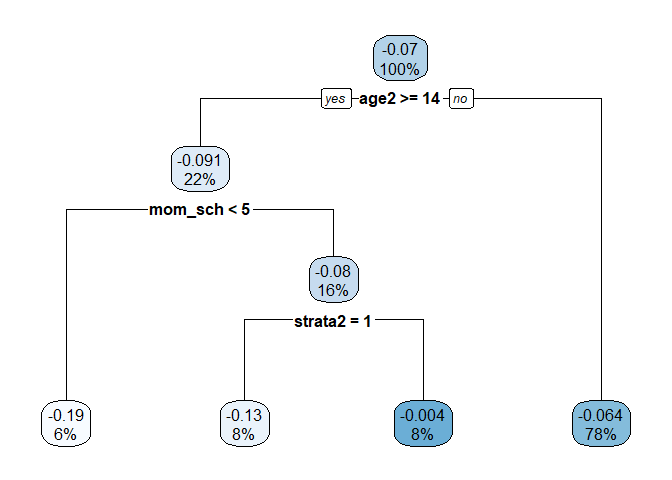
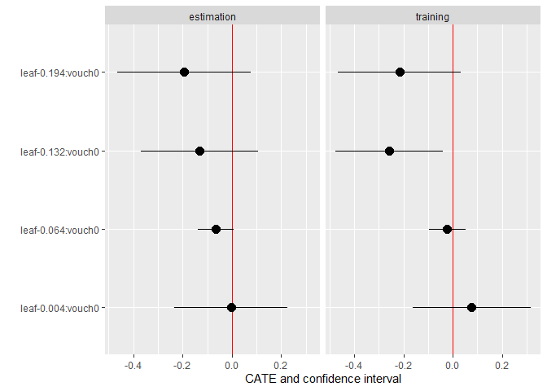
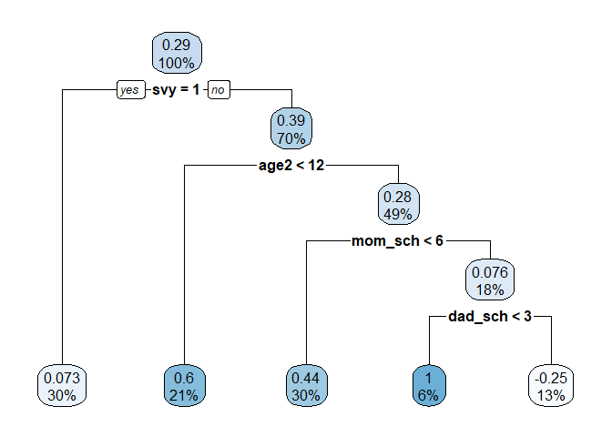
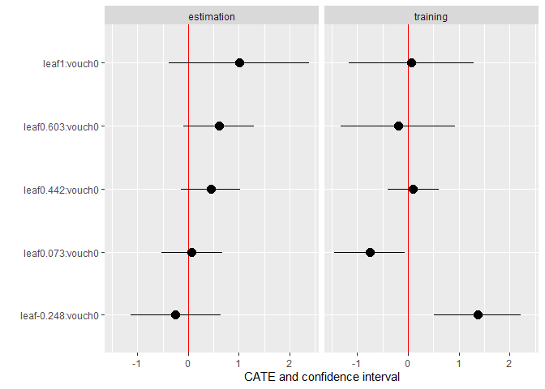

# Introduction
In this final project, I replicate the key findings from the paper *Vouchers for Private Schooling in Colombia: Evidence from a Randomized Natural Experiment* by by Joshua Angrist, Eric Bettinger, Erik Bloom, Elizabeth King, and Michael Kremer, published in the American Economic Review in 2002. The paper concludes that a voucher program, which partially covered the cost of private secondary school for students who maintained satisfactory academic progress, improved both educational and non-educational outcomes. The authors also tested the heterogeneity of the effect along the gender dimension (i.e., boys vs. girls) and found larger effects for girls in some outcomes.

In this project, I replicate the main results of the paper and extend the heterogeneity analysis by exploring high-dimensional heterogeneous effects using Honest Causal Tree analysis, as covered in the course.  Specifically, I explore the heterogeneous effects on grade repetition and test scores.


# Overview and Key Results of the Paper
The view that private schools outperform public schools in developing countries has led to recommendations for governments in these regions to explore demand-side financing options, such as vouchers. Angrist et al. provide evidence on the effects of one of the largest school voucher initiatives, the Programa de Ampliación de Cobertura de la Educación Secundaria (PACES) in Colombia. This program issued vouchers to over 125,000 students, covering slightly more than half of the cost of private secondary education. The vouchers were renewable contingent on maintaining satisfactory academic performance. Given that many vouchers were distributed through a lottery system, the authors employed a quasi-experimental design to compare the educational and other outcomes of lottery winners and losers. This study represents the first examination of a private school voucher program in a developing country utilizing randomly assigned treatment.

The paper investigates various effects of the voucher program and finds the following:

- Lottery winners were 15 percentage points more likely to attend private schools rather than public schools.
- They completed an additional 0.1 years of schooling.
- They were about 10 percentage points more likely than losers to have completed eighth grade, primarily because they repeated fewer grades.
- They scored approximately 0.2 standard deviations higher on achievement tests compared to losers. This difference is substantial but only marginally significant. The effect is more pronounced and precisely estimated for girls compared to boys.
- They were less likely to be married or cohabiting.
- They worked about 1.2 fewer hours per week, with this difference being more notable for girls.

The authors observe that around 90 percent of lottery winners had used the voucher or another form of scholarship, while 24 percent of losers received scholarships from different sources. As a result, they employ the lottery win/loss status as an instrument for scholarship receipt in a two-stage least squares (2SLS) analysis. This method is expected to provide more accurate estimates of the impact of scholarship programs on new recipients compared to the reduced-form effects, which are diluted due to less-than-full take-up rates and the availability of alternative financing. Instrumenting for scholarship
use with lottery win/loss status suggests that scholarship use generated effects on grade completion and test scores that are about 50 percent larger than the reduced-form effect of winning the lottery.

Additionally, the authors perform a fiscal and cost-benefit analysis of the program. Their key finding is that the benefits to participants likely outweighed the $24 per winner additional cost incurred by the government for providing vouchers instead of public school placements.

The paper primarily focuses on the reduced-form effects observed across various educational outcomes. The authors examine how these effects vary by gender. In this project, I replicated the pooled reduced-form estimates and expanded the heterogeneity analysis by investigating high-dimensional heterogeneous effects using Honest Causal Tree analysis.

# Replication
To replicate the results related to educational outcomes, I utilized the dataset provided by the `{experimentdatar}` package. This dataset was also used to extend the analysis of heterogeneity. Additionally, I examined the impact of the voucher program on test scores by downloading the relevant dataset from the paper's replication package.

## Setup


Load the data sets

```r
data("vouchers")

# Main data set
vouchers <- vouchers %>%
  rename_with(~ tolower(.)) %>% 
  filter(!is.na(id))

# Tests data set
tests <- read_sas("tab5v1.sas7bdat") %>% 
  rename_with(~ tolower(.))
```

The authors limit their analysis to the 1995 and 1997 applicant cohorts from Bogotá and the 1993 cohort from Jamundí, a suburb of Cali. These selections were made for both scientific and practical reasons. Bogotá was prioritized because it hosted the largest and most long-standing voucher program, and the survey team was based there. Cali, being the second-largest city in Colombia, was also considered important. However, due to the lack of contact information from many Cali applicants, the focus was shifted to Jamundí, a nearby suburb.


## Descriptive statistics
The authors divide the data into three subsamples for reporting summary statistics:

- Population: All applicants from the three cohorts.
- Attempted Interviews: Applicants who were targeted for an interview.
- Completed Interviews: Applicants who were successfully interviewed by the research team.

```r
# Creating the subsamples
vouchers_pop <- vouchers %>% filter(dbogota  + djamundi > 0)  # Population:  1995 and 1997 applicant cohorts from Bogotá and the 1993 cohort from Jamundí
vouchers_pop_bog95 <- vouchers_pop %>% filter(dbogota == 1 & d1995 == 1) # Bogotá 1995
vouchers_pop_bog97 <- vouchers_pop %>% filter(dbogota == 1 & d1997 == 1) # Bogotá 1997
vouchers_pop_jam93 <- vouchers_pop %>% filter(djamundi == 1 & d1993 == 1) # Jamundí 1993

# Same for Attempted Interviews
vouchers_attempt <- vouchers %>% filter(bog95asd + bog97asd + jam93asd > 0)
vouchers_attempt_bog95 <- vouchers_attempt %>% filter(bog95asd == 1)
vouchers_attempt_bog97 <- vouchers_attempt %>% filter(bog97asd == 1)
vouchers_attempt_jam93 <- vouchers_attempt %>% filter(jam93asd == 1)

# Completed Interviews
vouchers_comp <- vouchers %>% filter(bog95smp + bog97smp + jam93smp > 0)
vouchers_comp_bog95 <- vouchers_comp %>% filter(bog95smp == 1)
vouchers_comp_bog97 <- vouchers_comp %>% filter(bog97smp == 1)
vouchers_comp_jam93 <- vouchers_comp %>% filter(jam93smp == 1)
```

I replicate Table 1 from the paper, which presents the descriptive statistics.


```r
# Panel A
table1A <- tibble(
  Variable = c("N", "Percentage awarded vouchers"),
  `Bogotá 1995` = c(
    nrow(vouchers_pop_bog95),
    round(100 * mean(vouchers_pop_bog95$vouch0, na.rm = TRUE), 1)
  ),
  `Bogotá 1997` = c(
    nrow(vouchers_pop_bog97),
    round(100 * mean(vouchers_pop_bog97$vouch0, na.rm = TRUE), 1)
  ),
  `Jamundí 1995` = c(
    nrow(vouchers_pop_jam93),
    round(100 * mean(vouchers_pop_jam93$vouch0, na.rm = TRUE), 1)
  ),
  `Combined sample` = c(
    nrow(vouchers_pop),
    round(100 * mean(vouchers_pop$vouch0, na.rm = TRUE), 1)
  )
)

# Panel N
table1B <- tibble(
  Variable = c("N", "Percentage awarded vouchers", "Response rate", "Winner rate", "Loser rate"),
  `Bogotá 1995` = c(
    nrow(vouchers_attempt_bog95),
    round(100 * mean(vouchers_attempt_bog95$vouch0, na.rm = TRUE), 1),
    round(mean(vouchers_attempt_bog95$response, na.rm = TRUE), 3),
    round(mean(vouchers_attempt_bog95$response[vouchers_attempt_bog95$vouch0 == 1], na.rm = TRUE),3),
    round(mean(vouchers_attempt_bog95$response[vouchers_attempt_bog95$vouch0 == 0], na.rm = TRUE),3)
  ),
  `Bogotá 1997` = c(
    nrow(vouchers_attempt_bog97),
    round(100 * mean(vouchers_attempt_bog97$vouch0, na.rm = TRUE), 1),
    round(mean(vouchers_attempt_bog97$response, na.rm = TRUE), 3),
    round(mean(vouchers_attempt_bog97$response[vouchers_attempt_bog97$vouch0 == 1], na.rm = TRUE),3),
    round(mean(vouchers_attempt_bog97$response[vouchers_attempt_bog97$vouch0 == 0], na.rm = TRUE),3)
  ),
  `Jamundí 1995` = c(
    nrow(vouchers_attempt_jam93),
    round(100 * mean(vouchers_attempt_jam93$vouch0, na.rm = TRUE), 1),
    round(mean(vouchers_attempt_jam93$response, na.rm = TRUE), 3),
    round(mean(vouchers_attempt_jam93$response[vouchers_attempt_jam93$vouch0 == 1], na.rm = TRUE),3),
    round(mean(vouchers_attempt_jam93$response[vouchers_attempt_jam93$vouch0 == 0], na.rm = TRUE),3)
  ),
  `Combined sample` = c(
    nrow(vouchers_attempt),
    round(100 * mean(vouchers_attempt$vouch0, na.rm = TRUE), 1),
    round(mean(vouchers_attempt$response, na.rm = TRUE), 3),
    round(mean(vouchers_attempt$response[vouchers_attempt$vouch0 == 1], na.rm = TRUE),3),
    round(mean(vouchers_attempt$response[vouchers_attempt$vouch0 == 0], na.rm = TRUE),3)
  )
)

# Panel C
table1C <- tibble(
  Variable = c("N", "Percentage awarded vouchers", "Household visit", "Age at time of application", " ", "Age on survey date (from survey data)", " ", "Male", "Started 6th grade in private", "Started 7th grade in private", "Currently in private school", "Highest grade completed", " ", "Currently in school"),
  
  `Bogotá 1995` = c(
    nrow(vouchers_comp_bog95),
    round(100 * mean(vouchers_comp_bog95$vouch0, na.rm = TRUE), 1),
    round(mean(vouchers_comp_bog95$hsvisit, na.rm = TRUE),3),
    round(mean(vouchers_comp_bog95$age2, na.rm = TRUE),1),
    paste0("(",round(sd(vouchers_comp_bog95$age2, na.rm = TRUE),1), ")"),
    round(mean(vouchers_comp_bog95$age, na.rm = TRUE),1),
    paste0("(",round(sd(vouchers_comp_bog95$age, na.rm = TRUE),1), ")"),
    round(mean(vouchers_comp_bog95$sex, na.rm = TRUE),3),
    round(mean(vouchers_comp_bog95$prscha_1, na.rm = TRUE),3),
    round(mean(vouchers_comp_bog95$prscha_2, na.rm = TRUE),3),
    round(mean(vouchers_comp_bog95$prsch_c, na.rm = TRUE),3),
    round(mean(vouchers_comp_bog95$scyfnsh, na.rm = TRUE),1),
    paste0("(",round(sd(vouchers_comp_bog95$scyfnsh, na.rm = TRUE),3), ")"),
    round(mean(vouchers_comp_bog95$inschl, na.rm = TRUE),3)
  ),
  `Bogotá 1997` = c(
    nrow(vouchers_comp_bog97),
    round(100 * mean(vouchers_comp_bog97$vouch0, na.rm = TRUE), 1),
    round(mean(vouchers_comp_bog97$hsvisit, na.rm = TRUE),3),
    round(mean(vouchers_comp_bog97$age2, na.rm = TRUE),1),
    paste0("(",round(sd(vouchers_comp_bog97$age2, na.rm = TRUE),1), ")"),
    round(mean(vouchers_comp_bog97$age, na.rm = TRUE),1),
    paste0("(",round(sd(vouchers_comp_bog97$age, na.rm = TRUE),1), ")"),
    round(mean(vouchers_comp_bog97$sex, na.rm = TRUE),3),
    round(mean(vouchers_comp_bog97$prscha_1, na.rm = TRUE),3),
    round(mean(vouchers_comp_bog97$prscha_2, na.rm = TRUE),3),
    round(mean(vouchers_comp_bog97$prsch_c, na.rm = TRUE),3),
    round(mean(vouchers_comp_bog97$scyfnsh, na.rm = TRUE),1),
    paste0("(",round(sd(vouchers_comp_bog97$scyfnsh, na.rm = TRUE),3), ")"),
    round(mean(vouchers_comp_bog97$inschl, na.rm = TRUE),3)
  ),
  `Jamundí 1995` = c(
    nrow(vouchers_comp_jam93),
    round(100 * mean(vouchers_comp_jam93$vouch0, na.rm = TRUE), 1),
    round(mean(vouchers_comp_jam93$hsvisit, na.rm = TRUE),3),
    round(mean(vouchers_comp_jam93$age2, na.rm = TRUE),1),
    paste0("(",round(sd(vouchers_comp_jam93$age2, na.rm = TRUE),1), ")"),
    round(mean(vouchers_comp_jam93$age, na.rm = TRUE),1),
    paste0("(",round(sd(vouchers_comp_jam93$age, na.rm = TRUE),1), ")"),
    round(mean(vouchers_comp_jam93$sex, na.rm = TRUE),3),
    round(mean(vouchers_comp_jam93$prscha_1, na.rm = TRUE),3),
    round(mean(vouchers_comp_jam93$prscha_2, na.rm = TRUE),3),
    round(mean(vouchers_comp_jam93$prsch_c, na.rm = TRUE),3),
    round(mean(vouchers_comp_jam93$scyfnsh, na.rm = TRUE),1),
    paste0("(",round(sd(vouchers_comp_jam93$scyfnsh, na.rm = TRUE),3), ")"),
    round(mean(vouchers_comp_jam93$inschl, na.rm = TRUE),3)
  ),
  `Combined sample` = c(
    nrow(vouchers_comp),
    round(100 * mean(vouchers_comp$vouch0, na.rm = TRUE), 1),
    round(mean(vouchers_comp$hsvisit, na.rm = TRUE),3),
    round(mean(vouchers_comp$age2, na.rm = TRUE),1),
    paste0("(",round(sd(vouchers_comp$age2, na.rm = TRUE),1), ")"),
    round(mean(vouchers_comp$age, na.rm = TRUE),1),
    paste0("(",round(sd(vouchers_comp$age, na.rm = TRUE),1), ")"),
    round(mean(vouchers_comp$sex, na.rm = TRUE),3),
    round(mean(vouchers_comp$prscha_1, na.rm = TRUE),3),
    round(mean(vouchers_comp$prscha_2, na.rm = TRUE),3),
    round(mean(vouchers_comp$prsch_c, na.rm = TRUE),3),
    round(mean(vouchers_comp$scyfnsh, na.rm = TRUE),1),
    paste0("(",round(sd(vouchers_comp$scyfnsh, na.rm = TRUE),3), ")"),
    round(mean(vouchers_comp$inschl, na.rm = TRUE),3)
  ),
)

table1 <- rbind(table1A, table1B, table1C)

kable(table1,
      caption = "Table 1—Sample Design and Survey Response Data") %>% 
  kable_classic(full_width = F) %>% 
   pack_rows(index = c("A. Population:" = 2, "B. Attempted Interviews:" = 5, "C. Completed Interviews:" = 14)) %>% 
  footnote("Standard deviations for nonbinary variables are shown in parentheses. Sample sizes may differ across rows. Data are from 1998 household surveys. “Age at time of application” is imputed from the National Identification number reported on the application.")
```

<table class=" lightable-classic" style='color: black; font-family: "Arial Narrow", "Source Sans Pro", sans-serif; width: auto !important; margin-left: auto; margin-right: auto;border-bottom: 0;'>
<caption>Table 1—Sample Design and Survey Response Data</caption>
 <thead>
  <tr>
   <th style="text-align:left;"> Variable </th>
   <th style="text-align:left;"> Bogotá 1995 </th>
   <th style="text-align:left;"> Bogotá 1997 </th>
   <th style="text-align:left;"> Jamundí 1995 </th>
   <th style="text-align:left;"> Combined sample </th>
  </tr>
 </thead>
<tbody>
  <tr grouplength="2"><td colspan="5" style="border-bottom: 0;"><strong>A. Population:</strong></td></tr>
<tr>
   <td style="text-align:left;padding-left: 2em;" indentlevel="1"> N </td>
   <td style="text-align:left;"> 4044 </td>
   <td style="text-align:left;"> 1770 </td>
   <td style="text-align:left;"> 342 </td>
   <td style="text-align:left;"> 6157 </td>
  </tr>
  <tr>
   <td style="text-align:left;padding-left: 2em;" indentlevel="1"> Percentage awarded vouchers </td>
   <td style="text-align:left;"> 58.8 </td>
   <td style="text-align:left;"> 84.7 </td>
   <td style="text-align:left;"> 50 </td>
   <td style="text-align:left;"> 65.8 </td>
  </tr>
  <tr grouplength="5"><td colspan="5" style="border-bottom: 0;"><strong>B. Attempted Interviews:</strong></td></tr>
<tr>
   <td style="text-align:left;padding-left: 2em;" indentlevel="1"> N </td>
   <td style="text-align:left;"> 2249 </td>
   <td style="text-align:left;"> 457 </td>
   <td style="text-align:left;"> 279 </td>
   <td style="text-align:left;"> 2985 </td>
  </tr>
  <tr>
   <td style="text-align:left;padding-left: 2em;" indentlevel="1"> Percentage awarded vouchers </td>
   <td style="text-align:left;"> 50 </td>
   <td style="text-align:left;"> 51.6 </td>
   <td style="text-align:left;"> 50.2 </td>
   <td style="text-align:left;"> 50.3 </td>
  </tr>
  <tr>
   <td style="text-align:left;padding-left: 2em;" indentlevel="1"> Response rate </td>
   <td style="text-align:left;"> 0.523 </td>
   <td style="text-align:left;"> 0.606 </td>
   <td style="text-align:left;"> 0.591 </td>
   <td style="text-align:left;"> 0.542 </td>
  </tr>
  <tr>
   <td style="text-align:left;padding-left: 2em;" indentlevel="1"> Winner rate </td>
   <td style="text-align:left;"> 0.528 </td>
   <td style="text-align:left;"> 0.619 </td>
   <td style="text-align:left;"> 0.65 </td>
   <td style="text-align:left;"> 0.553 </td>
  </tr>
  <tr>
   <td style="text-align:left;padding-left: 2em;" indentlevel="1"> Loser rate </td>
   <td style="text-align:left;"> 0.518 </td>
   <td style="text-align:left;"> 0.593 </td>
   <td style="text-align:left;"> 0.532 </td>
   <td style="text-align:left;"> 0.531 </td>
  </tr>
  <tr grouplength="14"><td colspan="5" style="border-bottom: 0;"><strong>C. Completed Interviews:</strong></td></tr>
<tr>
   <td style="text-align:left;padding-left: 2em;" indentlevel="1"> N </td>
   <td style="text-align:left;"> 1176 </td>
   <td style="text-align:left;"> 277 </td>
   <td style="text-align:left;"> 165 </td>
   <td style="text-align:left;"> 1618 </td>
  </tr>
  <tr>
   <td style="text-align:left;padding-left: 2em;" indentlevel="1"> Percentage awarded vouchers </td>
   <td style="text-align:left;"> 50.4 </td>
   <td style="text-align:left;"> 52.7 </td>
   <td style="text-align:left;"> 55.2 </td>
   <td style="text-align:left;"> 51.3 </td>
  </tr>
  <tr>
   <td style="text-align:left;padding-left: 2em;" indentlevel="1"> Household visit </td>
   <td style="text-align:left;"> 0.054 </td>
   <td style="text-align:left;"> 0.004 </td>
   <td style="text-align:left;"> 0.782 </td>
   <td style="text-align:left;"> 0.12 </td>
  </tr>
  <tr>
   <td style="text-align:left;padding-left: 2em;" indentlevel="1"> Age at time of application </td>
   <td style="text-align:left;"> 12.6 </td>
   <td style="text-align:left;"> 12.4 </td>
   <td style="text-align:left;"> 12.5 </td>
   <td style="text-align:left;"> 12.6 </td>
  </tr>
  <tr>
   <td style="text-align:left;padding-left: 2em;" indentlevel="1">  </td>
   <td style="text-align:left;"> (1.3) </td>
   <td style="text-align:left;"> (1.4) </td>
   <td style="text-align:left;"> (1.9) </td>
   <td style="text-align:left;"> (1.4) </td>
  </tr>
  <tr>
   <td style="text-align:left;padding-left: 2em;" indentlevel="1"> Age on survey date (from survey data) </td>
   <td style="text-align:left;"> 15 </td>
   <td style="text-align:left;"> 13.1 </td>
   <td style="text-align:left;"> 16.9 </td>
   <td style="text-align:left;"> 14.9 </td>
  </tr>
  <tr>
   <td style="text-align:left;padding-left: 2em;" indentlevel="1">  </td>
   <td style="text-align:left;"> (1.3) </td>
   <td style="text-align:left;"> (1.4) </td>
   <td style="text-align:left;"> (1.5) </td>
   <td style="text-align:left;"> (1.7) </td>
  </tr>
  <tr>
   <td style="text-align:left;padding-left: 2em;" indentlevel="1"> Male </td>
   <td style="text-align:left;"> 0.501 </td>
   <td style="text-align:left;"> 0.505 </td>
   <td style="text-align:left;"> 0.424 </td>
   <td style="text-align:left;"> 0.494 </td>
  </tr>
  <tr>
   <td style="text-align:left;padding-left: 2em;" indentlevel="1"> Started 6th grade in private </td>
   <td style="text-align:left;"> 0.91 </td>
   <td style="text-align:left;"> 0.88 </td>
   <td style="text-align:left;"> 0.669 </td>
   <td style="text-align:left;"> 0.88 </td>
  </tr>
  <tr>
   <td style="text-align:left;padding-left: 2em;" indentlevel="1"> Started 7th grade in private </td>
   <td style="text-align:left;"> 0.763 </td>
   <td style="text-align:left;"> 0.731 </td>
   <td style="text-align:left;"> 0.626 </td>
   <td style="text-align:left;"> 0.744 </td>
  </tr>
  <tr>
   <td style="text-align:left;padding-left: 2em;" indentlevel="1"> Currently in private school </td>
   <td style="text-align:left;"> 0.618 </td>
   <td style="text-align:left;"> 0.738 </td>
   <td style="text-align:left;"> 0.506 </td>
   <td style="text-align:left;"> 0.627 </td>
  </tr>
  <tr>
   <td style="text-align:left;padding-left: 2em;" indentlevel="1"> Highest grade completed </td>
   <td style="text-align:left;"> 7.6 </td>
   <td style="text-align:left;"> 6 </td>
   <td style="text-align:left;"> 8.6 </td>
   <td style="text-align:left;"> 7.4 </td>
  </tr>
  <tr>
   <td style="text-align:left;padding-left: 2em;" indentlevel="1">  </td>
   <td style="text-align:left;"> (0.95) </td>
   <td style="text-align:left;"> (0.492) </td>
   <td style="text-align:left;"> (1.101) </td>
   <td style="text-align:left;"> (1.141) </td>
  </tr>
  <tr>
   <td style="text-align:left;padding-left: 2em;" indentlevel="1"> Currently in school </td>
   <td style="text-align:left;"> 0.836 </td>
   <td style="text-align:left;"> 0.957 </td>
   <td style="text-align:left;"> 0.778 </td>
   <td style="text-align:left;"> 0.851 </td>
  </tr>
</tbody>
<tfoot>
<tr><td style="padding: 0; " colspan="100%"><span style="font-style: italic;">Note: </span></td></tr>
<tr><td style="padding: 0; " colspan="100%">
<sup></sup> Standard deviations for nonbinary variables are shown in parentheses. Sample sizes may differ across rows. Data are from 1998 household surveys. “Age at time of application” is imputed from the National Identification number reported on the application.</td></tr>
</tfoot>
</table>

My replication closely mirrors Table 1 from the paper, with minor differences in the combined sample. Additionally, I have not included the last column, "Test-takers," as I was unable to obtain the statistics for this column, despite using the dummy indicator for test-taking.

## Main Results
The authors estimate the following regression model:

$$
y_{ic} = X'_i \beta_0 + \alpha_0 Z_i + \delta_c + \epsilon_{ic}
$$

where $y_ic$ is the dependent variable for child $i$ from application cohort $c$ (defined by city and year); $X_i$ represents a vector of individual and survey characteristics like age, sex, and whether the survey was telephone or in person; $Z_i$ is an indicator for whether child $i$ won the voucher.

The authors estimate the model using three sets of control variables: “no controls,” i.e., excluding the $X_i$ variables; “basic controls” including the $X_i$ variables; and “basic plus barrio controls” which includes the $X_i$ variables plus 19 neighborhood dummies in the Bogota-95 sample.

The main results of the model are presented in Table 3. I do not replicate columns 5 and 6 for the combined sample, as the authors focus on the Bogotá 1995 sample. This is due to the authors' suspicion of non-random assignment of vouchers in the Jamundí-93 sample and because the Bogotá cohort is too recent for a reliable assessment of some outcomes (the survey was conducted in 1998).


```r
vouchers_tab3 <- vouchers_comp %>% filter(tab3smpl == 1)
vouchers_tab3_bog95 <- vouchers_tab3 %>% filter(bog95 == 1)
vouchers_tab3_bog95_los <- vouchers_tab3_bog95 %>% filter(vouch0 == 0)

loser_means <- tibble(
  `Dependent variable` = c(
    "Using any scholarship in survey year",
    " ",
    "Started 6th grade in private",
    " ",
    "Started 7th grade in private",
    " ",
    "Currently in private school",
    " ",
    "Highest grade completed",
    " ",
    "Currently in school",
    " ",
    "Finished 6th grade",
    " ",
    "Finished 7th grade (excludes Bogota 97)",
    " ",
    "Finished 8th grade (excludes Bogota 97)",
    " ",
    "Repetitions of 6th grade",
    " ",
    "Ever repeated after lottery",
    " ",
    "Total repetitions since lottery",
    " ",
    "Years in school since lottery",
    " ",
    "Sample size"
  ),
  `(1)` = c(
    round(mean(vouchers_tab3_bog95_los$usngsch, na.rm = T),3),
    paste0("(", round(sd(vouchers_tab3_bog95_los$usngsch, na.rm = T),3), ")"),
    round(mean(vouchers_tab3_bog95_los$prscha_1, na.rm = T),3),
    paste0("(", round(sd(vouchers_tab3_bog95_los$prscha_1, na.rm = T),3), ")"),
    round(mean(vouchers_tab3_bog95_los$prscha_2, na.rm = T),3),
    paste0("(", round(sd(vouchers_tab3_bog95_los$prscha_2, na.rm = T),3), ")"),
    round(mean(vouchers_tab3_bog95_los$prsch_c, na.rm = T),3),
    paste0("(", round(sd(vouchers_tab3_bog95_los$prsch_c, na.rm = T),3), ")"),
    round(mean(vouchers_tab3_bog95_los$scyfnsh, na.rm = T),1),
    paste0("(", round(sd(vouchers_tab3_bog95_los$scyfnsh, na.rm = T),3), ")"),
    round(mean(vouchers_tab3_bog95_los$inschl, na.rm = T),3),
    paste0("(", round(sd(vouchers_tab3_bog95_los$inschl, na.rm = T),3), ")"),
    round(mean(vouchers_tab3_bog95_los$finish6, na.rm = T),3),
    paste0("(", round(sd(vouchers_tab3_bog95_los$finish6, na.rm = T),3), ")"),
    round(mean(vouchers_tab3_bog95_los$finish7, na.rm = T),3),
    paste0("(", round(sd(vouchers_tab3_bog95_los$finish7, na.rm = T),3), ")"),
    round(mean(vouchers_tab3_bog95_los$finish8, na.rm = T),3),
    paste0("(", round(sd(vouchers_tab3_bog95_los$finish8, na.rm = T),3), ")"),
    round(mean(vouchers_tab3_bog95_los$rept6, na.rm = T),3),
    paste0("(", round(sd(vouchers_tab3_bog95_los$rept6, na.rm = T),3), ")"),
    round(mean(vouchers_tab3_bog95_los$rept, na.rm = T),3),
    paste0("(", round(sd(vouchers_tab3_bog95_los$rept, na.rm = T),3), ")"),
    round(mean(vouchers_tab3_bog95_los$nrept, na.rm = T),3),
    paste0("(", round(sd(vouchers_tab3_bog95_los$nrept, na.rm = T),3), ")"),
    round(mean(vouchers_tab3_bog95_los$totscyrs, na.rm = T),1),
    paste0("(", round(sd(vouchers_tab3_bog95_los$totscyrs, na.rm = T),3), ")"),
    nrow(vouchers_tab3_bog95_los)
  )
)


# Model 1
m1 <- vouchers_tab3_bog95 %>% feols(c(usngsch, prscha_1, prscha_2, prsch_c, scyfnsh, inschl, finish6, finish7, finish8, rept6, rept, nrept, totscyrs)
                                    ~ vouch0, se = "hetero")

# Model 2
m2 <- vouchers_tab3_bog95 %>% feols(c(usngsch, prscha_1, prscha_2, prsch_c, scyfnsh, inschl, finish6, finish7, finish8, rept6, rept, nrept, totscyrs)
                                    ~ vouch0
                                    + svy + hsvisit + phone + age + sex2
                                    + dmonth2 + dmonth3 + dmonth4 + dmonth5 + dmonth6 + dmonth7 + dmonth8 + dmonth9 + dmonth10 + dmonth11 + dmonth12
                                    + strata2 + strata3 + strata4 + strata5 + stratams
                                    , se = "hetero")

# Model 3
m3 <- vouchers_tab3_bog95 %>% feols(c(usngsch, prscha_1, prscha_2, prsch_c, scyfnsh, inschl, finish6, finish7, finish8, rept6, rept, nrept, totscyrs)
                                    ~ vouch0
                                    + svy + hsvisit + phone + age + sex2
                                    + dmonth2 + dmonth3 + dmonth4 + dmonth5 + dmonth6 + dmonth7 + dmonth8 + dmonth9 + dmonth10 + dmonth11 + dmonth12
                                    + strata2 + strata3 + strata4 + strata5 + stratams
                                    + darea1 + darea2 + darea3 + darea4 + darea5 + darea6 + darea7 + darea8 + darea9 + darea10 + darea11 + darea12 + darea13 + darea14 + darea15 + darea16 + darea17 + darea18 + darea19
                                    , se = "hetero")


bog95_results <- tibble(
  `(2)` = c(
    round(m1[[1]]$coefficients["vouch0"], 3),
    paste0("(", round(m1[[1]]$se["vouch0"], 3), ")"),
    round(m1[[2]]$coefficients["vouch0"], 3),
    paste0("(", round(m1[[2]]$se["vouch0"], 3), ")"),
    round(m1[[3]]$coefficients["vouch0"], 3),
    paste0("(", round(m1[[3]]$se["vouch0"], 3), ")"),
    round(m1[[4]]$coefficients["vouch0"], 3),
    paste0("(", round(m1[[4]]$se["vouch0"], 3), ")"),
    round(m1[[5]]$coefficients["vouch0"], 3),
    paste0("(", round(m1[[5]]$se["vouch0"], 3), ")"),
    round(m1[[6]]$coefficients["vouch0"], 3),
    paste0("(", round(m1[[6]]$se["vouch0"], 3), ")"),
    round(m1[[7]]$coefficients["vouch0"], 3),
    paste0("(", round(m1[[7]]$se["vouch0"], 3), ")"),
    round(m1[[8]]$coefficients["vouch0"], 3),
    paste0("(", round(m1[[8]]$se["vouch0"], 3), ")"),
    round(m1[[9]]$coefficients["vouch0"], 3),
    paste0("(", round(m1[[9]]$se["vouch0"], 3), ")"),
    round(m1[[10]]$coefficients["vouch0"], 3),
    paste0("(", round(m1[[10]]$se["vouch0"], 3), ")"),
    round(m1[[11]]$coefficients["vouch0"], 3),
    paste0("(", round(m1[[11]]$se["vouch0"], 3), ")"),
    round(m1[[12]]$coefficients["vouch0"], 3),
    paste0("(", round(m1[[12]]$se["vouch0"], 3), ")"),
    round(m1[[13]]$coefficients["vouch0"], 3),
    paste0("(", round(m1[[13]]$se["vouch0"], 3), ")"),
    m1[[13]]$nobs
  ),
  `(3)` = c(
  round(m2[[1]]$coefficients["vouch0"], 3),
  paste0("(", round(m2[[1]]$se["vouch0"], 3), ")"),
  round(m2[[2]]$coefficients["vouch0"], 3),
  paste0("(", round(m2[[2]]$se["vouch0"], 3), ")"),
  round(m2[[3]]$coefficients["vouch0"], 3),
  paste0("(", round(m2[[3]]$se["vouch0"], 3), ")"),
  round(m2[[4]]$coefficients["vouch0"], 3),
  paste0("(", round(m2[[4]]$se["vouch0"], 3), ")"),
  round(m2[[5]]$coefficients["vouch0"], 3),
  paste0("(", round(m2[[5]]$se["vouch0"], 3), ")"),
  round(m2[[6]]$coefficients["vouch0"], 3),
  paste0("(", round(m2[[6]]$se["vouch0"], 3), ")"),
  round(m2[[7]]$coefficients["vouch0"], 3),
  paste0("(", round(m2[[7]]$se["vouch0"], 3), ")"),
  round(m2[[8]]$coefficients["vouch0"], 3),
  paste0("(", round(m2[[8]]$se["vouch0"], 3), ")"),
  round(m2[[9]]$coefficients["vouch0"], 3),
  paste0("(", round(m2[[9]]$se["vouch0"], 3), ")"),
  round(m2[[10]]$coefficients["vouch0"], 3),
  paste0("(", round(m2[[10]]$se["vouch0"], 3), ")"),
  round(m2[[11]]$coefficients["vouch0"], 3),
  paste0("(", round(m2[[11]]$se["vouch0"], 3), ")"),
  round(m2[[12]]$coefficients["vouch0"], 3),
  paste0("(", round(m2[[12]]$se["vouch0"], 3), ")"),
  round(m2[[13]]$coefficients["vouch0"], 3),
  paste0("(", round(m2[[13]]$se["vouch0"], 3), ")"),
  m2[[13]]$nobs
  ),
`(4)` = c(
  round(m3[[1]]$coefficients["vouch0"], 3),
  paste0("(", round(m3[[1]]$se["vouch0"], 3), ")"),
  round(m3[[2]]$coefficients["vouch0"], 3),
  paste0("(", round(m3[[2]]$se["vouch0"], 3), ")"),
  round(m3[[3]]$coefficients["vouch0"], 3),
  paste0("(", round(m3[[3]]$se["vouch0"], 3), ")"),
  round(m3[[4]]$coefficients["vouch0"], 3),
  paste0("(", round(m3[[4]]$se["vouch0"], 3), ")"),
  round(m3[[5]]$coefficients["vouch0"], 3),
  paste0("(", round(m3[[5]]$se["vouch0"], 3), ")"),
  round(m3[[6]]$coefficients["vouch0"], 3),
  paste0("(", round(m3[[6]]$se["vouch0"], 3), ")"),
  round(m3[[7]]$coefficients["vouch0"], 3),
  paste0("(", round(m3[[7]]$se["vouch0"], 3), ")"),
  round(m3[[8]]$coefficients["vouch0"], 3),
  paste0("(", round(m3[[8]]$se["vouch0"], 3), ")"),
  round(m3[[9]]$coefficients["vouch0"], 3),
  paste0("(", round(m3[[9]]$se["vouch0"], 3), ")"),
  round(m3[[10]]$coefficients["vouch0"], 3),
  paste0("(", round(m3[[10]]$se["vouch0"], 3), ")"),
  round(m3[[11]]$coefficients["vouch0"], 3),
  paste0("(", round(m3[[11]]$se["vouch0"], 3), ")"),
  round(m3[[12]]$coefficients["vouch0"], 3),
  paste0("(", round(m3[[12]]$se["vouch0"], 3), ")"),
  round(m3[[13]]$coefficients["vouch0"], 3),
  paste0("(", round(m3[[13]]$se["vouch0"], 3), ")"),
  m3[[12]]$nobs
  )

)

table3 <- cbind(loser_means, bog95_results)


kable(table3,
      col.names = c(" ", "(1)", "(2)", "(3)", "(4)"),
      caption = "Table 3 — Educational Outcomes and Voucher Status") %>% 
  kable_classic(full_width = F) %>% 
  add_header_above(c(" " = 1, "Loser means" = 1, "No controls" = 1, "Basic controls" = 1, "Basic + 19 barrio controls" = 1)) %>% 
   add_header_above(c(" " = 1, "Bogota 1995" = 4)) %>% 
  pack_rows(index = c("Scholarship Use" = 2,"School Choice" = 6, "Schooling" = 18)) %>% 
  footnote("The table reports voucher losers’ means and the estimated effect of winning a voucher. Numbers in parentheses are standard deviations in the column of means and standard errors in columns of estimated voucher effects. The regression estimates are from models that include controls for phone access, age, type of survey and instrument, strata of residence, and month of interview.") 
```

<table class=" lightable-classic" style='color: black; font-family: "Arial Narrow", "Source Sans Pro", sans-serif; width: auto !important; margin-left: auto; margin-right: auto;border-bottom: 0;'>
<caption>Table 3 — Educational Outcomes and Voucher Status</caption>
 <thead>
<tr>
<th style="empty-cells: hide;" colspan="1"></th>
<th style="padding-bottom:0; padding-left:3px;padding-right:3px;text-align: center; " colspan="4"><div style="border-bottom: 1px solid #111111; margin-bottom: -1px; ">Bogota 1995</div></th>
</tr>
<tr>
<th style="empty-cells: hide;" colspan="1"></th>
<th style="padding-bottom:0; padding-left:3px;padding-right:3px;text-align: center; " colspan="1"><div style="border-bottom: 1px solid #111111; margin-bottom: -1px; ">Loser means</div></th>
<th style="padding-bottom:0; padding-left:3px;padding-right:3px;text-align: center; " colspan="1"><div style="border-bottom: 1px solid #111111; margin-bottom: -1px; ">No controls</div></th>
<th style="padding-bottom:0; padding-left:3px;padding-right:3px;text-align: center; " colspan="1"><div style="border-bottom: 1px solid #111111; margin-bottom: -1px; ">Basic controls</div></th>
<th style="padding-bottom:0; padding-left:3px;padding-right:3px;text-align: center; " colspan="1"><div style="border-bottom: 1px solid #111111; margin-bottom: -1px; ">Basic + 19 barrio controls</div></th>
</tr>
  <tr>
   <th style="text-align:left;">  </th>
   <th style="text-align:left;"> (1) </th>
   <th style="text-align:left;"> (2) </th>
   <th style="text-align:left;"> (3) </th>
   <th style="text-align:left;"> (4) </th>
  </tr>
 </thead>
<tbody>
  <tr grouplength="2"><td colspan="5" style="border-bottom: 0;"><strong>Scholarship Use</strong></td></tr>
<tr>
   <td style="text-align:left;padding-left: 2em;" indentlevel="1"> Using any scholarship in survey year </td>
   <td style="text-align:left;"> 0.057 </td>
   <td style="text-align:left;"> 0.509 </td>
   <td style="text-align:left;"> 0.504 </td>
   <td style="text-align:left;"> 0.505 </td>
  </tr>
  <tr>
   <td style="text-align:left;padding-left: 2em;" indentlevel="1">  </td>
   <td style="text-align:left;"> (0.232) </td>
   <td style="text-align:left;"> (0.023) </td>
   <td style="text-align:left;"> (0.023) </td>
   <td style="text-align:left;"> (0.023) </td>
  </tr>
  <tr grouplength="6"><td colspan="5" style="border-bottom: 0;"><strong>School Choice</strong></td></tr>
<tr>
   <td style="text-align:left;padding-left: 2em;" indentlevel="1"> Started 6th grade in private </td>
   <td style="text-align:left;"> 0.877 </td>
   <td style="text-align:left;"> 0.063 </td>
   <td style="text-align:left;"> 0.057 </td>
   <td style="text-align:left;"> 0.058 </td>
  </tr>
  <tr>
   <td style="text-align:left;padding-left: 2em;" indentlevel="1">  </td>
   <td style="text-align:left;"> (0.328) </td>
   <td style="text-align:left;"> (0.017) </td>
   <td style="text-align:left;"> (0.017) </td>
   <td style="text-align:left;"> (0.017) </td>
  </tr>
  <tr>
   <td style="text-align:left;padding-left: 2em;" indentlevel="1"> Started 7th grade in private </td>
   <td style="text-align:left;"> 0.673 </td>
   <td style="text-align:left;"> 0.174 </td>
   <td style="text-align:left;"> 0.168 </td>
   <td style="text-align:left;"> 0.171 </td>
  </tr>
  <tr>
   <td style="text-align:left;padding-left: 2em;" indentlevel="1">  </td>
   <td style="text-align:left;"> (0.47) </td>
   <td style="text-align:left;"> (0.025) </td>
   <td style="text-align:left;"> (0.025) </td>
   <td style="text-align:left;"> (0.025) </td>
  </tr>
  <tr>
   <td style="text-align:left;padding-left: 2em;" indentlevel="1"> Currently in private school </td>
   <td style="text-align:left;"> 0.539 </td>
   <td style="text-align:left;"> 0.16 </td>
   <td style="text-align:left;"> 0.153 </td>
   <td style="text-align:left;"> 0.156 </td>
  </tr>
  <tr>
   <td style="text-align:left;padding-left: 2em;" indentlevel="1">  </td>
   <td style="text-align:left;"> (0.499) </td>
   <td style="text-align:left;"> (0.028) </td>
   <td style="text-align:left;"> (0.028) </td>
   <td style="text-align:left;"> (0.028) </td>
  </tr>
  <tr grouplength="18"><td colspan="5" style="border-bottom: 0;"><strong>Schooling</strong></td></tr>
<tr>
   <td style="text-align:left;padding-left: 2em;" indentlevel="1"> Highest grade completed </td>
   <td style="text-align:left;"> 7.5 </td>
   <td style="text-align:left;"> 0.164 </td>
   <td style="text-align:left;"> 0.13 </td>
   <td style="text-align:left;"> 0.12 </td>
  </tr>
  <tr>
   <td style="text-align:left;padding-left: 2em;" indentlevel="1">  </td>
   <td style="text-align:left;"> (0.965) </td>
   <td style="text-align:left;"> (0.053) </td>
   <td style="text-align:left;"> (0.051) </td>
   <td style="text-align:left;"> (0.052) </td>
  </tr>
  <tr>
   <td style="text-align:left;padding-left: 2em;" indentlevel="1"> Currently in school </td>
   <td style="text-align:left;"> 0.831 </td>
   <td style="text-align:left;"> 0.019 </td>
   <td style="text-align:left;"> 0.007 </td>
   <td style="text-align:left;"> 0.007 </td>
  </tr>
  <tr>
   <td style="text-align:left;padding-left: 2em;" indentlevel="1">  </td>
   <td style="text-align:left;"> (0.375) </td>
   <td style="text-align:left;"> (0.022) </td>
   <td style="text-align:left;"> (0.02) </td>
   <td style="text-align:left;"> (0.02) </td>
  </tr>
  <tr>
   <td style="text-align:left;padding-left: 2em;" indentlevel="1"> Finished 6th grade </td>
   <td style="text-align:left;"> 0.943 </td>
   <td style="text-align:left;"> 0.026 </td>
   <td style="text-align:left;"> 0.023 </td>
   <td style="text-align:left;"> 0.021 </td>
  </tr>
  <tr>
   <td style="text-align:left;padding-left: 2em;" indentlevel="1">  </td>
   <td style="text-align:left;"> (0.232) </td>
   <td style="text-align:left;"> (0.012) </td>
   <td style="text-align:left;"> (0.012) </td>
   <td style="text-align:left;"> (0.012) </td>
  </tr>
  <tr>
   <td style="text-align:left;padding-left: 2em;" indentlevel="1"> Finished 7th grade (excludes Bogota 97) </td>
   <td style="text-align:left;"> 0.847 </td>
   <td style="text-align:left;"> 0.04 </td>
   <td style="text-align:left;"> 0.031 </td>
   <td style="text-align:left;"> 0.029 </td>
  </tr>
  <tr>
   <td style="text-align:left;padding-left: 2em;" indentlevel="1">  </td>
   <td style="text-align:left;"> (0.36) </td>
   <td style="text-align:left;"> (0.02) </td>
   <td style="text-align:left;"> (0.02) </td>
   <td style="text-align:left;"> (0.02) </td>
  </tr>
  <tr>
   <td style="text-align:left;padding-left: 2em;" indentlevel="1"> Finished 8th grade (excludes Bogota 97) </td>
   <td style="text-align:left;"> 0.632 </td>
   <td style="text-align:left;"> 0.112 </td>
   <td style="text-align:left;"> 0.1 </td>
   <td style="text-align:left;"> 0.094 </td>
  </tr>
  <tr>
   <td style="text-align:left;padding-left: 2em;" indentlevel="1">  </td>
   <td style="text-align:left;"> (0.483) </td>
   <td style="text-align:left;"> (0.027) </td>
   <td style="text-align:left;"> (0.027) </td>
   <td style="text-align:left;"> (0.027) </td>
  </tr>
  <tr>
   <td style="text-align:left;padding-left: 2em;" indentlevel="1"> Repetitions of 6th grade </td>
   <td style="text-align:left;"> 0.194 </td>
   <td style="text-align:left;"> -0.066 </td>
   <td style="text-align:left;"> -0.059 </td>
   <td style="text-align:left;"> -0.059 </td>
  </tr>
  <tr>
   <td style="text-align:left;padding-left: 2em;" indentlevel="1">  </td>
   <td style="text-align:left;"> (0.454) </td>
   <td style="text-align:left;"> (0.024) </td>
   <td style="text-align:left;"> (0.024) </td>
   <td style="text-align:left;"> (0.025) </td>
  </tr>
  <tr>
   <td style="text-align:left;padding-left: 2em;" indentlevel="1"> Ever repeated after lottery </td>
   <td style="text-align:left;"> 0.224 </td>
   <td style="text-align:left;"> -0.06 </td>
   <td style="text-align:left;"> -0.055 </td>
   <td style="text-align:left;"> -0.051 </td>
  </tr>
  <tr>
   <td style="text-align:left;padding-left: 2em;" indentlevel="1">  </td>
   <td style="text-align:left;"> (0.417) </td>
   <td style="text-align:left;"> (0.023) </td>
   <td style="text-align:left;"> (0.023) </td>
   <td style="text-align:left;"> (0.024) </td>
  </tr>
  <tr>
   <td style="text-align:left;padding-left: 2em;" indentlevel="1"> Total repetitions since lottery </td>
   <td style="text-align:left;"> 0.254 </td>
   <td style="text-align:left;"> -0.073 </td>
   <td style="text-align:left;"> -0.067 </td>
   <td style="text-align:left;"> -0.064 </td>
  </tr>
  <tr>
   <td style="text-align:left;padding-left: 2em;" indentlevel="1">  </td>
   <td style="text-align:left;"> (0.508) </td>
   <td style="text-align:left;"> (0.028) </td>
   <td style="text-align:left;"> (0.028) </td>
   <td style="text-align:left;"> (0.028) </td>
  </tr>
  <tr>
   <td style="text-align:left;padding-left: 2em;" indentlevel="1"> Years in school since lottery </td>
   <td style="text-align:left;"> 3.7 </td>
   <td style="text-align:left;"> 0.058 </td>
   <td style="text-align:left;"> 0.034 </td>
   <td style="text-align:left;"> 0.031 </td>
  </tr>
  <tr>
   <td style="text-align:left;padding-left: 2em;" indentlevel="1">  </td>
   <td style="text-align:left;"> (0.951) </td>
   <td style="text-align:left;"> (0.053) </td>
   <td style="text-align:left;"> (0.051) </td>
   <td style="text-align:left;"> (0.051) </td>
  </tr>
  <tr>
   <td style="text-align:left;"> Sample size </td>
   <td style="text-align:left;"> 562 </td>
   <td style="text-align:left;"> 1147 </td>
   <td style="text-align:left;"> 1147 </td>
   <td style="text-align:left;"> 1147 </td>
  </tr>
</tbody>
<tfoot>
<tr><td style="padding: 0; " colspan="100%"><span style="font-style: italic;">Note: </span></td></tr>
<tr><td style="padding: 0; " colspan="100%">
<sup></sup> The table reports voucher losers’ means and the estimated effect of winning a voucher. Numbers in parentheses are standard deviations in the column of means and standard errors in columns of estimated voucher effects. The regression estimates are from models that include controls for phone access, age, type of survey and instrument, strata of residence, and month of interview.</td></tr>
</tfoot>
</table>


I obtain the same means in column 1 and similar estimates in columns 2 through 4 as reported by Angrist et al. Note that I did not replicate the results for the "ever used a scholarship" variable because the SAS code provided by the authors is unclear regarding this variable. Additionally, the dataset and replication package provided by the authors do not include any label identifying this variable.

Some insights:

- School choice: 
  - lottery winners were 6–7 percentage points more likely than losers to have begun sixth or seventh grade in private school.
  - and 15–16 percentage points more likely to be in private school at the
time of our survey.
- Schooling:
  - Winners completed an additional 0.12–0.16 years in comparison to the average of 7.5 among the losers.
  - The probability of grade repetition was reduced by 5–6 percentage points for lottery winners.
- The estimates remain stable regardless of the control variables included, which is expected given that the voucher lottery was random.

The authors also estimated the effects on these educational outcomes separately for girls and boys, finding moderately larger effects for girls (see Table 4, which is not replicated in this project).

Private schools have had an incentive to promote pupils with vouchers even if their performance did not meet normal promotional standards. To explore this possibility, the authors also look at effects on test scores and noneducational outcomes. I specifically explore the effect on test scores. The authors conducted tests among the 1995 applicant cohort in three neighborhoods of Bogotá. Out of 1,176 Bogotá applicants surveyed, 473 were invited for testing, and 283 participated. They found that lottery winners scored just over 0.2 standard deviations higher than lottery losers. However, this difference is only marginally significant, which is not surprising given the small sample size (see Table 5, which is not replicated in this project). This result is consistent with the findings from an individual fixed effects model that was also run. Additionally, the authors found evidence of heterogeneity in the treatment effect, with girls experiencing a larger benefit.

# Machine Learning Extension
Before proceeding with the machine learning extension, I will first provide a summary analysis of the data for both the primary data set (used for educational outcomes) and the test scores data set.

## Data Summary
### Primary Data Set

```r
print(dfSummary(vouchers_tab3_bog95), method = "render")
```

```{=html}
<div class="container st-container">
<h3>Data Frame Summary</h3>
<h4>vouchers_tab3_bog95</h4>
<strong>Label</strong>: AERDAT4
  <br/><strong>Dimensions</strong>: 1147 x 89
  <br/><strong>Duplicates</strong>: 0
<br/>
<table class="table table-striped table-bordered st-table st-table-striped st-table-bordered st-multiline ">
  <thead>
    <tr>
      <th align="center" class="st-protect-top-border"><strong>No</strong></th>
      <th align="center" class="st-protect-top-border"><strong>Variable</strong></th>
      <th align="center" class="st-protect-top-border"><strong>Label</strong></th>
      <th align="center" class="st-protect-top-border"><strong>Stats / Values</strong></th>
      <th align="center" class="st-protect-top-border"><strong>Freqs (% of Valid)</strong></th>
      <th align="center" class="st-protect-top-border"><strong>Graph</strong></th>
      <th align="center" class="st-protect-top-border"><strong>Valid</strong></th>
      <th align="center" class="st-protect-top-border"><strong>Missing</strong></th>
    </tr>
  </thead>
  <tbody>
    <tr>
      <td align="center">1</td>
      <td align="left">id
[numeric]</td>
      <td align="left">ID number assigned by Gabriel</td>
      <td align="left" style="padding:8;vertical-align:middle"><table style="border-collapse:collapse;border:none;margin:0"><tr style="background-color:transparent"><td style="padding:0;margin:0;border:0" align="left">Mean (sd) : 1356.2 (893.5)</td></tr><tr style="background-color:transparent"><td style="padding:0;margin:0;border:0" align="left">min &le; med &le; max:</td></tr><tr style="background-color:transparent"><td style="padding:0;margin:0;border:0" align="left">3 &le; 1278 &le; 4030</td></tr><tr style="background-color:transparent"><td style="padding:0;margin:0;border:0" align="left">IQR (CV) : 1366.5 (0.7)</td></tr></table></td>
      <td align="left" style="vertical-align:middle">1147 distinct values</td>
      <td align="left" style="vertical-align:middle;padding:0;background-color:transparent;"></td>
      <td align="center">1147
(100.0%)</td>
      <td align="center">0
(0.0%)</td>
    </tr>
    <tr>
      <td align="center">2</td>
      <td align="left">bog95smp
[numeric]</td>
      <td align="left"></td>
      <td align="left">1 distinct value</td>
      <td align="left" style="padding:0;vertical-align:middle"><table style="border-collapse:collapse;border:none;margin:0"><tr style="background-color:transparent"><td style="padding:0 2px 0 7px;margin:0;border:0" align="right">1</td><td style="padding:0 2px;border:0;" align="left">:</td><td style="padding:0 4px 0 6px;margin:0;border:0" align="right">1147</td><td style="padding:0;border:0" align="left">(</td><td style="padding:0 2px;margin:0;border:0" align="right">100.0%</td><td style="padding:0 4px 0 0;border:0" align="left">)</td></tr></table></td>
      <td align="left" style="vertical-align:middle;padding:0;background-color:transparent;"></td>
      <td align="center">1147
(100.0%)</td>
      <td align="center">0
(0.0%)</td>
    </tr>
    <tr>
      <td align="center">3</td>
      <td align="left">bog97smp
[numeric]</td>
      <td align="left"></td>
      <td align="left">1 distinct value</td>
      <td align="left" style="padding:0;vertical-align:middle"><table style="border-collapse:collapse;border:none;margin:0"><tr style="background-color:transparent"><td style="padding:0 2px 0 7px;margin:0;border:0" align="right">0</td><td style="padding:0 2px;border:0;" align="left">:</td><td style="padding:0 4px 0 6px;margin:0;border:0" align="right">1147</td><td style="padding:0;border:0" align="left">(</td><td style="padding:0 2px;margin:0;border:0" align="right">100.0%</td><td style="padding:0 4px 0 0;border:0" align="left">)</td></tr></table></td>
      <td align="left" style="vertical-align:middle;padding:0;background-color:transparent;"></td>
      <td align="center">1147
(100.0%)</td>
      <td align="center">0
(0.0%)</td>
    </tr>
    <tr>
      <td align="center">4</td>
      <td align="left">jam93smp
[numeric]</td>
      <td align="left"></td>
      <td align="left">1 distinct value</td>
      <td align="left" style="padding:0;vertical-align:middle"><table style="border-collapse:collapse;border:none;margin:0"><tr style="background-color:transparent"><td style="padding:0 2px 0 7px;margin:0;border:0" align="right">0</td><td style="padding:0 2px;border:0;" align="left">:</td><td style="padding:0 4px 0 6px;margin:0;border:0" align="right">1147</td><td style="padding:0;border:0" align="left">(</td><td style="padding:0 2px;margin:0;border:0" align="right">100.0%</td><td style="padding:0 4px 0 0;border:0" align="left">)</td></tr></table></td>
      <td align="left" style="vertical-align:middle;padding:0;background-color:transparent;"></td>
      <td align="center">1147
(100.0%)</td>
      <td align="center">0
(0.0%)</td>
    </tr>
    <tr>
      <td align="center">5</td>
      <td align="left">sex
[numeric]</td>
      <td align="left">Gender: Equals 1 if Applicant is Male</td>
      <td align="left" style="padding:8;vertical-align:middle"><table style="border-collapse:collapse;border:none;margin:0"><tr style="background-color:transparent"><td style="padding:0;margin:0;border:0" align="left">Min  : 0</td></tr><tr style="background-color:transparent"><td style="padding:0;margin:0;border:0" align="left">Mean : 0.5</td></tr><tr style="background-color:transparent"><td style="padding:0;margin:0;border:0" align="left">Max  : 1</td></tr></table></td>
      <td align="left" style="padding:0;vertical-align:middle"><table style="border-collapse:collapse;border:none;margin:0"><tr style="background-color:transparent"><td style="padding:0 2px 0 7px;margin:0;border:0" align="right">0</td><td style="padding:0 2px;border:0;" align="left">:</td><td style="padding:0 4px 0 6px;margin:0;border:0" align="right">574</td><td style="padding:0;border:0" align="left">(</td><td style="padding:0 2px;margin:0;border:0" align="right">50.0%</td><td style="padding:0 4px 0 0;border:0" align="left">)</td></tr><tr style="background-color:transparent"><td style="padding:0 2px 0 7px;margin:0;border:0" align="right">1</td><td style="padding:0 2px;border:0;" align="left">:</td><td style="padding:0 4px 0 6px;margin:0;border:0" align="right">573</td><td style="padding:0;border:0" align="left">(</td><td style="padding:0 2px;margin:0;border:0" align="right">50.0%</td><td style="padding:0 4px 0 0;border:0" align="left">)</td></tr></table></td>
      <td align="left" style="vertical-align:middle;padding:0;background-color:transparent;"></td>
      <td align="center">1147
(100.0%)</td>
      <td align="center">0
(0.0%)</td>
    </tr>
    <tr>
      <td align="center">6</td>
      <td align="left">age
[numeric]</td>
      <td align="left"></td>
      <td align="left" style="padding:8;vertical-align:middle"><table style="border-collapse:collapse;border:none;margin:0"><tr style="background-color:transparent"><td style="padding:0;margin:0;border:0" align="left">Mean (sd) : 15 (1.3)</td></tr><tr style="background-color:transparent"><td style="padding:0;margin:0;border:0" align="left">min &le; med &le; max:</td></tr><tr style="background-color:transparent"><td style="padding:0;margin:0;border:0" align="left">10 &le; 15 &le; 20</td></tr><tr style="background-color:transparent"><td style="padding:0;margin:0;border:0" align="left">IQR (CV) : 2 (0.1)</td></tr></table></td>
      <td align="left" style="padding:0;vertical-align:middle"><table style="border-collapse:collapse;border:none;margin:0"><tr style="background-color:transparent"><td style="padding:0 2px 0 7px;margin:0;border:0" align="right">10</td><td style="padding:0 2px;border:0;" align="left">:</td><td style="padding:0 4px 0 6px;margin:0;border:0" align="right">1</td><td style="padding:0;border:0" align="left">(</td><td style="padding:0 2px;margin:0;border:0" align="right">0.1%</td><td style="padding:0 4px 0 0;border:0" align="left">)</td></tr><tr style="background-color:transparent"><td style="padding:0 2px 0 7px;margin:0;border:0" align="right">12</td><td style="padding:0 2px;border:0;" align="left">:</td><td style="padding:0 4px 0 6px;margin:0;border:0" align="right">9</td><td style="padding:0;border:0" align="left">(</td><td style="padding:0 2px;margin:0;border:0" align="right">0.8%</td><td style="padding:0 4px 0 0;border:0" align="left">)</td></tr><tr style="background-color:transparent"><td style="padding:0 2px 0 7px;margin:0;border:0" align="right">13</td><td style="padding:0 2px;border:0;" align="left">:</td><td style="padding:0 4px 0 6px;margin:0;border:0" align="right">90</td><td style="padding:0;border:0" align="left">(</td><td style="padding:0 2px;margin:0;border:0" align="right">7.8%</td><td style="padding:0 4px 0 0;border:0" align="left">)</td></tr><tr style="background-color:transparent"><td style="padding:0 2px 0 7px;margin:0;border:0" align="right">14</td><td style="padding:0 2px;border:0;" align="left">:</td><td style="padding:0 4px 0 6px;margin:0;border:0" align="right">395</td><td style="padding:0;border:0" align="left">(</td><td style="padding:0 2px;margin:0;border:0" align="right">34.4%</td><td style="padding:0 4px 0 0;border:0" align="left">)</td></tr><tr style="background-color:transparent"><td style="padding:0 2px 0 7px;margin:0;border:0" align="right">15</td><td style="padding:0 2px;border:0;" align="left">:</td><td style="padding:0 4px 0 6px;margin:0;border:0" align="right">293</td><td style="padding:0;border:0" align="left">(</td><td style="padding:0 2px;margin:0;border:0" align="right">25.5%</td><td style="padding:0 4px 0 0;border:0" align="left">)</td></tr><tr style="background-color:transparent"><td style="padding:0 2px 0 7px;margin:0;border:0" align="right">16</td><td style="padding:0 2px;border:0;" align="left">:</td><td style="padding:0 4px 0 6px;margin:0;border:0" align="right">185</td><td style="padding:0;border:0" align="left">(</td><td style="padding:0 2px;margin:0;border:0" align="right">16.1%</td><td style="padding:0 4px 0 0;border:0" align="left">)</td></tr><tr style="background-color:transparent"><td style="padding:0 2px 0 7px;margin:0;border:0" align="right">17</td><td style="padding:0 2px;border:0;" align="left">:</td><td style="padding:0 4px 0 6px;margin:0;border:0" align="right">123</td><td style="padding:0;border:0" align="left">(</td><td style="padding:0 2px;margin:0;border:0" align="right">10.7%</td><td style="padding:0 4px 0 0;border:0" align="left">)</td></tr><tr style="background-color:transparent"><td style="padding:0 2px 0 7px;margin:0;border:0" align="right">18</td><td style="padding:0 2px;border:0;" align="left">:</td><td style="padding:0 4px 0 6px;margin:0;border:0" align="right">45</td><td style="padding:0;border:0" align="left">(</td><td style="padding:0 2px;margin:0;border:0" align="right">3.9%</td><td style="padding:0 4px 0 0;border:0" align="left">)</td></tr><tr style="background-color:transparent"><td style="padding:0 2px 0 7px;margin:0;border:0" align="right">19</td><td style="padding:0 2px;border:0;" align="left">:</td><td style="padding:0 4px 0 6px;margin:0;border:0" align="right">5</td><td style="padding:0;border:0" align="left">(</td><td style="padding:0 2px;margin:0;border:0" align="right">0.4%</td><td style="padding:0 4px 0 0;border:0" align="left">)</td></tr><tr style="background-color:transparent"><td style="padding:0 2px 0 7px;margin:0;border:0" align="right">20</td><td style="padding:0 2px;border:0;" align="left">:</td><td style="padding:0 4px 0 6px;margin:0;border:0" align="right">1</td><td style="padding:0;border:0" align="left">(</td><td style="padding:0 2px;margin:0;border:0" align="right">0.1%</td><td style="padding:0 4px 0 0;border:0" align="left">)</td></tr></table></td>
      <td align="left" style="vertical-align:middle;padding:0;background-color:transparent;"></td>
      <td align="center">1147
(100.0%)</td>
      <td align="center">0
(0.0%)</td>
    </tr>
    <tr>
      <td align="center">7</td>
      <td align="left">age2
[numeric]</td>
      <td align="left"></td>
      <td align="left" style="padding:8;vertical-align:middle"><table style="border-collapse:collapse;border:none;margin:0"><tr style="background-color:transparent"><td style="padding:0;margin:0;border:0" align="left">Mean (sd) : 12.6 (1.3)</td></tr><tr style="background-color:transparent"><td style="padding:0;margin:0;border:0" align="left">min &le; med &le; max:</td></tr><tr style="background-color:transparent"><td style="padding:0;margin:0;border:0" align="left">10 &le; 12 &le; 18</td></tr><tr style="background-color:transparent"><td style="padding:0;margin:0;border:0" align="left">IQR (CV) : 1 (0.1)</td></tr></table></td>
      <td align="left" style="padding:0;vertical-align:middle"><table style="border-collapse:collapse;border:none;margin:0"><tr style="background-color:transparent"><td style="padding:0 2px 0 7px;margin:0;border:0" align="right">10</td><td style="padding:0 2px;border:0;" align="left">:</td><td style="padding:0 4px 0 6px;margin:0;border:0" align="right">20</td><td style="padding:0;border:0" align="left">(</td><td style="padding:0 2px;margin:0;border:0" align="right">1.8%</td><td style="padding:0 4px 0 0;border:0" align="left">)</td></tr><tr style="background-color:transparent"><td style="padding:0 2px 0 7px;margin:0;border:0" align="right">11</td><td style="padding:0 2px;border:0;" align="left">:</td><td style="padding:0 4px 0 6px;margin:0;border:0" align="right">192</td><td style="padding:0;border:0" align="left">(</td><td style="padding:0 2px;margin:0;border:0" align="right">17.6%</td><td style="padding:0 4px 0 0;border:0" align="left">)</td></tr><tr style="background-color:transparent"><td style="padding:0 2px 0 7px;margin:0;border:0" align="right">12</td><td style="padding:0 2px;border:0;" align="left">:</td><td style="padding:0 4px 0 6px;margin:0;border:0" align="right">386</td><td style="padding:0;border:0" align="left">(</td><td style="padding:0 2px;margin:0;border:0" align="right">35.3%</td><td style="padding:0 4px 0 0;border:0" align="left">)</td></tr><tr style="background-color:transparent"><td style="padding:0 2px 0 7px;margin:0;border:0" align="right">13</td><td style="padding:0 2px;border:0;" align="left">:</td><td style="padding:0 4px 0 6px;margin:0;border:0" align="right">238</td><td style="padding:0;border:0" align="left">(</td><td style="padding:0 2px;margin:0;border:0" align="right">21.8%</td><td style="padding:0 4px 0 0;border:0" align="left">)</td></tr><tr style="background-color:transparent"><td style="padding:0 2px 0 7px;margin:0;border:0" align="right">14</td><td style="padding:0 2px;border:0;" align="left">:</td><td style="padding:0 4px 0 6px;margin:0;border:0" align="right">169</td><td style="padding:0;border:0" align="left">(</td><td style="padding:0 2px;margin:0;border:0" align="right">15.5%</td><td style="padding:0 4px 0 0;border:0" align="left">)</td></tr><tr style="background-color:transparent"><td style="padding:0 2px 0 7px;margin:0;border:0" align="right">15</td><td style="padding:0 2px;border:0;" align="left">:</td><td style="padding:0 4px 0 6px;margin:0;border:0" align="right">72</td><td style="padding:0;border:0" align="left">(</td><td style="padding:0 2px;margin:0;border:0" align="right">6.6%</td><td style="padding:0 4px 0 0;border:0" align="left">)</td></tr><tr style="background-color:transparent"><td style="padding:0 2px 0 7px;margin:0;border:0" align="right">16</td><td style="padding:0 2px;border:0;" align="left">:</td><td style="padding:0 4px 0 6px;margin:0;border:0" align="right">15</td><td style="padding:0;border:0" align="left">(</td><td style="padding:0 2px;margin:0;border:0" align="right">1.4%</td><td style="padding:0 4px 0 0;border:0" align="left">)</td></tr><tr style="background-color:transparent"><td style="padding:0 2px 0 7px;margin:0;border:0" align="right">18</td><td style="padding:0 2px;border:0;" align="left">:</td><td style="padding:0 4px 0 6px;margin:0;border:0" align="right">1</td><td style="padding:0;border:0" align="left">(</td><td style="padding:0 2px;margin:0;border:0" align="right">0.1%</td><td style="padding:0 4px 0 0;border:0" align="left">)</td></tr></table></td>
      <td align="left" style="vertical-align:middle;padding:0;background-color:transparent;"></td>
      <td align="center">1093
(95.3%)</td>
      <td align="center">54
(4.7%)</td>
    </tr>
    <tr>
      <td align="center">8</td>
      <td align="left">hsvisit
[numeric]</td>
      <td align="left">Survey was conducted in person</td>
      <td align="left" style="padding:8;vertical-align:middle"><table style="border-collapse:collapse;border:none;margin:0"><tr style="background-color:transparent"><td style="padding:0;margin:0;border:0" align="left">Min  : 0</td></tr><tr style="background-color:transparent"><td style="padding:0;margin:0;border:0" align="left">Mean : 0.1</td></tr><tr style="background-color:transparent"><td style="padding:0;margin:0;border:0" align="left">Max  : 1</td></tr></table></td>
      <td align="left" style="padding:0;vertical-align:middle"><table style="border-collapse:collapse;border:none;margin:0"><tr style="background-color:transparent"><td style="padding:0 2px 0 7px;margin:0;border:0" align="right">0</td><td style="padding:0 2px;border:0;" align="left">:</td><td style="padding:0 4px 0 6px;margin:0;border:0" align="right">1084</td><td style="padding:0;border:0" align="left">(</td><td style="padding:0 2px;margin:0;border:0" align="right">94.5%</td><td style="padding:0 4px 0 0;border:0" align="left">)</td></tr><tr style="background-color:transparent"><td style="padding:0 2px 0 7px;margin:0;border:0" align="right">1</td><td style="padding:0 2px;border:0;" align="left">:</td><td style="padding:0 4px 0 6px;margin:0;border:0" align="right">63</td><td style="padding:0;border:0" align="left">(</td><td style="padding:0 2px;margin:0;border:0" align="right">5.5%</td><td style="padding:0 4px 0 0;border:0" align="left">)</td></tr></table></td>
      <td align="left" style="vertical-align:middle;padding:0;background-color:transparent;"></td>
      <td align="center">1147
(100.0%)</td>
      <td align="center">0
(0.0%)</td>
    </tr>
    <tr>
      <td align="center">9</td>
      <td align="left">scyfnsh
[numeric]</td>
      <td align="left">Maximum grade finished</td>
      <td align="left" style="padding:8;vertical-align:middle"><table style="border-collapse:collapse;border:none;margin:0"><tr style="background-color:transparent"><td style="padding:0;margin:0;border:0" align="left">Mean (sd) : 7.6 (0.9)</td></tr><tr style="background-color:transparent"><td style="padding:0;margin:0;border:0" align="left">min &le; med &le; max:</td></tr><tr style="background-color:transparent"><td style="padding:0;margin:0;border:0" align="left">5 &le; 8 &le; 10</td></tr><tr style="background-color:transparent"><td style="padding:0;margin:0;border:0" align="left">IQR (CV) : 1 (0.1)</td></tr></table></td>
      <td align="left" style="padding:0;vertical-align:middle"><table style="border-collapse:collapse;border:none;margin:0"><tr style="background-color:transparent"><td style="padding:0 2px 0 7px;margin:0;border:0" align="right">5</td><td style="padding:0 2px;border:0;" align="left">:</td><td style="padding:0 4px 0 6px;margin:0;border:0" align="right">50</td><td style="padding:0;border:0" align="left">(</td><td style="padding:0 2px;margin:0;border:0" align="right">4.4%</td><td style="padding:0 4px 0 0;border:0" align="left">)</td></tr><tr style="background-color:transparent"><td style="padding:0 2px 0 7px;margin:0;border:0" align="right">6</td><td style="padding:0 2px;border:0;" align="left">:</td><td style="padding:0 4px 0 6px;margin:0;border:0" align="right">102</td><td style="padding:0;border:0" align="left">(</td><td style="padding:0 2px;margin:0;border:0" align="right">8.9%</td><td style="padding:0 4px 0 0;border:0" align="left">)</td></tr><tr style="background-color:transparent"><td style="padding:0 2px 0 7px;margin:0;border:0" align="right">7</td><td style="padding:0 2px;border:0;" align="left">:</td><td style="padding:0 4px 0 6px;margin:0;border:0" align="right">205</td><td style="padding:0;border:0" align="left">(</td><td style="padding:0 2px;margin:0;border:0" align="right">17.9%</td><td style="padding:0 4px 0 0;border:0" align="left">)</td></tr><tr style="background-color:transparent"><td style="padding:0 2px 0 7px;margin:0;border:0" align="right">8</td><td style="padding:0 2px;border:0;" align="left">:</td><td style="padding:0 4px 0 6px;margin:0;border:0" align="right">733</td><td style="padding:0;border:0" align="left">(</td><td style="padding:0 2px;margin:0;border:0" align="right">63.9%</td><td style="padding:0 4px 0 0;border:0" align="left">)</td></tr><tr style="background-color:transparent"><td style="padding:0 2px 0 7px;margin:0;border:0" align="right">9</td><td style="padding:0 2px;border:0;" align="left">:</td><td style="padding:0 4px 0 6px;margin:0;border:0" align="right">49</td><td style="padding:0;border:0" align="left">(</td><td style="padding:0 2px;margin:0;border:0" align="right">4.3%</td><td style="padding:0 4px 0 0;border:0" align="left">)</td></tr><tr style="background-color:transparent"><td style="padding:0 2px 0 7px;margin:0;border:0" align="right">10</td><td style="padding:0 2px;border:0;" align="left">:</td><td style="padding:0 4px 0 6px;margin:0;border:0" align="right">8</td><td style="padding:0;border:0" align="left">(</td><td style="padding:0 2px;margin:0;border:0" align="right">0.7%</td><td style="padding:0 4px 0 0;border:0" align="left">)</td></tr></table></td>
      <td align="left" style="vertical-align:middle;padding:0;background-color:transparent;"></td>
      <td align="center">1147
(100.0%)</td>
      <td align="center">0
(0.0%)</td>
    </tr>
    <tr>
      <td align="center">10</td>
      <td align="left">inschl
[numeric]</td>
      <td align="left">Applicant is still in school</td>
      <td align="left" style="padding:8;vertical-align:middle"><table style="border-collapse:collapse;border:none;margin:0"><tr style="background-color:transparent"><td style="padding:0;margin:0;border:0" align="left">Min  : 0</td></tr><tr style="background-color:transparent"><td style="padding:0;margin:0;border:0" align="left">Mean : 0.8</td></tr><tr style="background-color:transparent"><td style="padding:0;margin:0;border:0" align="left">Max  : 1</td></tr></table></td>
      <td align="left" style="padding:0;vertical-align:middle"><table style="border-collapse:collapse;border:none;margin:0"><tr style="background-color:transparent"><td style="padding:0 2px 0 7px;margin:0;border:0" align="right">0</td><td style="padding:0 2px;border:0;" align="left">:</td><td style="padding:0 4px 0 6px;margin:0;border:0" align="right">183</td><td style="padding:0;border:0" align="left">(</td><td style="padding:0 2px;margin:0;border:0" align="right">16.0%</td><td style="padding:0 4px 0 0;border:0" align="left">)</td></tr><tr style="background-color:transparent"><td style="padding:0 2px 0 7px;margin:0;border:0" align="right">1</td><td style="padding:0 2px;border:0;" align="left">:</td><td style="padding:0 4px 0 6px;margin:0;border:0" align="right">964</td><td style="padding:0;border:0" align="left">(</td><td style="padding:0 2px;margin:0;border:0" align="right">84.0%</td><td style="padding:0 4px 0 0;border:0" align="left">)</td></tr></table></td>
      <td align="left" style="vertical-align:middle;padding:0;background-color:transparent;"></td>
      <td align="center">1147
(100.0%)</td>
      <td align="center">0
(0.0%)</td>
    </tr>
    <tr>
      <td align="center">11</td>
      <td align="left">prsch_c
[numeric]</td>
      <td align="left"></td>
      <td align="left" style="padding:8;vertical-align:middle"><table style="border-collapse:collapse;border:none;margin:0"><tr style="background-color:transparent"><td style="padding:0;margin:0;border:0" align="left">Min  : 0</td></tr><tr style="background-color:transparent"><td style="padding:0;margin:0;border:0" align="left">Mean : 0.6</td></tr><tr style="background-color:transparent"><td style="padding:0;margin:0;border:0" align="left">Max  : 1</td></tr></table></td>
      <td align="left" style="padding:0;vertical-align:middle"><table style="border-collapse:collapse;border:none;margin:0"><tr style="background-color:transparent"><td style="padding:0 2px 0 7px;margin:0;border:0" align="right">0</td><td style="padding:0 2px;border:0;" align="left">:</td><td style="padding:0 4px 0 6px;margin:0;border:0" align="right">435</td><td style="padding:0;border:0" align="left">(</td><td style="padding:0 2px;margin:0;border:0" align="right">37.9%</td><td style="padding:0 4px 0 0;border:0" align="left">)</td></tr><tr style="background-color:transparent"><td style="padding:0 2px 0 7px;margin:0;border:0" align="right">1</td><td style="padding:0 2px;border:0;" align="left">:</td><td style="padding:0 4px 0 6px;margin:0;border:0" align="right">712</td><td style="padding:0;border:0" align="left">(</td><td style="padding:0 2px;margin:0;border:0" align="right">62.1%</td><td style="padding:0 4px 0 0;border:0" align="left">)</td></tr></table></td>
      <td align="left" style="vertical-align:middle;padding:0;background-color:transparent;"></td>
      <td align="center">1147
(100.0%)</td>
      <td align="center">0
(0.0%)</td>
    </tr>
    <tr>
      <td align="center">12</td>
      <td align="left">prscha_1
[numeric]</td>
      <td align="left"></td>
      <td align="left" style="padding:8;vertical-align:middle"><table style="border-collapse:collapse;border:none;margin:0"><tr style="background-color:transparent"><td style="padding:0;margin:0;border:0" align="left">Min  : 0</td></tr><tr style="background-color:transparent"><td style="padding:0;margin:0;border:0" align="left">Mean : 0.9</td></tr><tr style="background-color:transparent"><td style="padding:0;margin:0;border:0" align="left">Max  : 1</td></tr></table></td>
      <td align="left" style="padding:0;vertical-align:middle"><table style="border-collapse:collapse;border:none;margin:0"><tr style="background-color:transparent"><td style="padding:0 2px 0 7px;margin:0;border:0" align="right">0</td><td style="padding:0 2px;border:0;" align="left">:</td><td style="padding:0 4px 0 6px;margin:0;border:0" align="right">104</td><td style="padding:0;border:0" align="left">(</td><td style="padding:0 2px;margin:0;border:0" align="right">9.1%</td><td style="padding:0 4px 0 0;border:0" align="left">)</td></tr><tr style="background-color:transparent"><td style="padding:0 2px 0 7px;margin:0;border:0" align="right">1</td><td style="padding:0 2px;border:0;" align="left">:</td><td style="padding:0 4px 0 6px;margin:0;border:0" align="right">1043</td><td style="padding:0;border:0" align="left">(</td><td style="padding:0 2px;margin:0;border:0" align="right">90.9%</td><td style="padding:0 4px 0 0;border:0" align="left">)</td></tr></table></td>
      <td align="left" style="vertical-align:middle;padding:0;background-color:transparent;"></td>
      <td align="center">1147
(100.0%)</td>
      <td align="center">0
(0.0%)</td>
    </tr>
    <tr>
      <td align="center">13</td>
      <td align="left">prscha_2
[numeric]</td>
      <td align="left"></td>
      <td align="left" style="padding:8;vertical-align:middle"><table style="border-collapse:collapse;border:none;margin:0"><tr style="background-color:transparent"><td style="padding:0;margin:0;border:0" align="left">Min  : 0</td></tr><tr style="background-color:transparent"><td style="padding:0;margin:0;border:0" align="left">Mean : 0.8</td></tr><tr style="background-color:transparent"><td style="padding:0;margin:0;border:0" align="left">Max  : 1</td></tr></table></td>
      <td align="left" style="padding:0;vertical-align:middle"><table style="border-collapse:collapse;border:none;margin:0"><tr style="background-color:transparent"><td style="padding:0 2px 0 7px;margin:0;border:0" align="right">0</td><td style="padding:0 2px;border:0;" align="left">:</td><td style="padding:0 4px 0 6px;margin:0;border:0" align="right">274</td><td style="padding:0;border:0" align="left">(</td><td style="padding:0 2px;margin:0;border:0" align="right">23.9%</td><td style="padding:0 4px 0 0;border:0" align="left">)</td></tr><tr style="background-color:transparent"><td style="padding:0 2px 0 7px;margin:0;border:0" align="right">1</td><td style="padding:0 2px;border:0;" align="left">:</td><td style="padding:0 4px 0 6px;margin:0;border:0" align="right">873</td><td style="padding:0;border:0" align="left">(</td><td style="padding:0 2px;margin:0;border:0" align="right">76.1%</td><td style="padding:0 4px 0 0;border:0" align="left">)</td></tr></table></td>
      <td align="left" style="vertical-align:middle;padding:0;background-color:transparent;"></td>
      <td align="center">1147
(100.0%)</td>
      <td align="center">0
(0.0%)</td>
    </tr>
    <tr>
      <td align="center">14</td>
      <td align="left">vouch0
[numeric]</td>
      <td align="left">Student won voucher</td>
      <td align="left" style="padding:8;vertical-align:middle"><table style="border-collapse:collapse;border:none;margin:0"><tr style="background-color:transparent"><td style="padding:0;margin:0;border:0" align="left">Min  : 0</td></tr><tr style="background-color:transparent"><td style="padding:0;margin:0;border:0" align="left">Mean : 0.5</td></tr><tr style="background-color:transparent"><td style="padding:0;margin:0;border:0" align="left">Max  : 1</td></tr></table></td>
      <td align="left" style="padding:0;vertical-align:middle"><table style="border-collapse:collapse;border:none;margin:0"><tr style="background-color:transparent"><td style="padding:0 2px 0 7px;margin:0;border:0" align="right">0</td><td style="padding:0 2px;border:0;" align="left">:</td><td style="padding:0 4px 0 6px;margin:0;border:0" align="right">562</td><td style="padding:0;border:0" align="left">(</td><td style="padding:0 2px;margin:0;border:0" align="right">49.0%</td><td style="padding:0 4px 0 0;border:0" align="left">)</td></tr><tr style="background-color:transparent"><td style="padding:0 2px 0 7px;margin:0;border:0" align="right">1</td><td style="padding:0 2px;border:0;" align="left">:</td><td style="padding:0 4px 0 6px;margin:0;border:0" align="right">585</td><td style="padding:0;border:0" align="left">(</td><td style="padding:0 2px;margin:0;border:0" align="right">51.0%</td><td style="padding:0 4px 0 0;border:0" align="left">)</td></tr></table></td>
      <td align="left" style="vertical-align:middle;padding:0;background-color:transparent;"></td>
      <td align="center">1147
(100.0%)</td>
      <td align="center">0
(0.0%)</td>
    </tr>
    <tr>
      <td align="center">15</td>
      <td align="left">bog95asd
[numeric]</td>
      <td align="left"></td>
      <td align="left">1 distinct value</td>
      <td align="left" style="padding:0;vertical-align:middle"><table style="border-collapse:collapse;border:none;margin:0"><tr style="background-color:transparent"><td style="padding:0 2px 0 7px;margin:0;border:0" align="right">1</td><td style="padding:0 2px;border:0;" align="left">:</td><td style="padding:0 4px 0 6px;margin:0;border:0" align="right">1147</td><td style="padding:0;border:0" align="left">(</td><td style="padding:0 2px;margin:0;border:0" align="right">100.0%</td><td style="padding:0 4px 0 0;border:0" align="left">)</td></tr></table></td>
      <td align="left" style="vertical-align:middle;padding:0;background-color:transparent;"></td>
      <td align="center">1147
(100.0%)</td>
      <td align="center">0
(0.0%)</td>
    </tr>
    <tr>
      <td align="center">16</td>
      <td align="left">bog97asd
[numeric]</td>
      <td align="left"></td>
      <td align="left">1 distinct value</td>
      <td align="left" style="padding:0;vertical-align:middle"><table style="border-collapse:collapse;border:none;margin:0"><tr style="background-color:transparent"><td style="padding:0 2px 0 7px;margin:0;border:0" align="right">0</td><td style="padding:0 2px;border:0;" align="left">:</td><td style="padding:0 4px 0 6px;margin:0;border:0" align="right">1147</td><td style="padding:0;border:0" align="left">(</td><td style="padding:0 2px;margin:0;border:0" align="right">100.0%</td><td style="padding:0 4px 0 0;border:0" align="left">)</td></tr></table></td>
      <td align="left" style="vertical-align:middle;padding:0;background-color:transparent;"></td>
      <td align="center">1147
(100.0%)</td>
      <td align="center">0
(0.0%)</td>
    </tr>
    <tr>
      <td align="center">17</td>
      <td align="left">jam93asd
[numeric]</td>
      <td align="left"></td>
      <td align="left">1 distinct value</td>
      <td align="left" style="padding:0;vertical-align:middle"><table style="border-collapse:collapse;border:none;margin:0"><tr style="background-color:transparent"><td style="padding:0 2px 0 7px;margin:0;border:0" align="right">0</td><td style="padding:0 2px;border:0;" align="left">:</td><td style="padding:0 4px 0 6px;margin:0;border:0" align="right">1147</td><td style="padding:0;border:0" align="left">(</td><td style="padding:0 2px;margin:0;border:0" align="right">100.0%</td><td style="padding:0 4px 0 0;border:0" align="left">)</td></tr></table></td>
      <td align="left" style="vertical-align:middle;padding:0;background-color:transparent;"></td>
      <td align="center">1147
(100.0%)</td>
      <td align="center">0
(0.0%)</td>
    </tr>
    <tr>
      <td align="center">18</td>
      <td align="left">dbogota
[numeric]</td>
      <td align="left">Dummy indicating Bogota</td>
      <td align="left">1 distinct value</td>
      <td align="left" style="padding:0;vertical-align:middle"><table style="border-collapse:collapse;border:none;margin:0"><tr style="background-color:transparent"><td style="padding:0 2px 0 7px;margin:0;border:0" align="right">1</td><td style="padding:0 2px;border:0;" align="left">:</td><td style="padding:0 4px 0 6px;margin:0;border:0" align="right">1147</td><td style="padding:0;border:0" align="left">(</td><td style="padding:0 2px;margin:0;border:0" align="right">100.0%</td><td style="padding:0 4px 0 0;border:0" align="left">)</td></tr></table></td>
      <td align="left" style="vertical-align:middle;padding:0;background-color:transparent;"></td>
      <td align="center">1147
(100.0%)</td>
      <td align="center">0
(0.0%)</td>
    </tr>
    <tr>
      <td align="center">19</td>
      <td align="left">djamundi
[numeric]</td>
      <td align="left">Dummy indicating Jamundi</td>
      <td align="left">1 distinct value</td>
      <td align="left" style="padding:0;vertical-align:middle"><table style="border-collapse:collapse;border:none;margin:0"><tr style="background-color:transparent"><td style="padding:0 2px 0 7px;margin:0;border:0" align="right">0</td><td style="padding:0 2px;border:0;" align="left">:</td><td style="padding:0 4px 0 6px;margin:0;border:0" align="right">1147</td><td style="padding:0;border:0" align="left">(</td><td style="padding:0 2px;margin:0;border:0" align="right">100.0%</td><td style="padding:0 4px 0 0;border:0" align="left">)</td></tr></table></td>
      <td align="left" style="vertical-align:middle;padding:0;background-color:transparent;"></td>
      <td align="center">1147
(100.0%)</td>
      <td align="center">0
(0.0%)</td>
    </tr>
    <tr>
      <td align="center">20</td>
      <td align="left">d1995
[numeric]</td>
      <td align="left">Dummy indicating year=1995</td>
      <td align="left">1 distinct value</td>
      <td align="left" style="padding:0;vertical-align:middle"><table style="border-collapse:collapse;border:none;margin:0"><tr style="background-color:transparent"><td style="padding:0 2px 0 7px;margin:0;border:0" align="right">1</td><td style="padding:0 2px;border:0;" align="left">:</td><td style="padding:0 4px 0 6px;margin:0;border:0" align="right">1147</td><td style="padding:0;border:0" align="left">(</td><td style="padding:0 2px;margin:0;border:0" align="right">100.0%</td><td style="padding:0 4px 0 0;border:0" align="left">)</td></tr></table></td>
      <td align="left" style="vertical-align:middle;padding:0;background-color:transparent;"></td>
      <td align="center">1147
(100.0%)</td>
      <td align="center">0
(0.0%)</td>
    </tr>
    <tr>
      <td align="center">21</td>
      <td align="left">d1997
[numeric]</td>
      <td align="left">Dummy indicating year=1997</td>
      <td align="left">1 distinct value</td>
      <td align="left" style="padding:0;vertical-align:middle"><table style="border-collapse:collapse;border:none;margin:0"><tr style="background-color:transparent"><td style="padding:0 2px 0 7px;margin:0;border:0" align="right">0</td><td style="padding:0 2px;border:0;" align="left">:</td><td style="padding:0 4px 0 6px;margin:0;border:0" align="right">1147</td><td style="padding:0;border:0" align="left">(</td><td style="padding:0 2px;margin:0;border:0" align="right">100.0%</td><td style="padding:0 4px 0 0;border:0" align="left">)</td></tr></table></td>
      <td align="left" style="vertical-align:middle;padding:0;background-color:transparent;"></td>
      <td align="center">1147
(100.0%)</td>
      <td align="center">0
(0.0%)</td>
    </tr>
    <tr>
      <td align="center">22</td>
      <td align="left">response
[numeric]</td>
      <td align="left"></td>
      <td align="left">1 distinct value</td>
      <td align="left" style="padding:0;vertical-align:middle"><table style="border-collapse:collapse;border:none;margin:0"><tr style="background-color:transparent"><td style="padding:0 2px 0 7px;margin:0;border:0" align="right">1</td><td style="padding:0 2px;border:0;" align="left">:</td><td style="padding:0 4px 0 6px;margin:0;border:0" align="right">1147</td><td style="padding:0;border:0" align="left">(</td><td style="padding:0 2px;margin:0;border:0" align="right">100.0%</td><td style="padding:0 4px 0 0;border:0" align="left">)</td></tr></table></td>
      <td align="left" style="vertical-align:middle;padding:0;background-color:transparent;"></td>
      <td align="center">1147
(100.0%)</td>
      <td align="center">0
(0.0%)</td>
    </tr>
    <tr>
      <td align="center">23</td>
      <td align="left">test_tak
[numeric]</td>
      <td align="left"></td>
      <td align="left" style="padding:8;vertical-align:middle"><table style="border-collapse:collapse;border:none;margin:0"><tr style="background-color:transparent"><td style="padding:0;margin:0;border:0" align="left">Min  : 0</td></tr><tr style="background-color:transparent"><td style="padding:0;margin:0;border:0" align="left">Mean : 0.2</td></tr><tr style="background-color:transparent"><td style="padding:0;margin:0;border:0" align="left">Max  : 1</td></tr></table></td>
      <td align="left" style="padding:0;vertical-align:middle"><table style="border-collapse:collapse;border:none;margin:0"><tr style="background-color:transparent"><td style="padding:0 2px 0 7px;margin:0;border:0" align="right">0</td><td style="padding:0 2px;border:0;" align="left">:</td><td style="padding:0 4px 0 6px;margin:0;border:0" align="right">880</td><td style="padding:0;border:0" align="left">(</td><td style="padding:0 2px;margin:0;border:0" align="right">76.7%</td><td style="padding:0 4px 0 0;border:0" align="left">)</td></tr><tr style="background-color:transparent"><td style="padding:0 2px 0 7px;margin:0;border:0" align="right">1</td><td style="padding:0 2px;border:0;" align="left">:</td><td style="padding:0 4px 0 6px;margin:0;border:0" align="right">267</td><td style="padding:0;border:0" align="left">(</td><td style="padding:0 2px;margin:0;border:0" align="right">23.3%</td><td style="padding:0 4px 0 0;border:0" align="left">)</td></tr></table></td>
      <td align="left" style="vertical-align:middle;padding:0;background-color:transparent;"></td>
      <td align="center">1147
(100.0%)</td>
      <td align="center">0
(0.0%)</td>
    </tr>
    <tr>
      <td align="center">24</td>
      <td align="left">sex_name
[numeric]</td>
      <td align="left">Gender based on name</td>
      <td align="left" style="padding:8;vertical-align:middle"><table style="border-collapse:collapse;border:none;margin:0"><tr style="background-color:transparent"><td style="padding:0;margin:0;border:0" align="left">Min  : 0</td></tr><tr style="background-color:transparent"><td style="padding:0;margin:0;border:0" align="left">Mean : 0.5</td></tr><tr style="background-color:transparent"><td style="padding:0;margin:0;border:0" align="left">Max  : 1</td></tr></table></td>
      <td align="left" style="padding:0;vertical-align:middle"><table style="border-collapse:collapse;border:none;margin:0"><tr style="background-color:transparent"><td style="padding:0 2px 0 7px;margin:0;border:0" align="right">0</td><td style="padding:0 2px;border:0;" align="left">:</td><td style="padding:0 4px 0 6px;margin:0;border:0" align="right">553</td><td style="padding:0;border:0" align="left">(</td><td style="padding:0 2px;margin:0;border:0" align="right">48.9%</td><td style="padding:0 4px 0 0;border:0" align="left">)</td></tr><tr style="background-color:transparent"><td style="padding:0 2px 0 7px;margin:0;border:0" align="right">1</td><td style="padding:0 2px;border:0;" align="left">:</td><td style="padding:0 4px 0 6px;margin:0;border:0" align="right">579</td><td style="padding:0;border:0" align="left">(</td><td style="padding:0 2px;margin:0;border:0" align="right">51.1%</td><td style="padding:0 4px 0 0;border:0" align="left">)</td></tr></table></td>
      <td align="left" style="vertical-align:middle;padding:0;background-color:transparent;"></td>
      <td align="center">1132
(98.7%)</td>
      <td align="center">15
(1.3%)</td>
    </tr>
    <tr>
      <td align="center">25</td>
      <td align="left">svy
[numeric]</td>
      <td align="left">Survey completed using new survey</td>
      <td align="left" style="padding:8;vertical-align:middle"><table style="border-collapse:collapse;border:none;margin:0"><tr style="background-color:transparent"><td style="padding:0;margin:0;border:0" align="left">Min  : 0</td></tr><tr style="background-color:transparent"><td style="padding:0;margin:0;border:0" align="left">Mean : 0.2</td></tr><tr style="background-color:transparent"><td style="padding:0;margin:0;border:0" align="left">Max  : 1</td></tr></table></td>
      <td align="left" style="padding:0;vertical-align:middle"><table style="border-collapse:collapse;border:none;margin:0"><tr style="background-color:transparent"><td style="padding:0 2px 0 7px;margin:0;border:0" align="right">0</td><td style="padding:0 2px;border:0;" align="left">:</td><td style="padding:0 4px 0 6px;margin:0;border:0" align="right">886</td><td style="padding:0;border:0" align="left">(</td><td style="padding:0 2px;margin:0;border:0" align="right">77.2%</td><td style="padding:0 4px 0 0;border:0" align="left">)</td></tr><tr style="background-color:transparent"><td style="padding:0 2px 0 7px;margin:0;border:0" align="right">1</td><td style="padding:0 2px;border:0;" align="left">:</td><td style="padding:0 4px 0 6px;margin:0;border:0" align="right">261</td><td style="padding:0;border:0" align="left">(</td><td style="padding:0 2px;margin:0;border:0" align="right">22.8%</td><td style="padding:0 4px 0 0;border:0" align="left">)</td></tr></table></td>
      <td align="left" style="vertical-align:middle;padding:0;background-color:transparent;"></td>
      <td align="center">1147
(100.0%)</td>
      <td align="center">0
(0.0%)</td>
    </tr>
    <tr>
      <td align="center">26</td>
      <td align="left">d1993
[numeric]</td>
      <td align="left">Dummy indicating year=1993</td>
      <td align="left">1 distinct value</td>
      <td align="left" style="padding:0;vertical-align:middle"><table style="border-collapse:collapse;border:none;margin:0"><tr style="background-color:transparent"><td style="padding:0 2px 0 7px;margin:0;border:0" align="right">0</td><td style="padding:0 2px;border:0;" align="left">:</td><td style="padding:0 4px 0 6px;margin:0;border:0" align="right">1147</td><td style="padding:0;border:0" align="left">(</td><td style="padding:0 2px;margin:0;border:0" align="right">100.0%</td><td style="padding:0 4px 0 0;border:0" align="left">)</td></tr></table></td>
      <td align="left" style="vertical-align:middle;padding:0;background-color:transparent;"></td>
      <td align="center">1147
(100.0%)</td>
      <td align="center">0
(0.0%)</td>
    </tr>
    <tr>
      <td align="center">27</td>
      <td align="left">phone
[numeric]</td>
      <td align="left">Applicant has phone</td>
      <td align="left">1 distinct value</td>
      <td align="left" style="padding:0;vertical-align:middle"><table style="border-collapse:collapse;border:none;margin:0"><tr style="background-color:transparent"><td style="padding:0 2px 0 7px;margin:0;border:0" align="right">1</td><td style="padding:0 2px;border:0;" align="left">:</td><td style="padding:0 4px 0 6px;margin:0;border:0" align="right">1147</td><td style="padding:0;border:0" align="left">(</td><td style="padding:0 2px;margin:0;border:0" align="right">100.0%</td><td style="padding:0 4px 0 0;border:0" align="left">)</td></tr></table></td>
      <td align="left" style="vertical-align:middle;padding:0;background-color:transparent;"></td>
      <td align="center">1147
(100.0%)</td>
      <td align="center">0
(0.0%)</td>
    </tr>
    <tr>
      <td align="center">28</td>
      <td align="left">darea1
[numeric]</td>
      <td align="left"></td>
      <td align="left" style="padding:8;vertical-align:middle"><table style="border-collapse:collapse;border:none;margin:0"><tr style="background-color:transparent"><td style="padding:0;margin:0;border:0" align="left">Min  : 0</td></tr><tr style="background-color:transparent"><td style="padding:0;margin:0;border:0" align="left">Mean : 0</td></tr><tr style="background-color:transparent"><td style="padding:0;margin:0;border:0" align="left">Max  : 1</td></tr></table></td>
      <td align="left" style="padding:0;vertical-align:middle"><table style="border-collapse:collapse;border:none;margin:0"><tr style="background-color:transparent"><td style="padding:0 2px 0 7px;margin:0;border:0" align="right">0</td><td style="padding:0 2px;border:0;" align="left">:</td><td style="padding:0 4px 0 6px;margin:0;border:0" align="right">1142</td><td style="padding:0;border:0" align="left">(</td><td style="padding:0 2px;margin:0;border:0" align="right">99.6%</td><td style="padding:0 4px 0 0;border:0" align="left">)</td></tr><tr style="background-color:transparent"><td style="padding:0 2px 0 7px;margin:0;border:0" align="right">1</td><td style="padding:0 2px;border:0;" align="left">:</td><td style="padding:0 4px 0 6px;margin:0;border:0" align="right">5</td><td style="padding:0;border:0" align="left">(</td><td style="padding:0 2px;margin:0;border:0" align="right">0.4%</td><td style="padding:0 4px 0 0;border:0" align="left">)</td></tr></table></td>
      <td align="left" style="vertical-align:middle;padding:0;background-color:transparent;"></td>
      <td align="center">1147
(100.0%)</td>
      <td align="center">0
(0.0%)</td>
    </tr>
    <tr>
      <td align="center">29</td>
      <td align="left">darea2
[numeric]</td>
      <td align="left"></td>
      <td align="left">1 distinct value</td>
      <td align="left" style="padding:0;vertical-align:middle"><table style="border-collapse:collapse;border:none;margin:0"><tr style="background-color:transparent"><td style="padding:0 2px 0 7px;margin:0;border:0" align="right">0</td><td style="padding:0 2px;border:0;" align="left">:</td><td style="padding:0 4px 0 6px;margin:0;border:0" align="right">1147</td><td style="padding:0;border:0" align="left">(</td><td style="padding:0 2px;margin:0;border:0" align="right">100.0%</td><td style="padding:0 4px 0 0;border:0" align="left">)</td></tr></table></td>
      <td align="left" style="vertical-align:middle;padding:0;background-color:transparent;"></td>
      <td align="center">1147
(100.0%)</td>
      <td align="center">0
(0.0%)</td>
    </tr>
    <tr>
      <td align="center">30</td>
      <td align="left">darea3
[numeric]</td>
      <td align="left"></td>
      <td align="left">1 distinct value</td>
      <td align="left" style="padding:0;vertical-align:middle"><table style="border-collapse:collapse;border:none;margin:0"><tr style="background-color:transparent"><td style="padding:0 2px 0 7px;margin:0;border:0" align="right">0</td><td style="padding:0 2px;border:0;" align="left">:</td><td style="padding:0 4px 0 6px;margin:0;border:0" align="right">1147</td><td style="padding:0;border:0" align="left">(</td><td style="padding:0 2px;margin:0;border:0" align="right">100.0%</td><td style="padding:0 4px 0 0;border:0" align="left">)</td></tr></table></td>
      <td align="left" style="vertical-align:middle;padding:0;background-color:transparent;"></td>
      <td align="center">1147
(100.0%)</td>
      <td align="center">0
(0.0%)</td>
    </tr>
    <tr>
      <td align="center">31</td>
      <td align="left">darea4
[numeric]</td>
      <td align="left"></td>
      <td align="left" style="padding:8;vertical-align:middle"><table style="border-collapse:collapse;border:none;margin:0"><tr style="background-color:transparent"><td style="padding:0;margin:0;border:0" align="left">Min  : 0</td></tr><tr style="background-color:transparent"><td style="padding:0;margin:0;border:0" align="left">Mean : 0</td></tr><tr style="background-color:transparent"><td style="padding:0;margin:0;border:0" align="left">Max  : 1</td></tr></table></td>
      <td align="left" style="padding:0;vertical-align:middle"><table style="border-collapse:collapse;border:none;margin:0"><tr style="background-color:transparent"><td style="padding:0 2px 0 7px;margin:0;border:0" align="right">0</td><td style="padding:0 2px;border:0;" align="left">:</td><td style="padding:0 4px 0 6px;margin:0;border:0" align="right">1099</td><td style="padding:0;border:0" align="left">(</td><td style="padding:0 2px;margin:0;border:0" align="right">95.8%</td><td style="padding:0 4px 0 0;border:0" align="left">)</td></tr><tr style="background-color:transparent"><td style="padding:0 2px 0 7px;margin:0;border:0" align="right">1</td><td style="padding:0 2px;border:0;" align="left">:</td><td style="padding:0 4px 0 6px;margin:0;border:0" align="right">48</td><td style="padding:0;border:0" align="left">(</td><td style="padding:0 2px;margin:0;border:0" align="right">4.2%</td><td style="padding:0 4px 0 0;border:0" align="left">)</td></tr></table></td>
      <td align="left" style="vertical-align:middle;padding:0;background-color:transparent;"></td>
      <td align="center">1147
(100.0%)</td>
      <td align="center">0
(0.0%)</td>
    </tr>
    <tr>
      <td align="center">32</td>
      <td align="left">darea5
[numeric]</td>
      <td align="left"></td>
      <td align="left" style="padding:8;vertical-align:middle"><table style="border-collapse:collapse;border:none;margin:0"><tr style="background-color:transparent"><td style="padding:0;margin:0;border:0" align="left">Min  : 0</td></tr><tr style="background-color:transparent"><td style="padding:0;margin:0;border:0" align="left">Mean : 0.1</td></tr><tr style="background-color:transparent"><td style="padding:0;margin:0;border:0" align="left">Max  : 1</td></tr></table></td>
      <td align="left" style="padding:0;vertical-align:middle"><table style="border-collapse:collapse;border:none;margin:0"><tr style="background-color:transparent"><td style="padding:0 2px 0 7px;margin:0;border:0" align="right">0</td><td style="padding:0 2px;border:0;" align="left">:</td><td style="padding:0 4px 0 6px;margin:0;border:0" align="right">1033</td><td style="padding:0;border:0" align="left">(</td><td style="padding:0 2px;margin:0;border:0" align="right">90.1%</td><td style="padding:0 4px 0 0;border:0" align="left">)</td></tr><tr style="background-color:transparent"><td style="padding:0 2px 0 7px;margin:0;border:0" align="right">1</td><td style="padding:0 2px;border:0;" align="left">:</td><td style="padding:0 4px 0 6px;margin:0;border:0" align="right">114</td><td style="padding:0;border:0" align="left">(</td><td style="padding:0 2px;margin:0;border:0" align="right">9.9%</td><td style="padding:0 4px 0 0;border:0" align="left">)</td></tr></table></td>
      <td align="left" style="vertical-align:middle;padding:0;background-color:transparent;"></td>
      <td align="center">1147
(100.0%)</td>
      <td align="center">0
(0.0%)</td>
    </tr>
    <tr>
      <td align="center">33</td>
      <td align="left">darea6
[numeric]</td>
      <td align="left"></td>
      <td align="left" style="padding:8;vertical-align:middle"><table style="border-collapse:collapse;border:none;margin:0"><tr style="background-color:transparent"><td style="padding:0;margin:0;border:0" align="left">Min  : 0</td></tr><tr style="background-color:transparent"><td style="padding:0;margin:0;border:0" align="left">Mean : 0</td></tr><tr style="background-color:transparent"><td style="padding:0;margin:0;border:0" align="left">Max  : 1</td></tr></table></td>
      <td align="left" style="padding:0;vertical-align:middle"><table style="border-collapse:collapse;border:none;margin:0"><tr style="background-color:transparent"><td style="padding:0 2px 0 7px;margin:0;border:0" align="right">0</td><td style="padding:0 2px;border:0;" align="left">:</td><td style="padding:0 4px 0 6px;margin:0;border:0" align="right">1095</td><td style="padding:0;border:0" align="left">(</td><td style="padding:0 2px;margin:0;border:0" align="right">95.5%</td><td style="padding:0 4px 0 0;border:0" align="left">)</td></tr><tr style="background-color:transparent"><td style="padding:0 2px 0 7px;margin:0;border:0" align="right">1</td><td style="padding:0 2px;border:0;" align="left">:</td><td style="padding:0 4px 0 6px;margin:0;border:0" align="right">52</td><td style="padding:0;border:0" align="left">(</td><td style="padding:0 2px;margin:0;border:0" align="right">4.5%</td><td style="padding:0 4px 0 0;border:0" align="left">)</td></tr></table></td>
      <td align="left" style="vertical-align:middle;padding:0;background-color:transparent;"></td>
      <td align="center">1147
(100.0%)</td>
      <td align="center">0
(0.0%)</td>
    </tr>
    <tr>
      <td align="center">34</td>
      <td align="left">darea7
[numeric]</td>
      <td align="left"></td>
      <td align="left" style="padding:8;vertical-align:middle"><table style="border-collapse:collapse;border:none;margin:0"><tr style="background-color:transparent"><td style="padding:0;margin:0;border:0" align="left">Min  : 0</td></tr><tr style="background-color:transparent"><td style="padding:0;margin:0;border:0" align="left">Mean : 0.1</td></tr><tr style="background-color:transparent"><td style="padding:0;margin:0;border:0" align="left">Max  : 1</td></tr></table></td>
      <td align="left" style="padding:0;vertical-align:middle"><table style="border-collapse:collapse;border:none;margin:0"><tr style="background-color:transparent"><td style="padding:0 2px 0 7px;margin:0;border:0" align="right">0</td><td style="padding:0 2px;border:0;" align="left">:</td><td style="padding:0 4px 0 6px;margin:0;border:0" align="right">1088</td><td style="padding:0;border:0" align="left">(</td><td style="padding:0 2px;margin:0;border:0" align="right">94.9%</td><td style="padding:0 4px 0 0;border:0" align="left">)</td></tr><tr style="background-color:transparent"><td style="padding:0 2px 0 7px;margin:0;border:0" align="right">1</td><td style="padding:0 2px;border:0;" align="left">:</td><td style="padding:0 4px 0 6px;margin:0;border:0" align="right">59</td><td style="padding:0;border:0" align="left">(</td><td style="padding:0 2px;margin:0;border:0" align="right">5.1%</td><td style="padding:0 4px 0 0;border:0" align="left">)</td></tr></table></td>
      <td align="left" style="vertical-align:middle;padding:0;background-color:transparent;"></td>
      <td align="center">1147
(100.0%)</td>
      <td align="center">0
(0.0%)</td>
    </tr>
    <tr>
      <td align="center">35</td>
      <td align="left">darea8
[numeric]</td>
      <td align="left"></td>
      <td align="left" style="padding:8;vertical-align:middle"><table style="border-collapse:collapse;border:none;margin:0"><tr style="background-color:transparent"><td style="padding:0;margin:0;border:0" align="left">Min  : 0</td></tr><tr style="background-color:transparent"><td style="padding:0;margin:0;border:0" align="left">Mean : 0</td></tr><tr style="background-color:transparent"><td style="padding:0;margin:0;border:0" align="left">Max  : 1</td></tr></table></td>
      <td align="left" style="padding:0;vertical-align:middle"><table style="border-collapse:collapse;border:none;margin:0"><tr style="background-color:transparent"><td style="padding:0 2px 0 7px;margin:0;border:0" align="right">0</td><td style="padding:0 2px;border:0;" align="left">:</td><td style="padding:0 4px 0 6px;margin:0;border:0" align="right">1115</td><td style="padding:0;border:0" align="left">(</td><td style="padding:0 2px;margin:0;border:0" align="right">97.2%</td><td style="padding:0 4px 0 0;border:0" align="left">)</td></tr><tr style="background-color:transparent"><td style="padding:0 2px 0 7px;margin:0;border:0" align="right">1</td><td style="padding:0 2px;border:0;" align="left">:</td><td style="padding:0 4px 0 6px;margin:0;border:0" align="right">32</td><td style="padding:0;border:0" align="left">(</td><td style="padding:0 2px;margin:0;border:0" align="right">2.8%</td><td style="padding:0 4px 0 0;border:0" align="left">)</td></tr></table></td>
      <td align="left" style="vertical-align:middle;padding:0;background-color:transparent;"></td>
      <td align="center">1147
(100.0%)</td>
      <td align="center">0
(0.0%)</td>
    </tr>
    <tr>
      <td align="center">36</td>
      <td align="left">darea9
[numeric]</td>
      <td align="left"></td>
      <td align="left" style="padding:8;vertical-align:middle"><table style="border-collapse:collapse;border:none;margin:0"><tr style="background-color:transparent"><td style="padding:0;margin:0;border:0" align="left">Min  : 0</td></tr><tr style="background-color:transparent"><td style="padding:0;margin:0;border:0" align="left">Mean : 0</td></tr><tr style="background-color:transparent"><td style="padding:0;margin:0;border:0" align="left">Max  : 1</td></tr></table></td>
      <td align="left" style="padding:0;vertical-align:middle"><table style="border-collapse:collapse;border:none;margin:0"><tr style="background-color:transparent"><td style="padding:0 2px 0 7px;margin:0;border:0" align="right">0</td><td style="padding:0 2px;border:0;" align="left">:</td><td style="padding:0 4px 0 6px;margin:0;border:0" align="right">1140</td><td style="padding:0;border:0" align="left">(</td><td style="padding:0 2px;margin:0;border:0" align="right">99.4%</td><td style="padding:0 4px 0 0;border:0" align="left">)</td></tr><tr style="background-color:transparent"><td style="padding:0 2px 0 7px;margin:0;border:0" align="right">1</td><td style="padding:0 2px;border:0;" align="left">:</td><td style="padding:0 4px 0 6px;margin:0;border:0" align="right">7</td><td style="padding:0;border:0" align="left">(</td><td style="padding:0 2px;margin:0;border:0" align="right">0.6%</td><td style="padding:0 4px 0 0;border:0" align="left">)</td></tr></table></td>
      <td align="left" style="vertical-align:middle;padding:0;background-color:transparent;"></td>
      <td align="center">1147
(100.0%)</td>
      <td align="center">0
(0.0%)</td>
    </tr>
    <tr>
      <td align="center">37</td>
      <td align="left">darea10
[numeric]</td>
      <td align="left"></td>
      <td align="left" style="padding:8;vertical-align:middle"><table style="border-collapse:collapse;border:none;margin:0"><tr style="background-color:transparent"><td style="padding:0;margin:0;border:0" align="left">Min  : 0</td></tr><tr style="background-color:transparent"><td style="padding:0;margin:0;border:0" align="left">Mean : 0</td></tr><tr style="background-color:transparent"><td style="padding:0;margin:0;border:0" align="left">Max  : 1</td></tr></table></td>
      <td align="left" style="padding:0;vertical-align:middle"><table style="border-collapse:collapse;border:none;margin:0"><tr style="background-color:transparent"><td style="padding:0 2px 0 7px;margin:0;border:0" align="right">0</td><td style="padding:0 2px;border:0;" align="left">:</td><td style="padding:0 4px 0 6px;margin:0;border:0" align="right">1109</td><td style="padding:0;border:0" align="left">(</td><td style="padding:0 2px;margin:0;border:0" align="right">96.7%</td><td style="padding:0 4px 0 0;border:0" align="left">)</td></tr><tr style="background-color:transparent"><td style="padding:0 2px 0 7px;margin:0;border:0" align="right">1</td><td style="padding:0 2px;border:0;" align="left">:</td><td style="padding:0 4px 0 6px;margin:0;border:0" align="right">38</td><td style="padding:0;border:0" align="left">(</td><td style="padding:0 2px;margin:0;border:0" align="right">3.3%</td><td style="padding:0 4px 0 0;border:0" align="left">)</td></tr></table></td>
      <td align="left" style="vertical-align:middle;padding:0;background-color:transparent;"></td>
      <td align="center">1147
(100.0%)</td>
      <td align="center">0
(0.0%)</td>
    </tr>
    <tr>
      <td align="center">38</td>
      <td align="left">darea11
[numeric]</td>
      <td align="left"></td>
      <td align="left" style="padding:8;vertical-align:middle"><table style="border-collapse:collapse;border:none;margin:0"><tr style="background-color:transparent"><td style="padding:0;margin:0;border:0" align="left">Min  : 0</td></tr><tr style="background-color:transparent"><td style="padding:0;margin:0;border:0" align="left">Mean : 0.1</td></tr><tr style="background-color:transparent"><td style="padding:0;margin:0;border:0" align="left">Max  : 1</td></tr></table></td>
      <td align="left" style="padding:0;vertical-align:middle"><table style="border-collapse:collapse;border:none;margin:0"><tr style="background-color:transparent"><td style="padding:0 2px 0 7px;margin:0;border:0" align="right">0</td><td style="padding:0 2px;border:0;" align="left">:</td><td style="padding:0 4px 0 6px;margin:0;border:0" align="right">1085</td><td style="padding:0;border:0" align="left">(</td><td style="padding:0 2px;margin:0;border:0" align="right">94.6%</td><td style="padding:0 4px 0 0;border:0" align="left">)</td></tr><tr style="background-color:transparent"><td style="padding:0 2px 0 7px;margin:0;border:0" align="right">1</td><td style="padding:0 2px;border:0;" align="left">:</td><td style="padding:0 4px 0 6px;margin:0;border:0" align="right">62</td><td style="padding:0;border:0" align="left">(</td><td style="padding:0 2px;margin:0;border:0" align="right">5.4%</td><td style="padding:0 4px 0 0;border:0" align="left">)</td></tr></table></td>
      <td align="left" style="vertical-align:middle;padding:0;background-color:transparent;"></td>
      <td align="center">1147
(100.0%)</td>
      <td align="center">0
(0.0%)</td>
    </tr>
    <tr>
      <td align="center">39</td>
      <td align="left">darea12
[numeric]</td>
      <td align="left"></td>
      <td align="left" style="padding:8;vertical-align:middle"><table style="border-collapse:collapse;border:none;margin:0"><tr style="background-color:transparent"><td style="padding:0;margin:0;border:0" align="left">Min  : 0</td></tr><tr style="background-color:transparent"><td style="padding:0;margin:0;border:0" align="left">Mean : 0</td></tr><tr style="background-color:transparent"><td style="padding:0;margin:0;border:0" align="left">Max  : 1</td></tr></table></td>
      <td align="left" style="padding:0;vertical-align:middle"><table style="border-collapse:collapse;border:none;margin:0"><tr style="background-color:transparent"><td style="padding:0 2px 0 7px;margin:0;border:0" align="right">0</td><td style="padding:0 2px;border:0;" align="left">:</td><td style="padding:0 4px 0 6px;margin:0;border:0" align="right">1119</td><td style="padding:0;border:0" align="left">(</td><td style="padding:0 2px;margin:0;border:0" align="right">97.6%</td><td style="padding:0 4px 0 0;border:0" align="left">)</td></tr><tr style="background-color:transparent"><td style="padding:0 2px 0 7px;margin:0;border:0" align="right">1</td><td style="padding:0 2px;border:0;" align="left">:</td><td style="padding:0 4px 0 6px;margin:0;border:0" align="right">28</td><td style="padding:0;border:0" align="left">(</td><td style="padding:0 2px;margin:0;border:0" align="right">2.4%</td><td style="padding:0 4px 0 0;border:0" align="left">)</td></tr></table></td>
      <td align="left" style="vertical-align:middle;padding:0;background-color:transparent;"></td>
      <td align="center">1147
(100.0%)</td>
      <td align="center">0
(0.0%)</td>
    </tr>
    <tr>
      <td align="center">40</td>
      <td align="left">darea13
[numeric]</td>
      <td align="left"></td>
      <td align="left">1 distinct value</td>
      <td align="left" style="padding:0;vertical-align:middle"><table style="border-collapse:collapse;border:none;margin:0"><tr style="background-color:transparent"><td style="padding:0 2px 0 7px;margin:0;border:0" align="right">0</td><td style="padding:0 2px;border:0;" align="left">:</td><td style="padding:0 4px 0 6px;margin:0;border:0" align="right">1147</td><td style="padding:0;border:0" align="left">(</td><td style="padding:0 2px;margin:0;border:0" align="right">100.0%</td><td style="padding:0 4px 0 0;border:0" align="left">)</td></tr></table></td>
      <td align="left" style="vertical-align:middle;padding:0;background-color:transparent;"></td>
      <td align="center">1147
(100.0%)</td>
      <td align="center">0
(0.0%)</td>
    </tr>
    <tr>
      <td align="center">41</td>
      <td align="left">darea14
[numeric]</td>
      <td align="left"></td>
      <td align="left" style="padding:8;vertical-align:middle"><table style="border-collapse:collapse;border:none;margin:0"><tr style="background-color:transparent"><td style="padding:0;margin:0;border:0" align="left">Min  : 0</td></tr><tr style="background-color:transparent"><td style="padding:0;margin:0;border:0" align="left">Mean : 0</td></tr><tr style="background-color:transparent"><td style="padding:0;margin:0;border:0" align="left">Max  : 1</td></tr></table></td>
      <td align="left" style="padding:0;vertical-align:middle"><table style="border-collapse:collapse;border:none;margin:0"><tr style="background-color:transparent"><td style="padding:0 2px 0 7px;margin:0;border:0" align="right">0</td><td style="padding:0 2px;border:0;" align="left">:</td><td style="padding:0 4px 0 6px;margin:0;border:0" align="right">1144</td><td style="padding:0;border:0" align="left">(</td><td style="padding:0 2px;margin:0;border:0" align="right">99.7%</td><td style="padding:0 4px 0 0;border:0" align="left">)</td></tr><tr style="background-color:transparent"><td style="padding:0 2px 0 7px;margin:0;border:0" align="right">1</td><td style="padding:0 2px;border:0;" align="left">:</td><td style="padding:0 4px 0 6px;margin:0;border:0" align="right">3</td><td style="padding:0;border:0" align="left">(</td><td style="padding:0 2px;margin:0;border:0" align="right">0.3%</td><td style="padding:0 4px 0 0;border:0" align="left">)</td></tr></table></td>
      <td align="left" style="vertical-align:middle;padding:0;background-color:transparent;"></td>
      <td align="center">1147
(100.0%)</td>
      <td align="center">0
(0.0%)</td>
    </tr>
    <tr>
      <td align="center">42</td>
      <td align="left">darea15
[numeric]</td>
      <td align="left"></td>
      <td align="left" style="padding:8;vertical-align:middle"><table style="border-collapse:collapse;border:none;margin:0"><tr style="background-color:transparent"><td style="padding:0;margin:0;border:0" align="left">Min  : 0</td></tr><tr style="background-color:transparent"><td style="padding:0;margin:0;border:0" align="left">Mean : 0</td></tr><tr style="background-color:transparent"><td style="padding:0;margin:0;border:0" align="left">Max  : 1</td></tr></table></td>
      <td align="left" style="padding:0;vertical-align:middle"><table style="border-collapse:collapse;border:none;margin:0"><tr style="background-color:transparent"><td style="padding:0 2px 0 7px;margin:0;border:0" align="right">0</td><td style="padding:0 2px;border:0;" align="left">:</td><td style="padding:0 4px 0 6px;margin:0;border:0" align="right">1125</td><td style="padding:0;border:0" align="left">(</td><td style="padding:0 2px;margin:0;border:0" align="right">98.1%</td><td style="padding:0 4px 0 0;border:0" align="left">)</td></tr><tr style="background-color:transparent"><td style="padding:0 2px 0 7px;margin:0;border:0" align="right">1</td><td style="padding:0 2px;border:0;" align="left">:</td><td style="padding:0 4px 0 6px;margin:0;border:0" align="right">22</td><td style="padding:0;border:0" align="left">(</td><td style="padding:0 2px;margin:0;border:0" align="right">1.9%</td><td style="padding:0 4px 0 0;border:0" align="left">)</td></tr></table></td>
      <td align="left" style="vertical-align:middle;padding:0;background-color:transparent;"></td>
      <td align="center">1147
(100.0%)</td>
      <td align="center">0
(0.0%)</td>
    </tr>
    <tr>
      <td align="center">43</td>
      <td align="left">darea16
[numeric]</td>
      <td align="left"></td>
      <td align="left" style="padding:8;vertical-align:middle"><table style="border-collapse:collapse;border:none;margin:0"><tr style="background-color:transparent"><td style="padding:0;margin:0;border:0" align="left">Min  : 0</td></tr><tr style="background-color:transparent"><td style="padding:0;margin:0;border:0" align="left">Mean : 0</td></tr><tr style="background-color:transparent"><td style="padding:0;margin:0;border:0" align="left">Max  : 1</td></tr></table></td>
      <td align="left" style="padding:0;vertical-align:middle"><table style="border-collapse:collapse;border:none;margin:0"><tr style="background-color:transparent"><td style="padding:0 2px 0 7px;margin:0;border:0" align="right">0</td><td style="padding:0 2px;border:0;" align="left">:</td><td style="padding:0 4px 0 6px;margin:0;border:0" align="right">1130</td><td style="padding:0;border:0" align="left">(</td><td style="padding:0 2px;margin:0;border:0" align="right">98.5%</td><td style="padding:0 4px 0 0;border:0" align="left">)</td></tr><tr style="background-color:transparent"><td style="padding:0 2px 0 7px;margin:0;border:0" align="right">1</td><td style="padding:0 2px;border:0;" align="left">:</td><td style="padding:0 4px 0 6px;margin:0;border:0" align="right">17</td><td style="padding:0;border:0" align="left">(</td><td style="padding:0 2px;margin:0;border:0" align="right">1.5%</td><td style="padding:0 4px 0 0;border:0" align="left">)</td></tr></table></td>
      <td align="left" style="vertical-align:middle;padding:0;background-color:transparent;"></td>
      <td align="center">1147
(100.0%)</td>
      <td align="center">0
(0.0%)</td>
    </tr>
    <tr>
      <td align="center">44</td>
      <td align="left">darea17
[numeric]</td>
      <td align="left"></td>
      <td align="left" style="padding:8;vertical-align:middle"><table style="border-collapse:collapse;border:none;margin:0"><tr style="background-color:transparent"><td style="padding:0;margin:0;border:0" align="left">Min  : 0</td></tr><tr style="background-color:transparent"><td style="padding:0;margin:0;border:0" align="left">Mean : 0.1</td></tr><tr style="background-color:transparent"><td style="padding:0;margin:0;border:0" align="left">Max  : 1</td></tr></table></td>
      <td align="left" style="padding:0;vertical-align:middle"><table style="border-collapse:collapse;border:none;margin:0"><tr style="background-color:transparent"><td style="padding:0 2px 0 7px;margin:0;border:0" align="right">0</td><td style="padding:0 2px;border:0;" align="left">:</td><td style="padding:0 4px 0 6px;margin:0;border:0" align="right">1052</td><td style="padding:0;border:0" align="left">(</td><td style="padding:0 2px;margin:0;border:0" align="right">91.7%</td><td style="padding:0 4px 0 0;border:0" align="left">)</td></tr><tr style="background-color:transparent"><td style="padding:0 2px 0 7px;margin:0;border:0" align="right">1</td><td style="padding:0 2px;border:0;" align="left">:</td><td style="padding:0 4px 0 6px;margin:0;border:0" align="right">95</td><td style="padding:0;border:0" align="left">(</td><td style="padding:0 2px;margin:0;border:0" align="right">8.3%</td><td style="padding:0 4px 0 0;border:0" align="left">)</td></tr></table></td>
      <td align="left" style="vertical-align:middle;padding:0;background-color:transparent;"></td>
      <td align="center">1147
(100.0%)</td>
      <td align="center">0
(0.0%)</td>
    </tr>
    <tr>
      <td align="center">45</td>
      <td align="left">darea18
[numeric]</td>
      <td align="left"></td>
      <td align="left" style="padding:8;vertical-align:middle"><table style="border-collapse:collapse;border:none;margin:0"><tr style="background-color:transparent"><td style="padding:0;margin:0;border:0" align="left">Min  : 0</td></tr><tr style="background-color:transparent"><td style="padding:0;margin:0;border:0" align="left">Mean : 0</td></tr><tr style="background-color:transparent"><td style="padding:0;margin:0;border:0" align="left">Max  : 1</td></tr></table></td>
      <td align="left" style="padding:0;vertical-align:middle"><table style="border-collapse:collapse;border:none;margin:0"><tr style="background-color:transparent"><td style="padding:0 2px 0 7px;margin:0;border:0" align="right">0</td><td style="padding:0 2px;border:0;" align="left">:</td><td style="padding:0 4px 0 6px;margin:0;border:0" align="right">1102</td><td style="padding:0;border:0" align="left">(</td><td style="padding:0 2px;margin:0;border:0" align="right">96.1%</td><td style="padding:0 4px 0 0;border:0" align="left">)</td></tr><tr style="background-color:transparent"><td style="padding:0 2px 0 7px;margin:0;border:0" align="right">1</td><td style="padding:0 2px;border:0;" align="left">:</td><td style="padding:0 4px 0 6px;margin:0;border:0" align="right">45</td><td style="padding:0;border:0" align="left">(</td><td style="padding:0 2px;margin:0;border:0" align="right">3.9%</td><td style="padding:0 4px 0 0;border:0" align="left">)</td></tr></table></td>
      <td align="left" style="vertical-align:middle;padding:0;background-color:transparent;"></td>
      <td align="center">1147
(100.0%)</td>
      <td align="center">0
(0.0%)</td>
    </tr>
    <tr>
      <td align="center">46</td>
      <td align="left">darea19
[numeric]</td>
      <td align="left"></td>
      <td align="left" style="padding:8;vertical-align:middle"><table style="border-collapse:collapse;border:none;margin:0"><tr style="background-color:transparent"><td style="padding:0;margin:0;border:0" align="left">Min  : 0</td></tr><tr style="background-color:transparent"><td style="padding:0;margin:0;border:0" align="left">Mean : 0.2</td></tr><tr style="background-color:transparent"><td style="padding:0;margin:0;border:0" align="left">Max  : 1</td></tr></table></td>
      <td align="left" style="padding:0;vertical-align:middle"><table style="border-collapse:collapse;border:none;margin:0"><tr style="background-color:transparent"><td style="padding:0 2px 0 7px;margin:0;border:0" align="right">0</td><td style="padding:0 2px;border:0;" align="left">:</td><td style="padding:0 4px 0 6px;margin:0;border:0" align="right">900</td><td style="padding:0;border:0" align="left">(</td><td style="padding:0 2px;margin:0;border:0" align="right">78.5%</td><td style="padding:0 4px 0 0;border:0" align="left">)</td></tr><tr style="background-color:transparent"><td style="padding:0 2px 0 7px;margin:0;border:0" align="right">1</td><td style="padding:0 2px;border:0;" align="left">:</td><td style="padding:0 4px 0 6px;margin:0;border:0" align="right">247</td><td style="padding:0;border:0" align="left">(</td><td style="padding:0 2px;margin:0;border:0" align="right">21.5%</td><td style="padding:0 4px 0 0;border:0" align="left">)</td></tr></table></td>
      <td align="left" style="vertical-align:middle;padding:0;background-color:transparent;"></td>
      <td align="center">1147
(100.0%)</td>
      <td align="center">0
(0.0%)</td>
    </tr>
    <tr>
      <td align="center">47</td>
      <td align="left">dmonth1
[numeric]</td>
      <td align="left"></td>
      <td align="left" style="padding:8;vertical-align:middle"><table style="border-collapse:collapse;border:none;margin:0"><tr style="background-color:transparent"><td style="padding:0;margin:0;border:0" align="left">Min  : 0</td></tr><tr style="background-color:transparent"><td style="padding:0;margin:0;border:0" align="left">Mean : 0</td></tr><tr style="background-color:transparent"><td style="padding:0;margin:0;border:0" align="left">Max  : 1</td></tr></table></td>
      <td align="left" style="padding:0;vertical-align:middle"><table style="border-collapse:collapse;border:none;margin:0"><tr style="background-color:transparent"><td style="padding:0 2px 0 7px;margin:0;border:0" align="right">0</td><td style="padding:0 2px;border:0;" align="left">:</td><td style="padding:0 4px 0 6px;margin:0;border:0" align="right">1122</td><td style="padding:0;border:0" align="left">(</td><td style="padding:0 2px;margin:0;border:0" align="right">97.8%</td><td style="padding:0 4px 0 0;border:0" align="left">)</td></tr><tr style="background-color:transparent"><td style="padding:0 2px 0 7px;margin:0;border:0" align="right">1</td><td style="padding:0 2px;border:0;" align="left">:</td><td style="padding:0 4px 0 6px;margin:0;border:0" align="right">25</td><td style="padding:0;border:0" align="left">(</td><td style="padding:0 2px;margin:0;border:0" align="right">2.2%</td><td style="padding:0 4px 0 0;border:0" align="left">)</td></tr></table></td>
      <td align="left" style="vertical-align:middle;padding:0;background-color:transparent;"></td>
      <td align="center">1147
(100.0%)</td>
      <td align="center">0
(0.0%)</td>
    </tr>
    <tr>
      <td align="center">48</td>
      <td align="left">dmonth2
[numeric]</td>
      <td align="left"></td>
      <td align="left" style="padding:8;vertical-align:middle"><table style="border-collapse:collapse;border:none;margin:0"><tr style="background-color:transparent"><td style="padding:0;margin:0;border:0" align="left">Min  : 0</td></tr><tr style="background-color:transparent"><td style="padding:0;margin:0;border:0" align="left">Mean : 0</td></tr><tr style="background-color:transparent"><td style="padding:0;margin:0;border:0" align="left">Max  : 1</td></tr></table></td>
      <td align="left" style="padding:0;vertical-align:middle"><table style="border-collapse:collapse;border:none;margin:0"><tr style="background-color:transparent"><td style="padding:0 2px 0 7px;margin:0;border:0" align="right">0</td><td style="padding:0 2px;border:0;" align="left">:</td><td style="padding:0 4px 0 6px;margin:0;border:0" align="right">1105</td><td style="padding:0;border:0" align="left">(</td><td style="padding:0 2px;margin:0;border:0" align="right">96.3%</td><td style="padding:0 4px 0 0;border:0" align="left">)</td></tr><tr style="background-color:transparent"><td style="padding:0 2px 0 7px;margin:0;border:0" align="right">1</td><td style="padding:0 2px;border:0;" align="left">:</td><td style="padding:0 4px 0 6px;margin:0;border:0" align="right">42</td><td style="padding:0;border:0" align="left">(</td><td style="padding:0 2px;margin:0;border:0" align="right">3.7%</td><td style="padding:0 4px 0 0;border:0" align="left">)</td></tr></table></td>
      <td align="left" style="vertical-align:middle;padding:0;background-color:transparent;"></td>
      <td align="center">1147
(100.0%)</td>
      <td align="center">0
(0.0%)</td>
    </tr>
    <tr>
      <td align="center">49</td>
      <td align="left">dmonth3
[numeric]</td>
      <td align="left"></td>
      <td align="left" style="padding:8;vertical-align:middle"><table style="border-collapse:collapse;border:none;margin:0"><tr style="background-color:transparent"><td style="padding:0;margin:0;border:0" align="left">Min  : 0</td></tr><tr style="background-color:transparent"><td style="padding:0;margin:0;border:0" align="left">Mean : 0.4</td></tr><tr style="background-color:transparent"><td style="padding:0;margin:0;border:0" align="left">Max  : 1</td></tr></table></td>
      <td align="left" style="padding:0;vertical-align:middle"><table style="border-collapse:collapse;border:none;margin:0"><tr style="background-color:transparent"><td style="padding:0 2px 0 7px;margin:0;border:0" align="right">0</td><td style="padding:0 2px;border:0;" align="left">:</td><td style="padding:0 4px 0 6px;margin:0;border:0" align="right">672</td><td style="padding:0;border:0" align="left">(</td><td style="padding:0 2px;margin:0;border:0" align="right">58.6%</td><td style="padding:0 4px 0 0;border:0" align="left">)</td></tr><tr style="background-color:transparent"><td style="padding:0 2px 0 7px;margin:0;border:0" align="right">1</td><td style="padding:0 2px;border:0;" align="left">:</td><td style="padding:0 4px 0 6px;margin:0;border:0" align="right">475</td><td style="padding:0;border:0" align="left">(</td><td style="padding:0 2px;margin:0;border:0" align="right">41.4%</td><td style="padding:0 4px 0 0;border:0" align="left">)</td></tr></table></td>
      <td align="left" style="vertical-align:middle;padding:0;background-color:transparent;"></td>
      <td align="center">1147
(100.0%)</td>
      <td align="center">0
(0.0%)</td>
    </tr>
    <tr>
      <td align="center">50</td>
      <td align="left">dmonth4
[numeric]</td>
      <td align="left"></td>
      <td align="left" style="padding:8;vertical-align:middle"><table style="border-collapse:collapse;border:none;margin:0"><tr style="background-color:transparent"><td style="padding:0;margin:0;border:0" align="left">Min  : 0</td></tr><tr style="background-color:transparent"><td style="padding:0;margin:0;border:0" align="left">Mean : 0.2</td></tr><tr style="background-color:transparent"><td style="padding:0;margin:0;border:0" align="left">Max  : 1</td></tr></table></td>
      <td align="left" style="padding:0;vertical-align:middle"><table style="border-collapse:collapse;border:none;margin:0"><tr style="background-color:transparent"><td style="padding:0 2px 0 7px;margin:0;border:0" align="right">0</td><td style="padding:0 2px;border:0;" align="left">:</td><td style="padding:0 4px 0 6px;margin:0;border:0" align="right">890</td><td style="padding:0;border:0" align="left">(</td><td style="padding:0 2px;margin:0;border:0" align="right">77.6%</td><td style="padding:0 4px 0 0;border:0" align="left">)</td></tr><tr style="background-color:transparent"><td style="padding:0 2px 0 7px;margin:0;border:0" align="right">1</td><td style="padding:0 2px;border:0;" align="left">:</td><td style="padding:0 4px 0 6px;margin:0;border:0" align="right">257</td><td style="padding:0;border:0" align="left">(</td><td style="padding:0 2px;margin:0;border:0" align="right">22.4%</td><td style="padding:0 4px 0 0;border:0" align="left">)</td></tr></table></td>
      <td align="left" style="vertical-align:middle;padding:0;background-color:transparent;"></td>
      <td align="center">1147
(100.0%)</td>
      <td align="center">0
(0.0%)</td>
    </tr>
    <tr>
      <td align="center">51</td>
      <td align="left">dmonth5
[numeric]</td>
      <td align="left"></td>
      <td align="left" style="padding:8;vertical-align:middle"><table style="border-collapse:collapse;border:none;margin:0"><tr style="background-color:transparent"><td style="padding:0;margin:0;border:0" align="left">Min  : 0</td></tr><tr style="background-color:transparent"><td style="padding:0;margin:0;border:0" align="left">Mean : 0.1</td></tr><tr style="background-color:transparent"><td style="padding:0;margin:0;border:0" align="left">Max  : 1</td></tr></table></td>
      <td align="left" style="padding:0;vertical-align:middle"><table style="border-collapse:collapse;border:none;margin:0"><tr style="background-color:transparent"><td style="padding:0 2px 0 7px;margin:0;border:0" align="right">0</td><td style="padding:0 2px;border:0;" align="left">:</td><td style="padding:0 4px 0 6px;margin:0;border:0" align="right">1074</td><td style="padding:0;border:0" align="left">(</td><td style="padding:0 2px;margin:0;border:0" align="right">93.6%</td><td style="padding:0 4px 0 0;border:0" align="left">)</td></tr><tr style="background-color:transparent"><td style="padding:0 2px 0 7px;margin:0;border:0" align="right">1</td><td style="padding:0 2px;border:0;" align="left">:</td><td style="padding:0 4px 0 6px;margin:0;border:0" align="right">73</td><td style="padding:0;border:0" align="left">(</td><td style="padding:0 2px;margin:0;border:0" align="right">6.4%</td><td style="padding:0 4px 0 0;border:0" align="left">)</td></tr></table></td>
      <td align="left" style="vertical-align:middle;padding:0;background-color:transparent;"></td>
      <td align="center">1147
(100.0%)</td>
      <td align="center">0
(0.0%)</td>
    </tr>
    <tr>
      <td align="center">52</td>
      <td align="left">dmonth6
[numeric]</td>
      <td align="left"></td>
      <td align="left" style="padding:8;vertical-align:middle"><table style="border-collapse:collapse;border:none;margin:0"><tr style="background-color:transparent"><td style="padding:0;margin:0;border:0" align="left">Min  : 0</td></tr><tr style="background-color:transparent"><td style="padding:0;margin:0;border:0" align="left">Mean : 0.1</td></tr><tr style="background-color:transparent"><td style="padding:0;margin:0;border:0" align="left">Max  : 1</td></tr></table></td>
      <td align="left" style="padding:0;vertical-align:middle"><table style="border-collapse:collapse;border:none;margin:0"><tr style="background-color:transparent"><td style="padding:0 2px 0 7px;margin:0;border:0" align="right">0</td><td style="padding:0 2px;border:0;" align="left">:</td><td style="padding:0 4px 0 6px;margin:0;border:0" align="right">1072</td><td style="padding:0;border:0" align="left">(</td><td style="padding:0 2px;margin:0;border:0" align="right">93.5%</td><td style="padding:0 4px 0 0;border:0" align="left">)</td></tr><tr style="background-color:transparent"><td style="padding:0 2px 0 7px;margin:0;border:0" align="right">1</td><td style="padding:0 2px;border:0;" align="left">:</td><td style="padding:0 4px 0 6px;margin:0;border:0" align="right">75</td><td style="padding:0;border:0" align="left">(</td><td style="padding:0 2px;margin:0;border:0" align="right">6.5%</td><td style="padding:0 4px 0 0;border:0" align="left">)</td></tr></table></td>
      <td align="left" style="vertical-align:middle;padding:0;background-color:transparent;"></td>
      <td align="center">1147
(100.0%)</td>
      <td align="center">0
(0.0%)</td>
    </tr>
    <tr>
      <td align="center">53</td>
      <td align="left">dmonth7
[numeric]</td>
      <td align="left"></td>
      <td align="left" style="padding:8;vertical-align:middle"><table style="border-collapse:collapse;border:none;margin:0"><tr style="background-color:transparent"><td style="padding:0;margin:0;border:0" align="left">Min  : 0</td></tr><tr style="background-color:transparent"><td style="padding:0;margin:0;border:0" align="left">Mean : 0.1</td></tr><tr style="background-color:transparent"><td style="padding:0;margin:0;border:0" align="left">Max  : 1</td></tr></table></td>
      <td align="left" style="padding:0;vertical-align:middle"><table style="border-collapse:collapse;border:none;margin:0"><tr style="background-color:transparent"><td style="padding:0 2px 0 7px;margin:0;border:0" align="right">0</td><td style="padding:0 2px;border:0;" align="left">:</td><td style="padding:0 4px 0 6px;margin:0;border:0" align="right">1069</td><td style="padding:0;border:0" align="left">(</td><td style="padding:0 2px;margin:0;border:0" align="right">93.2%</td><td style="padding:0 4px 0 0;border:0" align="left">)</td></tr><tr style="background-color:transparent"><td style="padding:0 2px 0 7px;margin:0;border:0" align="right">1</td><td style="padding:0 2px;border:0;" align="left">:</td><td style="padding:0 4px 0 6px;margin:0;border:0" align="right">78</td><td style="padding:0;border:0" align="left">(</td><td style="padding:0 2px;margin:0;border:0" align="right">6.8%</td><td style="padding:0 4px 0 0;border:0" align="left">)</td></tr></table></td>
      <td align="left" style="vertical-align:middle;padding:0;background-color:transparent;"></td>
      <td align="center">1147
(100.0%)</td>
      <td align="center">0
(0.0%)</td>
    </tr>
    <tr>
      <td align="center">54</td>
      <td align="left">dmonth8
[numeric]</td>
      <td align="left"></td>
      <td align="left" style="padding:8;vertical-align:middle"><table style="border-collapse:collapse;border:none;margin:0"><tr style="background-color:transparent"><td style="padding:0;margin:0;border:0" align="left">Min  : 0</td></tr><tr style="background-color:transparent"><td style="padding:0;margin:0;border:0" align="left">Mean : 0.1</td></tr><tr style="background-color:transparent"><td style="padding:0;margin:0;border:0" align="left">Max  : 1</td></tr></table></td>
      <td align="left" style="padding:0;vertical-align:middle"><table style="border-collapse:collapse;border:none;margin:0"><tr style="background-color:transparent"><td style="padding:0 2px 0 7px;margin:0;border:0" align="right">0</td><td style="padding:0 2px;border:0;" align="left">:</td><td style="padding:0 4px 0 6px;margin:0;border:0" align="right">1048</td><td style="padding:0;border:0" align="left">(</td><td style="padding:0 2px;margin:0;border:0" align="right">91.4%</td><td style="padding:0 4px 0 0;border:0" align="left">)</td></tr><tr style="background-color:transparent"><td style="padding:0 2px 0 7px;margin:0;border:0" align="right">1</td><td style="padding:0 2px;border:0;" align="left">:</td><td style="padding:0 4px 0 6px;margin:0;border:0" align="right">99</td><td style="padding:0;border:0" align="left">(</td><td style="padding:0 2px;margin:0;border:0" align="right">8.6%</td><td style="padding:0 4px 0 0;border:0" align="left">)</td></tr></table></td>
      <td align="left" style="vertical-align:middle;padding:0;background-color:transparent;"></td>
      <td align="center">1147
(100.0%)</td>
      <td align="center">0
(0.0%)</td>
    </tr>
    <tr>
      <td align="center">55</td>
      <td align="left">dmonth9
[numeric]</td>
      <td align="left"></td>
      <td align="left" style="padding:8;vertical-align:middle"><table style="border-collapse:collapse;border:none;margin:0"><tr style="background-color:transparent"><td style="padding:0;margin:0;border:0" align="left">Min  : 0</td></tr><tr style="background-color:transparent"><td style="padding:0;margin:0;border:0" align="left">Mean : 0</td></tr><tr style="background-color:transparent"><td style="padding:0;margin:0;border:0" align="left">Max  : 1</td></tr></table></td>
      <td align="left" style="padding:0;vertical-align:middle"><table style="border-collapse:collapse;border:none;margin:0"><tr style="background-color:transparent"><td style="padding:0 2px 0 7px;margin:0;border:0" align="right">0</td><td style="padding:0 2px;border:0;" align="left">:</td><td style="padding:0 4px 0 6px;margin:0;border:0" align="right">1136</td><td style="padding:0;border:0" align="left">(</td><td style="padding:0 2px;margin:0;border:0" align="right">99.0%</td><td style="padding:0 4px 0 0;border:0" align="left">)</td></tr><tr style="background-color:transparent"><td style="padding:0 2px 0 7px;margin:0;border:0" align="right">1</td><td style="padding:0 2px;border:0;" align="left">:</td><td style="padding:0 4px 0 6px;margin:0;border:0" align="right">11</td><td style="padding:0;border:0" align="left">(</td><td style="padding:0 2px;margin:0;border:0" align="right">1.0%</td><td style="padding:0 4px 0 0;border:0" align="left">)</td></tr></table></td>
      <td align="left" style="vertical-align:middle;padding:0;background-color:transparent;"></td>
      <td align="center">1147
(100.0%)</td>
      <td align="center">0
(0.0%)</td>
    </tr>
    <tr>
      <td align="center">56</td>
      <td align="left">dmonth10
[numeric]</td>
      <td align="left"></td>
      <td align="left" style="padding:8;vertical-align:middle"><table style="border-collapse:collapse;border:none;margin:0"><tr style="background-color:transparent"><td style="padding:0;margin:0;border:0" align="left">Min  : 0</td></tr><tr style="background-color:transparent"><td style="padding:0;margin:0;border:0" align="left">Mean : 0</td></tr><tr style="background-color:transparent"><td style="padding:0;margin:0;border:0" align="left">Max  : 1</td></tr></table></td>
      <td align="left" style="padding:0;vertical-align:middle"><table style="border-collapse:collapse;border:none;margin:0"><tr style="background-color:transparent"><td style="padding:0 2px 0 7px;margin:0;border:0" align="right">0</td><td style="padding:0 2px;border:0;" align="left">:</td><td style="padding:0 4px 0 6px;margin:0;border:0" align="right">1146</td><td style="padding:0;border:0" align="left">(</td><td style="padding:0 2px;margin:0;border:0" align="right">99.9%</td><td style="padding:0 4px 0 0;border:0" align="left">)</td></tr><tr style="background-color:transparent"><td style="padding:0 2px 0 7px;margin:0;border:0" align="right">1</td><td style="padding:0 2px;border:0;" align="left">:</td><td style="padding:0 4px 0 6px;margin:0;border:0" align="right">1</td><td style="padding:0;border:0" align="left">(</td><td style="padding:0 2px;margin:0;border:0" align="right">0.1%</td><td style="padding:0 4px 0 0;border:0" align="left">)</td></tr></table></td>
      <td align="left" style="vertical-align:middle;padding:0;background-color:transparent;"></td>
      <td align="center">1147
(100.0%)</td>
      <td align="center">0
(0.0%)</td>
    </tr>
    <tr>
      <td align="center">57</td>
      <td align="left">dmonth11
[numeric]</td>
      <td align="left"></td>
      <td align="left" style="padding:8;vertical-align:middle"><table style="border-collapse:collapse;border:none;margin:0"><tr style="background-color:transparent"><td style="padding:0;margin:0;border:0" align="left">Min  : 0</td></tr><tr style="background-color:transparent"><td style="padding:0;margin:0;border:0" align="left">Mean : 0</td></tr><tr style="background-color:transparent"><td style="padding:0;margin:0;border:0" align="left">Max  : 1</td></tr></table></td>
      <td align="left" style="padding:0;vertical-align:middle"><table style="border-collapse:collapse;border:none;margin:0"><tr style="background-color:transparent"><td style="padding:0 2px 0 7px;margin:0;border:0" align="right">0</td><td style="padding:0 2px;border:0;" align="left">:</td><td style="padding:0 4px 0 6px;margin:0;border:0" align="right">1142</td><td style="padding:0;border:0" align="left">(</td><td style="padding:0 2px;margin:0;border:0" align="right">99.6%</td><td style="padding:0 4px 0 0;border:0" align="left">)</td></tr><tr style="background-color:transparent"><td style="padding:0 2px 0 7px;margin:0;border:0" align="right">1</td><td style="padding:0 2px;border:0;" align="left">:</td><td style="padding:0 4px 0 6px;margin:0;border:0" align="right">5</td><td style="padding:0;border:0" align="left">(</td><td style="padding:0 2px;margin:0;border:0" align="right">0.4%</td><td style="padding:0 4px 0 0;border:0" align="left">)</td></tr></table></td>
      <td align="left" style="vertical-align:middle;padding:0;background-color:transparent;"></td>
      <td align="center">1147
(100.0%)</td>
      <td align="center">0
(0.0%)</td>
    </tr>
    <tr>
      <td align="center">58</td>
      <td align="left">dmonth12
[numeric]</td>
      <td align="left"></td>
      <td align="left" style="padding:8;vertical-align:middle"><table style="border-collapse:collapse;border:none;margin:0"><tr style="background-color:transparent"><td style="padding:0;margin:0;border:0" align="left">Min  : 0</td></tr><tr style="background-color:transparent"><td style="padding:0;margin:0;border:0" align="left">Mean : 0</td></tr><tr style="background-color:transparent"><td style="padding:0;margin:0;border:0" align="left">Max  : 1</td></tr></table></td>
      <td align="left" style="padding:0;vertical-align:middle"><table style="border-collapse:collapse;border:none;margin:0"><tr style="background-color:transparent"><td style="padding:0 2px 0 7px;margin:0;border:0" align="right">0</td><td style="padding:0 2px;border:0;" align="left">:</td><td style="padding:0 4px 0 6px;margin:0;border:0" align="right">1141</td><td style="padding:0;border:0" align="left">(</td><td style="padding:0 2px;margin:0;border:0" align="right">99.5%</td><td style="padding:0 4px 0 0;border:0" align="left">)</td></tr><tr style="background-color:transparent"><td style="padding:0 2px 0 7px;margin:0;border:0" align="right">1</td><td style="padding:0 2px;border:0;" align="left">:</td><td style="padding:0 4px 0 6px;margin:0;border:0" align="right">6</td><td style="padding:0;border:0" align="left">(</td><td style="padding:0 2px;margin:0;border:0" align="right">0.5%</td><td style="padding:0 4px 0 0;border:0" align="left">)</td></tr></table></td>
      <td align="left" style="vertical-align:middle;padding:0;background-color:transparent;"></td>
      <td align="center">1147
(100.0%)</td>
      <td align="center">0
(0.0%)</td>
    </tr>
    <tr>
      <td align="center">59</td>
      <td align="left">bog95
[numeric]</td>
      <td align="left"></td>
      <td align="left">1 distinct value</td>
      <td align="left" style="padding:0;vertical-align:middle"><table style="border-collapse:collapse;border:none;margin:0"><tr style="background-color:transparent"><td style="padding:0 2px 0 7px;margin:0;border:0" align="right">1</td><td style="padding:0 2px;border:0;" align="left">:</td><td style="padding:0 4px 0 6px;margin:0;border:0" align="right">1147</td><td style="padding:0;border:0" align="left">(</td><td style="padding:0 2px;margin:0;border:0" align="right">100.0%</td><td style="padding:0 4px 0 0;border:0" align="left">)</td></tr></table></td>
      <td align="left" style="vertical-align:middle;padding:0;background-color:transparent;"></td>
      <td align="center">1147
(100.0%)</td>
      <td align="center">0
(0.0%)</td>
    </tr>
    <tr>
      <td align="center">60</td>
      <td align="left">bog97
[numeric]</td>
      <td align="left"></td>
      <td align="left">1 distinct value</td>
      <td align="left" style="padding:0;vertical-align:middle"><table style="border-collapse:collapse;border:none;margin:0"><tr style="background-color:transparent"><td style="padding:0 2px 0 7px;margin:0;border:0" align="right">0</td><td style="padding:0 2px;border:0;" align="left">:</td><td style="padding:0 4px 0 6px;margin:0;border:0" align="right">1147</td><td style="padding:0;border:0" align="left">(</td><td style="padding:0 2px;margin:0;border:0" align="right">100.0%</td><td style="padding:0 4px 0 0;border:0" align="left">)</td></tr></table></td>
      <td align="left" style="vertical-align:middle;padding:0;background-color:transparent;"></td>
      <td align="center">1147
(100.0%)</td>
      <td align="center">0
(0.0%)</td>
    </tr>
    <tr>
      <td align="center">61</td>
      <td align="left">mom_sch
[numeric]</td>
      <td align="left"></td>
      <td align="left" style="padding:8;vertical-align:middle"><table style="border-collapse:collapse;border:none;margin:0"><tr style="background-color:transparent"><td style="padding:0;margin:0;border:0" align="left">Mean (sd) : 5.9 (2.7)</td></tr><tr style="background-color:transparent"><td style="padding:0;margin:0;border:0" align="left">min &le; med &le; max:</td></tr><tr style="background-color:transparent"><td style="padding:0;margin:0;border:0" align="left">0 &le; 5 &le; 11</td></tr><tr style="background-color:transparent"><td style="padding:0;margin:0;border:0" align="left">IQR (CV) : 3 (0.5)</td></tr></table></td>
      <td align="left" style="vertical-align:middle">12 distinct values</td>
      <td align="left" style="vertical-align:middle;padding:0;background-color:transparent;"></td>
      <td align="center">1032
(90.0%)</td>
      <td align="center">115
(10.0%)</td>
    </tr>
    <tr>
      <td align="center">62</td>
      <td align="left">mom_age
[numeric]</td>
      <td align="left"></td>
      <td align="left" style="padding:8;vertical-align:middle"><table style="border-collapse:collapse;border:none;margin:0"><tr style="background-color:transparent"><td style="padding:0;margin:0;border:0" align="left">Mean (sd) : 40.7 (7.1)</td></tr><tr style="background-color:transparent"><td style="padding:0;margin:0;border:0" align="left">min &le; med &le; max:</td></tr><tr style="background-color:transparent"><td style="padding:0;margin:0;border:0" align="left">8 &le; 40 &le; 97</td></tr><tr style="background-color:transparent"><td style="padding:0;margin:0;border:0" align="left">IQR (CV) : 9 (0.2)</td></tr></table></td>
      <td align="left" style="vertical-align:middle">42 distinct values</td>
      <td align="left" style="vertical-align:middle;padding:0;background-color:transparent;"></td>
      <td align="center">1101
(96.0%)</td>
      <td align="center">46
(4.0%)</td>
    </tr>
    <tr>
      <td align="center">63</td>
      <td align="left">mom_mw
[numeric]</td>
      <td align="left"></td>
      <td align="left" style="padding:8;vertical-align:middle"><table style="border-collapse:collapse;border:none;margin:0"><tr style="background-color:transparent"><td style="padding:0;margin:0;border:0" align="left">Min  : 0</td></tr><tr style="background-color:transparent"><td style="padding:0;margin:0;border:0" align="left">Mean : 0</td></tr><tr style="background-color:transparent"><td style="padding:0;margin:0;border:0" align="left">Max  : 1</td></tr></table></td>
      <td align="left" style="padding:0;vertical-align:middle"><table style="border-collapse:collapse;border:none;margin:0"><tr style="background-color:transparent"><td style="padding:0 2px 0 7px;margin:0;border:0" align="right">0</td><td style="padding:0 2px;border:0;" align="left">:</td><td style="padding:0 4px 0 6px;margin:0;border:0" align="right">1060</td><td style="padding:0;border:0" align="left">(</td><td style="padding:0 2px;margin:0;border:0" align="right">97.4%</td><td style="padding:0 4px 0 0;border:0" align="left">)</td></tr><tr style="background-color:transparent"><td style="padding:0 2px 0 7px;margin:0;border:0" align="right">1</td><td style="padding:0 2px;border:0;" align="left">:</td><td style="padding:0 4px 0 6px;margin:0;border:0" align="right">28</td><td style="padding:0;border:0" align="left">(</td><td style="padding:0 2px;margin:0;border:0" align="right">2.6%</td><td style="padding:0 4px 0 0;border:0" align="left">)</td></tr></table></td>
      <td align="left" style="vertical-align:middle;padding:0;background-color:transparent;"></td>
      <td align="center">1088
(94.9%)</td>
      <td align="center">59
(5.1%)</td>
    </tr>
    <tr>
      <td align="center">64</td>
      <td align="left">dad_sch
[numeric]</td>
      <td align="left"></td>
      <td align="left" style="padding:8;vertical-align:middle"><table style="border-collapse:collapse;border:none;margin:0"><tr style="background-color:transparent"><td style="padding:0;margin:0;border:0" align="left">Mean (sd) : 5.7 (2.9)</td></tr><tr style="background-color:transparent"><td style="padding:0;margin:0;border:0" align="left">min &le; med &le; max:</td></tr><tr style="background-color:transparent"><td style="padding:0;margin:0;border:0" align="left">0 &le; 5 &le; 11</td></tr><tr style="background-color:transparent"><td style="padding:0;margin:0;border:0" align="left">IQR (CV) : 4 (0.5)</td></tr></table></td>
      <td align="left" style="vertical-align:middle">12 distinct values</td>
      <td align="left" style="vertical-align:middle;padding:0;background-color:transparent;"></td>
      <td align="center">829
(72.3%)</td>
      <td align="center">318
(27.7%)</td>
    </tr>
    <tr>
      <td align="center">65</td>
      <td align="left">dad_age
[numeric]</td>
      <td align="left"></td>
      <td align="left" style="padding:8;vertical-align:middle"><table style="border-collapse:collapse;border:none;margin:0"><tr style="background-color:transparent"><td style="padding:0;margin:0;border:0" align="left">Mean (sd) : 44.8 (8.1)</td></tr><tr style="background-color:transparent"><td style="padding:0;margin:0;border:0" align="left">min &le; med &le; max:</td></tr><tr style="background-color:transparent"><td style="padding:0;margin:0;border:0" align="left">1 &le; 43 &le; 91</td></tr><tr style="background-color:transparent"><td style="padding:0;margin:0;border:0" align="left">IQR (CV) : 11 (0.2)</td></tr></table></td>
      <td align="left" style="vertical-align:middle">48 distinct values</td>
      <td align="left" style="vertical-align:middle;padding:0;background-color:transparent;"></td>
      <td align="center">927
(80.8%)</td>
      <td align="center">220
(19.2%)</td>
    </tr>
    <tr>
      <td align="center">66</td>
      <td align="left">dad_mw
[numeric]</td>
      <td align="left"></td>
      <td align="left" style="padding:8;vertical-align:middle"><table style="border-collapse:collapse;border:none;margin:0"><tr style="background-color:transparent"><td style="padding:0;margin:0;border:0" align="left">Min  : 0</td></tr><tr style="background-color:transparent"><td style="padding:0;margin:0;border:0" align="left">Mean : 0.1</td></tr><tr style="background-color:transparent"><td style="padding:0;margin:0;border:0" align="left">Max  : 1</td></tr></table></td>
      <td align="left" style="padding:0;vertical-align:middle"><table style="border-collapse:collapse;border:none;margin:0"><tr style="background-color:transparent"><td style="padding:0 2px 0 7px;margin:0;border:0" align="right">0</td><td style="padding:0 2px;border:0;" align="left">:</td><td style="padding:0 4px 0 6px;margin:0;border:0" align="right">759</td><td style="padding:0;border:0" align="left">(</td><td style="padding:0 2px;margin:0;border:0" align="right">89.5%</td><td style="padding:0 4px 0 0;border:0" align="left">)</td></tr><tr style="background-color:transparent"><td style="padding:0 2px 0 7px;margin:0;border:0" align="right">1</td><td style="padding:0 2px;border:0;" align="left">:</td><td style="padding:0 4px 0 6px;margin:0;border:0" align="right">89</td><td style="padding:0;border:0" align="left">(</td><td style="padding:0 2px;margin:0;border:0" align="right">10.5%</td><td style="padding:0 4px 0 0;border:0" align="left">)</td></tr></table></td>
      <td align="left" style="vertical-align:middle;padding:0;background-color:transparent;"></td>
      <td align="center">848
(73.9%)</td>
      <td align="center">299
(26.1%)</td>
    </tr>
    <tr>
      <td align="center">67</td>
      <td align="left">sex2
[numeric]</td>
      <td align="left"></td>
      <td align="left" style="padding:8;vertical-align:middle"><table style="border-collapse:collapse;border:none;margin:0"><tr style="background-color:transparent"><td style="padding:0;margin:0;border:0" align="left">Min  : 0</td></tr><tr style="background-color:transparent"><td style="padding:0;margin:0;border:0" align="left">Mean : 0.5</td></tr><tr style="background-color:transparent"><td style="padding:0;margin:0;border:0" align="left">Max  : 1</td></tr></table></td>
      <td align="left" style="padding:0;vertical-align:middle"><table style="border-collapse:collapse;border:none;margin:0"><tr style="background-color:transparent"><td style="padding:0 2px 0 7px;margin:0;border:0" align="right">0</td><td style="padding:0 2px;border:0;" align="left">:</td><td style="padding:0 4px 0 6px;margin:0;border:0" align="right">572</td><td style="padding:0;border:0" align="left">(</td><td style="padding:0 2px;margin:0;border:0" align="right">49.9%</td><td style="padding:0 4px 0 0;border:0" align="left">)</td></tr><tr style="background-color:transparent"><td style="padding:0 2px 0 7px;margin:0;border:0" align="right">1</td><td style="padding:0 2px;border:0;" align="left">:</td><td style="padding:0 4px 0 6px;margin:0;border:0" align="right">575</td><td style="padding:0;border:0" align="left">(</td><td style="padding:0 2px;margin:0;border:0" align="right">50.1%</td><td style="padding:0 4px 0 0;border:0" align="left">)</td></tr></table></td>
      <td align="left" style="vertical-align:middle;padding:0;background-color:transparent;"></td>
      <td align="center">1147
(100.0%)</td>
      <td align="center">0
(0.0%)</td>
    </tr>
    <tr>
      <td align="center">68</td>
      <td align="left">strata1
[numeric]</td>
      <td align="left"></td>
      <td align="left" style="padding:8;vertical-align:middle"><table style="border-collapse:collapse;border:none;margin:0"><tr style="background-color:transparent"><td style="padding:0;margin:0;border:0" align="left">Min  : 0</td></tr><tr style="background-color:transparent"><td style="padding:0;margin:0;border:0" align="left">Mean : 0.1</td></tr><tr style="background-color:transparent"><td style="padding:0;margin:0;border:0" align="left">Max  : 1</td></tr></table></td>
      <td align="left" style="padding:0;vertical-align:middle"><table style="border-collapse:collapse;border:none;margin:0"><tr style="background-color:transparent"><td style="padding:0 2px 0 7px;margin:0;border:0" align="right">0</td><td style="padding:0 2px;border:0;" align="left">:</td><td style="padding:0 4px 0 6px;margin:0;border:0" align="right">979</td><td style="padding:0;border:0" align="left">(</td><td style="padding:0 2px;margin:0;border:0" align="right">85.4%</td><td style="padding:0 4px 0 0;border:0" align="left">)</td></tr><tr style="background-color:transparent"><td style="padding:0 2px 0 7px;margin:0;border:0" align="right">1</td><td style="padding:0 2px;border:0;" align="left">:</td><td style="padding:0 4px 0 6px;margin:0;border:0" align="right">168</td><td style="padding:0;border:0" align="left">(</td><td style="padding:0 2px;margin:0;border:0" align="right">14.6%</td><td style="padding:0 4px 0 0;border:0" align="left">)</td></tr></table></td>
      <td align="left" style="vertical-align:middle;padding:0;background-color:transparent;"></td>
      <td align="center">1147
(100.0%)</td>
      <td align="center">0
(0.0%)</td>
    </tr>
    <tr>
      <td align="center">69</td>
      <td align="left">strata2
[numeric]</td>
      <td align="left"></td>
      <td align="left" style="padding:8;vertical-align:middle"><table style="border-collapse:collapse;border:none;margin:0"><tr style="background-color:transparent"><td style="padding:0;margin:0;border:0" align="left">Min  : 0</td></tr><tr style="background-color:transparent"><td style="padding:0;margin:0;border:0" align="left">Mean : 0.6</td></tr><tr style="background-color:transparent"><td style="padding:0;margin:0;border:0" align="left">Max  : 1</td></tr></table></td>
      <td align="left" style="padding:0;vertical-align:middle"><table style="border-collapse:collapse;border:none;margin:0"><tr style="background-color:transparent"><td style="padding:0 2px 0 7px;margin:0;border:0" align="right">0</td><td style="padding:0 2px;border:0;" align="left">:</td><td style="padding:0 4px 0 6px;margin:0;border:0" align="right">502</td><td style="padding:0;border:0" align="left">(</td><td style="padding:0 2px;margin:0;border:0" align="right">43.8%</td><td style="padding:0 4px 0 0;border:0" align="left">)</td></tr><tr style="background-color:transparent"><td style="padding:0 2px 0 7px;margin:0;border:0" align="right">1</td><td style="padding:0 2px;border:0;" align="left">:</td><td style="padding:0 4px 0 6px;margin:0;border:0" align="right">645</td><td style="padding:0;border:0" align="left">(</td><td style="padding:0 2px;margin:0;border:0" align="right">56.2%</td><td style="padding:0 4px 0 0;border:0" align="left">)</td></tr></table></td>
      <td align="left" style="vertical-align:middle;padding:0;background-color:transparent;"></td>
      <td align="center">1147
(100.0%)</td>
      <td align="center">0
(0.0%)</td>
    </tr>
    <tr>
      <td align="center">70</td>
      <td align="left">strata3
[numeric]</td>
      <td align="left"></td>
      <td align="left" style="padding:8;vertical-align:middle"><table style="border-collapse:collapse;border:none;margin:0"><tr style="background-color:transparent"><td style="padding:0;margin:0;border:0" align="left">Min  : 0</td></tr><tr style="background-color:transparent"><td style="padding:0;margin:0;border:0" align="left">Mean : 0.1</td></tr><tr style="background-color:transparent"><td style="padding:0;margin:0;border:0" align="left">Max  : 1</td></tr></table></td>
      <td align="left" style="padding:0;vertical-align:middle"><table style="border-collapse:collapse;border:none;margin:0"><tr style="background-color:transparent"><td style="padding:0 2px 0 7px;margin:0;border:0" align="right">0</td><td style="padding:0 2px;border:0;" align="left">:</td><td style="padding:0 4px 0 6px;margin:0;border:0" align="right">998</td><td style="padding:0;border:0" align="left">(</td><td style="padding:0 2px;margin:0;border:0" align="right">87.0%</td><td style="padding:0 4px 0 0;border:0" align="left">)</td></tr><tr style="background-color:transparent"><td style="padding:0 2px 0 7px;margin:0;border:0" align="right">1</td><td style="padding:0 2px;border:0;" align="left">:</td><td style="padding:0 4px 0 6px;margin:0;border:0" align="right">149</td><td style="padding:0;border:0" align="left">(</td><td style="padding:0 2px;margin:0;border:0" align="right">13.0%</td><td style="padding:0 4px 0 0;border:0" align="left">)</td></tr></table></td>
      <td align="left" style="vertical-align:middle;padding:0;background-color:transparent;"></td>
      <td align="center">1147
(100.0%)</td>
      <td align="center">0
(0.0%)</td>
    </tr>
    <tr>
      <td align="center">71</td>
      <td align="left">strata4
[numeric]</td>
      <td align="left"></td>
      <td align="left" style="padding:8;vertical-align:middle"><table style="border-collapse:collapse;border:none;margin:0"><tr style="background-color:transparent"><td style="padding:0;margin:0;border:0" align="left">Min  : 0</td></tr><tr style="background-color:transparent"><td style="padding:0;margin:0;border:0" align="left">Mean : 0</td></tr><tr style="background-color:transparent"><td style="padding:0;margin:0;border:0" align="left">Max  : 1</td></tr></table></td>
      <td align="left" style="padding:0;vertical-align:middle"><table style="border-collapse:collapse;border:none;margin:0"><tr style="background-color:transparent"><td style="padding:0 2px 0 7px;margin:0;border:0" align="right">0</td><td style="padding:0 2px;border:0;" align="left">:</td><td style="padding:0 4px 0 6px;margin:0;border:0" align="right">1141</td><td style="padding:0;border:0" align="left">(</td><td style="padding:0 2px;margin:0;border:0" align="right">99.5%</td><td style="padding:0 4px 0 0;border:0" align="left">)</td></tr><tr style="background-color:transparent"><td style="padding:0 2px 0 7px;margin:0;border:0" align="right">1</td><td style="padding:0 2px;border:0;" align="left">:</td><td style="padding:0 4px 0 6px;margin:0;border:0" align="right">6</td><td style="padding:0;border:0" align="left">(</td><td style="padding:0 2px;margin:0;border:0" align="right">0.5%</td><td style="padding:0 4px 0 0;border:0" align="left">)</td></tr></table></td>
      <td align="left" style="vertical-align:middle;padding:0;background-color:transparent;"></td>
      <td align="center">1147
(100.0%)</td>
      <td align="center">0
(0.0%)</td>
    </tr>
    <tr>
      <td align="center">72</td>
      <td align="left">strata5
[numeric]</td>
      <td align="left"></td>
      <td align="left" style="padding:8;vertical-align:middle"><table style="border-collapse:collapse;border:none;margin:0"><tr style="background-color:transparent"><td style="padding:0;margin:0;border:0" align="left">Min  : 0</td></tr><tr style="background-color:transparent"><td style="padding:0;margin:0;border:0" align="left">Mean : 0</td></tr><tr style="background-color:transparent"><td style="padding:0;margin:0;border:0" align="left">Max  : 1</td></tr></table></td>
      <td align="left" style="padding:0;vertical-align:middle"><table style="border-collapse:collapse;border:none;margin:0"><tr style="background-color:transparent"><td style="padding:0 2px 0 7px;margin:0;border:0" align="right">0</td><td style="padding:0 2px;border:0;" align="left">:</td><td style="padding:0 4px 0 6px;margin:0;border:0" align="right">1145</td><td style="padding:0;border:0" align="left">(</td><td style="padding:0 2px;margin:0;border:0" align="right">99.8%</td><td style="padding:0 4px 0 0;border:0" align="left">)</td></tr><tr style="background-color:transparent"><td style="padding:0 2px 0 7px;margin:0;border:0" align="right">1</td><td style="padding:0 2px;border:0;" align="left">:</td><td style="padding:0 4px 0 6px;margin:0;border:0" align="right">2</td><td style="padding:0;border:0" align="left">(</td><td style="padding:0 2px;margin:0;border:0" align="right">0.2%</td><td style="padding:0 4px 0 0;border:0" align="left">)</td></tr></table></td>
      <td align="left" style="vertical-align:middle;padding:0;background-color:transparent;"></td>
      <td align="center">1147
(100.0%)</td>
      <td align="center">0
(0.0%)</td>
    </tr>
    <tr>
      <td align="center">73</td>
      <td align="left">strata6
[numeric]</td>
      <td align="left"></td>
      <td align="left">1 distinct value</td>
      <td align="left" style="padding:0;vertical-align:middle"><table style="border-collapse:collapse;border:none;margin:0"><tr style="background-color:transparent"><td style="padding:0 2px 0 7px;margin:0;border:0" align="right">0</td><td style="padding:0 2px;border:0;" align="left">:</td><td style="padding:0 4px 0 6px;margin:0;border:0" align="right">1147</td><td style="padding:0;border:0" align="left">(</td><td style="padding:0 2px;margin:0;border:0" align="right">100.0%</td><td style="padding:0 4px 0 0;border:0" align="left">)</td></tr></table></td>
      <td align="left" style="vertical-align:middle;padding:0;background-color:transparent;"></td>
      <td align="center">1147
(100.0%)</td>
      <td align="center">0
(0.0%)</td>
    </tr>
    <tr>
      <td align="center">74</td>
      <td align="left">stratams
[numeric]</td>
      <td align="left"></td>
      <td align="left" style="padding:8;vertical-align:middle"><table style="border-collapse:collapse;border:none;margin:0"><tr style="background-color:transparent"><td style="padding:0;margin:0;border:0" align="left">Min  : 0</td></tr><tr style="background-color:transparent"><td style="padding:0;margin:0;border:0" align="left">Mean : 0.2</td></tr><tr style="background-color:transparent"><td style="padding:0;margin:0;border:0" align="left">Max  : 1</td></tr></table></td>
      <td align="left" style="padding:0;vertical-align:middle"><table style="border-collapse:collapse;border:none;margin:0"><tr style="background-color:transparent"><td style="padding:0 2px 0 7px;margin:0;border:0" align="right">0</td><td style="padding:0 2px;border:0;" align="left">:</td><td style="padding:0 4px 0 6px;margin:0;border:0" align="right">970</td><td style="padding:0;border:0" align="left">(</td><td style="padding:0 2px;margin:0;border:0" align="right">84.6%</td><td style="padding:0 4px 0 0;border:0" align="left">)</td></tr><tr style="background-color:transparent"><td style="padding:0 2px 0 7px;margin:0;border:0" align="right">1</td><td style="padding:0 2px;border:0;" align="left">:</td><td style="padding:0 4px 0 6px;margin:0;border:0" align="right">177</td><td style="padding:0;border:0" align="left">(</td><td style="padding:0 2px;margin:0;border:0" align="right">15.4%</td><td style="padding:0 4px 0 0;border:0" align="left">)</td></tr></table></td>
      <td align="left" style="vertical-align:middle;padding:0;background-color:transparent;"></td>
      <td align="center">1147
(100.0%)</td>
      <td align="center">0
(0.0%)</td>
    </tr>
    <tr>
      <td align="center">75</td>
      <td align="left">rept6
[numeric]</td>
      <td align="left"></td>
      <td align="left" style="padding:8;vertical-align:middle"><table style="border-collapse:collapse;border:none;margin:0"><tr style="background-color:transparent"><td style="padding:0;margin:0;border:0" align="left">Mean (sd) : 0.2 (0.4)</td></tr><tr style="background-color:transparent"><td style="padding:0;margin:0;border:0" align="left">min &le; med &le; max:</td></tr><tr style="background-color:transparent"><td style="padding:0;margin:0;border:0" align="left">0 &le; 0 &le; 3</td></tr><tr style="background-color:transparent"><td style="padding:0;margin:0;border:0" align="left">IQR (CV) : 0 (2.6)</td></tr></table></td>
      <td align="left" style="padding:0;vertical-align:middle"><table style="border-collapse:collapse;border:none;margin:0"><tr style="background-color:transparent"><td style="padding:0 2px 0 7px;margin:0;border:0" align="right">0</td><td style="padding:0 2px;border:0;" align="left">:</td><td style="padding:0 4px 0 6px;margin:0;border:0" align="right">982</td><td style="padding:0;border:0" align="left">(</td><td style="padding:0 2px;margin:0;border:0" align="right">85.6%</td><td style="padding:0 4px 0 0;border:0" align="left">)</td></tr><tr style="background-color:transparent"><td style="padding:0 2px 0 7px;margin:0;border:0" align="right">1</td><td style="padding:0 2px;border:0;" align="left">:</td><td style="padding:0 4px 0 6px;margin:0;border:0" align="right">147</td><td style="padding:0;border:0" align="left">(</td><td style="padding:0 2px;margin:0;border:0" align="right">12.8%</td><td style="padding:0 4px 0 0;border:0" align="left">)</td></tr><tr style="background-color:transparent"><td style="padding:0 2px 0 7px;margin:0;border:0" align="right">2</td><td style="padding:0 2px;border:0;" align="left">:</td><td style="padding:0 4px 0 6px;margin:0;border:0" align="right">17</td><td style="padding:0;border:0" align="left">(</td><td style="padding:0 2px;margin:0;border:0" align="right">1.5%</td><td style="padding:0 4px 0 0;border:0" align="left">)</td></tr><tr style="background-color:transparent"><td style="padding:0 2px 0 7px;margin:0;border:0" align="right">3</td><td style="padding:0 2px;border:0;" align="left">:</td><td style="padding:0 4px 0 6px;margin:0;border:0" align="right">1</td><td style="padding:0;border:0" align="left">(</td><td style="padding:0 2px;margin:0;border:0" align="right">0.1%</td><td style="padding:0 4px 0 0;border:0" align="left">)</td></tr></table></td>
      <td align="left" style="vertical-align:middle;padding:0;background-color:transparent;"></td>
      <td align="center">1147
(100.0%)</td>
      <td align="center">0
(0.0%)</td>
    </tr>
    <tr>
      <td align="center">76</td>
      <td align="left">totscyrs
[numeric]</td>
      <td align="left"></td>
      <td align="left" style="padding:8;vertical-align:middle"><table style="border-collapse:collapse;border:none;margin:0"><tr style="background-color:transparent"><td style="padding:0;margin:0;border:0" align="left">Mean (sd) : 3.7 (0.9)</td></tr><tr style="background-color:transparent"><td style="padding:0;margin:0;border:0" align="left">min &le; med &le; max:</td></tr><tr style="background-color:transparent"><td style="padding:0;margin:0;border:0" align="left">0 &le; 4 &le; 6</td></tr><tr style="background-color:transparent"><td style="padding:0;margin:0;border:0" align="left">IQR (CV) : 0 (0.2)</td></tr></table></td>
      <td align="left" style="padding:0;vertical-align:middle"><table style="border-collapse:collapse;border:none;margin:0"><tr style="background-color:transparent"><td style="padding:0 2px 0 7px;margin:0;border:0" align="right">0</td><td style="padding:0 2px;border:0;" align="left">:</td><td style="padding:0 4px 0 6px;margin:0;border:0" align="right">2</td><td style="padding:0;border:0" align="left">(</td><td style="padding:0 2px;margin:0;border:0" align="right">0.2%</td><td style="padding:0 4px 0 0;border:0" align="left">)</td></tr><tr style="background-color:transparent"><td style="padding:0 2px 0 7px;margin:0;border:0" align="right">1</td><td style="padding:0 2px;border:0;" align="left">:</td><td style="padding:0 4px 0 6px;margin:0;border:0" align="right">61</td><td style="padding:0;border:0" align="left">(</td><td style="padding:0 2px;margin:0;border:0" align="right">5.3%</td><td style="padding:0 4px 0 0;border:0" align="left">)</td></tr><tr style="background-color:transparent"><td style="padding:0 2px 0 7px;margin:0;border:0" align="right">2</td><td style="padding:0 2px;border:0;" align="left">:</td><td style="padding:0 4px 0 6px;margin:0;border:0" align="right">60</td><td style="padding:0;border:0" align="left">(</td><td style="padding:0 2px;margin:0;border:0" align="right">5.2%</td><td style="padding:0 4px 0 0;border:0" align="left">)</td></tr><tr style="background-color:transparent"><td style="padding:0 2px 0 7px;margin:0;border:0" align="right">3</td><td style="padding:0 2px;border:0;" align="left">:</td><td style="padding:0 4px 0 6px;margin:0;border:0" align="right">111</td><td style="padding:0;border:0" align="left">(</td><td style="padding:0 2px;margin:0;border:0" align="right">9.7%</td><td style="padding:0 4px 0 0;border:0" align="left">)</td></tr><tr style="background-color:transparent"><td style="padding:0 2px 0 7px;margin:0;border:0" align="right">4</td><td style="padding:0 2px;border:0;" align="left">:</td><td style="padding:0 4px 0 6px;margin:0;border:0" align="right">868</td><td style="padding:0;border:0" align="left">(</td><td style="padding:0 2px;margin:0;border:0" align="right">75.7%</td><td style="padding:0 4px 0 0;border:0" align="left">)</td></tr><tr style="background-color:transparent"><td style="padding:0 2px 0 7px;margin:0;border:0" align="right">5</td><td style="padding:0 2px;border:0;" align="left">:</td><td style="padding:0 4px 0 6px;margin:0;border:0" align="right">32</td><td style="padding:0;border:0" align="left">(</td><td style="padding:0 2px;margin:0;border:0" align="right">2.8%</td><td style="padding:0 4px 0 0;border:0" align="left">)</td></tr><tr style="background-color:transparent"><td style="padding:0 2px 0 7px;margin:0;border:0" align="right">6</td><td style="padding:0 2px;border:0;" align="left">:</td><td style="padding:0 4px 0 6px;margin:0;border:0" align="right">13</td><td style="padding:0;border:0" align="left">(</td><td style="padding:0 2px;margin:0;border:0" align="right">1.1%</td><td style="padding:0 4px 0 0;border:0" align="left">)</td></tr></table></td>
      <td align="left" style="vertical-align:middle;padding:0;background-color:transparent;"></td>
      <td align="center">1147
(100.0%)</td>
      <td align="center">0
(0.0%)</td>
    </tr>
    <tr>
      <td align="center">77</td>
      <td align="left">haschild
[numeric]</td>
      <td align="left"></td>
      <td align="left" style="padding:8;vertical-align:middle"><table style="border-collapse:collapse;border:none;margin:0"><tr style="background-color:transparent"><td style="padding:0;margin:0;border:0" align="left">Min  : 0</td></tr><tr style="background-color:transparent"><td style="padding:0;margin:0;border:0" align="left">Mean : 0</td></tr><tr style="background-color:transparent"><td style="padding:0;margin:0;border:0" align="left">Max  : 1</td></tr></table></td>
      <td align="left" style="padding:0;vertical-align:middle"><table style="border-collapse:collapse;border:none;margin:0"><tr style="background-color:transparent"><td style="padding:0 2px 0 7px;margin:0;border:0" align="right">0</td><td style="padding:0 2px;border:0;" align="left">:</td><td style="padding:0 4px 0 6px;margin:0;border:0" align="right">1114</td><td style="padding:0;border:0" align="left">(</td><td style="padding:0 2px;margin:0;border:0" align="right">97.2%</td><td style="padding:0 4px 0 0;border:0" align="left">)</td></tr><tr style="background-color:transparent"><td style="padding:0 2px 0 7px;margin:0;border:0" align="right">1</td><td style="padding:0 2px;border:0;" align="left">:</td><td style="padding:0 4px 0 6px;margin:0;border:0" align="right">32</td><td style="padding:0;border:0" align="left">(</td><td style="padding:0 2px;margin:0;border:0" align="right">2.8%</td><td style="padding:0 4px 0 0;border:0" align="left">)</td></tr></table></td>
      <td align="left" style="vertical-align:middle;padding:0;background-color:transparent;"></td>
      <td align="center">1146
(99.9%)</td>
      <td align="center">1
(0.1%)</td>
    </tr>
    <tr>
      <td align="center">78</td>
      <td align="left">married
[numeric]</td>
      <td align="left"></td>
      <td align="left" style="padding:8;vertical-align:middle"><table style="border-collapse:collapse;border:none;margin:0"><tr style="background-color:transparent"><td style="padding:0;margin:0;border:0" align="left">Min  : 0</td></tr><tr style="background-color:transparent"><td style="padding:0;margin:0;border:0" align="left">Mean : 0</td></tr><tr style="background-color:transparent"><td style="padding:0;margin:0;border:0" align="left">Max  : 1</td></tr></table></td>
      <td align="left" style="padding:0;vertical-align:middle"><table style="border-collapse:collapse;border:none;margin:0"><tr style="background-color:transparent"><td style="padding:0 2px 0 7px;margin:0;border:0" align="right">0</td><td style="padding:0 2px;border:0;" align="left">:</td><td style="padding:0 4px 0 6px;margin:0;border:0" align="right">1133</td><td style="padding:0;border:0" align="left">(</td><td style="padding:0 2px;margin:0;border:0" align="right">98.9%</td><td style="padding:0 4px 0 0;border:0" align="left">)</td></tr><tr style="background-color:transparent"><td style="padding:0 2px 0 7px;margin:0;border:0" align="right">1</td><td style="padding:0 2px;border:0;" align="left">:</td><td style="padding:0 4px 0 6px;margin:0;border:0" align="right">13</td><td style="padding:0;border:0" align="left">(</td><td style="padding:0 2px;margin:0;border:0" align="right">1.1%</td><td style="padding:0 4px 0 0;border:0" align="left">)</td></tr></table></td>
      <td align="left" style="vertical-align:middle;padding:0;background-color:transparent;"></td>
      <td align="center">1146
(99.9%)</td>
      <td align="center">1
(0.1%)</td>
    </tr>
    <tr>
      <td align="center">79</td>
      <td align="left">working
[numeric]</td>
      <td align="left"></td>
      <td align="left" style="padding:8;vertical-align:middle"><table style="border-collapse:collapse;border:none;margin:0"><tr style="background-color:transparent"><td style="padding:0;margin:0;border:0" align="left">Min  : 0</td></tr><tr style="background-color:transparent"><td style="padding:0;margin:0;border:0" align="left">Mean : 0.2</td></tr><tr style="background-color:transparent"><td style="padding:0;margin:0;border:0" align="left">Max  : 1</td></tr></table></td>
      <td align="left" style="padding:0;vertical-align:middle"><table style="border-collapse:collapse;border:none;margin:0"><tr style="background-color:transparent"><td style="padding:0 2px 0 7px;margin:0;border:0" align="right">0</td><td style="padding:0 2px;border:0;" align="left">:</td><td style="padding:0 4px 0 6px;margin:0;border:0" align="right">954</td><td style="padding:0;border:0" align="left">(</td><td style="padding:0 2px;margin:0;border:0" align="right">83.2%</td><td style="padding:0 4px 0 0;border:0" align="left">)</td></tr><tr style="background-color:transparent"><td style="padding:0 2px 0 7px;margin:0;border:0" align="right">1</td><td style="padding:0 2px;border:0;" align="left">:</td><td style="padding:0 4px 0 6px;margin:0;border:0" align="right">193</td><td style="padding:0;border:0" align="left">(</td><td style="padding:0 2px;margin:0;border:0" align="right">16.8%</td><td style="padding:0 4px 0 0;border:0" align="left">)</td></tr></table></td>
      <td align="left" style="vertical-align:middle;padding:0;background-color:transparent;"></td>
      <td align="center">1147
(100.0%)</td>
      <td align="center">0
(0.0%)</td>
    </tr>
    <tr>
      <td align="center">80</td>
      <td align="left">rept
[numeric]</td>
      <td align="left"></td>
      <td align="left" style="padding:8;vertical-align:middle"><table style="border-collapse:collapse;border:none;margin:0"><tr style="background-color:transparent"><td style="padding:0;margin:0;border:0" align="left">Min  : 0</td></tr><tr style="background-color:transparent"><td style="padding:0;margin:0;border:0" align="left">Mean : 0.2</td></tr><tr style="background-color:transparent"><td style="padding:0;margin:0;border:0" align="left">Max  : 1</td></tr></table></td>
      <td align="left" style="padding:0;vertical-align:middle"><table style="border-collapse:collapse;border:none;margin:0"><tr style="background-color:transparent"><td style="padding:0 2px 0 7px;margin:0;border:0" align="right">0</td><td style="padding:0 2px;border:0;" align="left">:</td><td style="padding:0 4px 0 6px;margin:0;border:0" align="right">925</td><td style="padding:0;border:0" align="left">(</td><td style="padding:0 2px;margin:0;border:0" align="right">80.6%</td><td style="padding:0 4px 0 0;border:0" align="left">)</td></tr><tr style="background-color:transparent"><td style="padding:0 2px 0 7px;margin:0;border:0" align="right">1</td><td style="padding:0 2px;border:0;" align="left">:</td><td style="padding:0 4px 0 6px;margin:0;border:0" align="right">222</td><td style="padding:0;border:0" align="left">(</td><td style="padding:0 2px;margin:0;border:0" align="right">19.4%</td><td style="padding:0 4px 0 0;border:0" align="left">)</td></tr></table></td>
      <td align="left" style="vertical-align:middle;padding:0;background-color:transparent;"></td>
      <td align="center">1147
(100.0%)</td>
      <td align="center">0
(0.0%)</td>
    </tr>
    <tr>
      <td align="center">81</td>
      <td align="left">nrept
[numeric]</td>
      <td align="left"></td>
      <td align="left" style="padding:8;vertical-align:middle"><table style="border-collapse:collapse;border:none;margin:0"><tr style="background-color:transparent"><td style="padding:0;margin:0;border:0" align="left">Mean (sd) : 0.2 (0.5)</td></tr><tr style="background-color:transparent"><td style="padding:0;margin:0;border:0" align="left">min &le; med &le; max:</td></tr><tr style="background-color:transparent"><td style="padding:0;margin:0;border:0" align="left">0 &le; 0 &le; 3</td></tr><tr style="background-color:transparent"><td style="padding:0;margin:0;border:0" align="left">IQR (CV) : 0 (2.2)</td></tr></table></td>
      <td align="left" style="padding:0;vertical-align:middle"><table style="border-collapse:collapse;border:none;margin:0"><tr style="background-color:transparent"><td style="padding:0 2px 0 7px;margin:0;border:0" align="right">0</td><td style="padding:0 2px;border:0;" align="left">:</td><td style="padding:0 4px 0 6px;margin:0;border:0" align="right">925</td><td style="padding:0;border:0" align="left">(</td><td style="padding:0 2px;margin:0;border:0" align="right">80.6%</td><td style="padding:0 4px 0 0;border:0" align="left">)</td></tr><tr style="background-color:transparent"><td style="padding:0 2px 0 7px;margin:0;border:0" align="right">1</td><td style="padding:0 2px;border:0;" align="left">:</td><td style="padding:0 4px 0 6px;margin:0;border:0" align="right">198</td><td style="padding:0;border:0" align="left">(</td><td style="padding:0 2px;margin:0;border:0" align="right">17.3%</td><td style="padding:0 4px 0 0;border:0" align="left">)</td></tr><tr style="background-color:transparent"><td style="padding:0 2px 0 7px;margin:0;border:0" align="right">2</td><td style="padding:0 2px;border:0;" align="left">:</td><td style="padding:0 4px 0 6px;margin:0;border:0" align="right">21</td><td style="padding:0;border:0" align="left">(</td><td style="padding:0 2px;margin:0;border:0" align="right">1.8%</td><td style="padding:0 4px 0 0;border:0" align="left">)</td></tr><tr style="background-color:transparent"><td style="padding:0 2px 0 7px;margin:0;border:0" align="right">3</td><td style="padding:0 2px;border:0;" align="left">:</td><td style="padding:0 4px 0 6px;margin:0;border:0" align="right">3</td><td style="padding:0;border:0" align="left">(</td><td style="padding:0 2px;margin:0;border:0" align="right">0.3%</td><td style="padding:0 4px 0 0;border:0" align="left">)</td></tr></table></td>
      <td align="left" style="vertical-align:middle;padding:0;background-color:transparent;"></td>
      <td align="center">1147
(100.0%)</td>
      <td align="center">0
(0.0%)</td>
    </tr>
    <tr>
      <td align="center">82</td>
      <td align="left">finish6
[numeric]</td>
      <td align="left"></td>
      <td align="left" style="padding:8;vertical-align:middle"><table style="border-collapse:collapse;border:none;margin:0"><tr style="background-color:transparent"><td style="padding:0;margin:0;border:0" align="left">Min  : 0</td></tr><tr style="background-color:transparent"><td style="padding:0;margin:0;border:0" align="left">Mean : 1</td></tr><tr style="background-color:transparent"><td style="padding:0;margin:0;border:0" align="left">Max  : 1</td></tr></table></td>
      <td align="left" style="padding:0;vertical-align:middle"><table style="border-collapse:collapse;border:none;margin:0"><tr style="background-color:transparent"><td style="padding:0 2px 0 7px;margin:0;border:0" align="right">0</td><td style="padding:0 2px;border:0;" align="left">:</td><td style="padding:0 4px 0 6px;margin:0;border:0" align="right">50</td><td style="padding:0;border:0" align="left">(</td><td style="padding:0 2px;margin:0;border:0" align="right">4.4%</td><td style="padding:0 4px 0 0;border:0" align="left">)</td></tr><tr style="background-color:transparent"><td style="padding:0 2px 0 7px;margin:0;border:0" align="right">1</td><td style="padding:0 2px;border:0;" align="left">:</td><td style="padding:0 4px 0 6px;margin:0;border:0" align="right">1097</td><td style="padding:0;border:0" align="left">(</td><td style="padding:0 2px;margin:0;border:0" align="right">95.6%</td><td style="padding:0 4px 0 0;border:0" align="left">)</td></tr></table></td>
      <td align="left" style="vertical-align:middle;padding:0;background-color:transparent;"></td>
      <td align="center">1147
(100.0%)</td>
      <td align="center">0
(0.0%)</td>
    </tr>
    <tr>
      <td align="center">83</td>
      <td align="left">finish7
[numeric]</td>
      <td align="left"></td>
      <td align="left" style="padding:8;vertical-align:middle"><table style="border-collapse:collapse;border:none;margin:0"><tr style="background-color:transparent"><td style="padding:0;margin:0;border:0" align="left">Min  : 0</td></tr><tr style="background-color:transparent"><td style="padding:0;margin:0;border:0" align="left">Mean : 0.9</td></tr><tr style="background-color:transparent"><td style="padding:0;margin:0;border:0" align="left">Max  : 1</td></tr></table></td>
      <td align="left" style="padding:0;vertical-align:middle"><table style="border-collapse:collapse;border:none;margin:0"><tr style="background-color:transparent"><td style="padding:0 2px 0 7px;margin:0;border:0" align="right">0</td><td style="padding:0 2px;border:0;" align="left">:</td><td style="padding:0 4px 0 6px;margin:0;border:0" align="right">152</td><td style="padding:0;border:0" align="left">(</td><td style="padding:0 2px;margin:0;border:0" align="right">13.3%</td><td style="padding:0 4px 0 0;border:0" align="left">)</td></tr><tr style="background-color:transparent"><td style="padding:0 2px 0 7px;margin:0;border:0" align="right">1</td><td style="padding:0 2px;border:0;" align="left">:</td><td style="padding:0 4px 0 6px;margin:0;border:0" align="right">995</td><td style="padding:0;border:0" align="left">(</td><td style="padding:0 2px;margin:0;border:0" align="right">86.7%</td><td style="padding:0 4px 0 0;border:0" align="left">)</td></tr></table></td>
      <td align="left" style="vertical-align:middle;padding:0;background-color:transparent;"></td>
      <td align="center">1147
(100.0%)</td>
      <td align="center">0
(0.0%)</td>
    </tr>
    <tr>
      <td align="center">84</td>
      <td align="left">finish8
[numeric]</td>
      <td align="left"></td>
      <td align="left" style="padding:8;vertical-align:middle"><table style="border-collapse:collapse;border:none;margin:0"><tr style="background-color:transparent"><td style="padding:0;margin:0;border:0" align="left">Min  : 0</td></tr><tr style="background-color:transparent"><td style="padding:0;margin:0;border:0" align="left">Mean : 0.7</td></tr><tr style="background-color:transparent"><td style="padding:0;margin:0;border:0" align="left">Max  : 1</td></tr></table></td>
      <td align="left" style="padding:0;vertical-align:middle"><table style="border-collapse:collapse;border:none;margin:0"><tr style="background-color:transparent"><td style="padding:0 2px 0 7px;margin:0;border:0" align="right">0</td><td style="padding:0 2px;border:0;" align="left">:</td><td style="padding:0 4px 0 6px;margin:0;border:0" align="right">357</td><td style="padding:0;border:0" align="left">(</td><td style="padding:0 2px;margin:0;border:0" align="right">31.1%</td><td style="padding:0 4px 0 0;border:0" align="left">)</td></tr><tr style="background-color:transparent"><td style="padding:0 2px 0 7px;margin:0;border:0" align="right">1</td><td style="padding:0 2px;border:0;" align="left">:</td><td style="padding:0 4px 0 6px;margin:0;border:0" align="right">790</td><td style="padding:0;border:0" align="left">(</td><td style="padding:0 2px;margin:0;border:0" align="right">68.9%</td><td style="padding:0 4px 0 0;border:0" align="left">)</td></tr></table></td>
      <td align="left" style="vertical-align:middle;padding:0;background-color:transparent;"></td>
      <td align="center">1147
(100.0%)</td>
      <td align="center">0
(0.0%)</td>
    </tr>
    <tr>
      <td align="center">85</td>
      <td align="left">sex_miss
[numeric]</td>
      <td align="left"></td>
      <td align="left">1 distinct value</td>
      <td align="left" style="padding:0;vertical-align:middle"><table style="border-collapse:collapse;border:none;margin:0"><tr style="background-color:transparent"><td style="padding:0 2px 0 7px;margin:0;border:0" align="right">0</td><td style="padding:0 2px;border:0;" align="left">:</td><td style="padding:0 4px 0 6px;margin:0;border:0" align="right">1147</td><td style="padding:0;border:0" align="left">(</td><td style="padding:0 2px;margin:0;border:0" align="right">100.0%</td><td style="padding:0 4px 0 0;border:0" align="left">)</td></tr></table></td>
      <td align="left" style="vertical-align:middle;padding:0;background-color:transparent;"></td>
      <td align="center">1147
(100.0%)</td>
      <td align="center">0
(0.0%)</td>
    </tr>
    <tr>
      <td align="center">86</td>
      <td align="left">usngsch
[numeric]</td>
      <td align="left"></td>
      <td align="left" style="padding:8;vertical-align:middle"><table style="border-collapse:collapse;border:none;margin:0"><tr style="background-color:transparent"><td style="padding:0;margin:0;border:0" align="left">Min  : 0</td></tr><tr style="background-color:transparent"><td style="padding:0;margin:0;border:0" align="left">Mean : 0.3</td></tr><tr style="background-color:transparent"><td style="padding:0;margin:0;border:0" align="left">Max  : 1</td></tr></table></td>
      <td align="left" style="padding:0;vertical-align:middle"><table style="border-collapse:collapse;border:none;margin:0"><tr style="background-color:transparent"><td style="padding:0 2px 0 7px;margin:0;border:0" align="right">0</td><td style="padding:0 2px;border:0;" align="left">:</td><td style="padding:0 4px 0 6px;margin:0;border:0" align="right">784</td><td style="padding:0;border:0" align="left">(</td><td style="padding:0 2px;margin:0;border:0" align="right">68.4%</td><td style="padding:0 4px 0 0;border:0" align="left">)</td></tr><tr style="background-color:transparent"><td style="padding:0 2px 0 7px;margin:0;border:0" align="right">1</td><td style="padding:0 2px;border:0;" align="left">:</td><td style="padding:0 4px 0 6px;margin:0;border:0" align="right">363</td><td style="padding:0;border:0" align="left">(</td><td style="padding:0 2px;margin:0;border:0" align="right">31.6%</td><td style="padding:0 4px 0 0;border:0" align="left">)</td></tr></table></td>
      <td align="left" style="vertical-align:middle;padding:0;background-color:transparent;"></td>
      <td align="center">1147
(100.0%)</td>
      <td align="center">0
(0.0%)</td>
    </tr>
    <tr>
      <td align="center">87</td>
      <td align="left">hoursum
[numeric]</td>
      <td align="left"></td>
      <td align="left" style="padding:8;vertical-align:middle"><table style="border-collapse:collapse;border:none;margin:0"><tr style="background-color:transparent"><td style="padding:0;margin:0;border:0" align="left">Mean (sd) : 4.2 (11.3)</td></tr><tr style="background-color:transparent"><td style="padding:0;margin:0;border:0" align="left">min &le; med &le; max:</td></tr><tr style="background-color:transparent"><td style="padding:0;margin:0;border:0" align="left">0 &le; 0 &le; 40</td></tr><tr style="background-color:transparent"><td style="padding:0;margin:0;border:0" align="left">IQR (CV) : 0 (2.7)</td></tr></table></td>
      <td align="left" style="vertical-align:middle">23 distinct values</td>
      <td align="left" style="vertical-align:middle;padding:0;background-color:transparent;"></td>
      <td align="center">1147
(100.0%)</td>
      <td align="center">0
(0.0%)</td>
    </tr>
    <tr>
      <td align="center">88</td>
      <td align="left">tab3smpl
[numeric]</td>
      <td align="left"></td>
      <td align="left">1 distinct value</td>
      <td align="left" style="padding:0;vertical-align:middle"><table style="border-collapse:collapse;border:none;margin:0"><tr style="background-color:transparent"><td style="padding:0 2px 0 7px;margin:0;border:0" align="right">1</td><td style="padding:0 2px;border:0;" align="left">:</td><td style="padding:0 4px 0 6px;margin:0;border:0" align="right">1147</td><td style="padding:0;border:0" align="left">(</td><td style="padding:0 2px;margin:0;border:0" align="right">100.0%</td><td style="padding:0 4px 0 0;border:0" align="left">)</td></tr></table></td>
      <td align="left" style="vertical-align:middle;padding:0;background-color:transparent;"></td>
      <td align="center">1147
(100.0%)</td>
      <td align="center">0
(0.0%)</td>
    </tr>
    <tr>
      <td align="center">89</td>
      <td align="left">working3
[numeric]</td>
      <td align="left"></td>
      <td align="left" style="padding:8;vertical-align:middle"><table style="border-collapse:collapse;border:none;margin:0"><tr style="background-color:transparent"><td style="padding:0;margin:0;border:0" align="left">Min  : 0</td></tr><tr style="background-color:transparent"><td style="padding:0;margin:0;border:0" align="left">Mean : 0.2</td></tr><tr style="background-color:transparent"><td style="padding:0;margin:0;border:0" align="left">Max  : 1</td></tr></table></td>
      <td align="left" style="padding:0;vertical-align:middle"><table style="border-collapse:collapse;border:none;margin:0"><tr style="background-color:transparent"><td style="padding:0 2px 0 7px;margin:0;border:0" align="right">0</td><td style="padding:0 2px;border:0;" align="left">:</td><td style="padding:0 4px 0 6px;margin:0;border:0" align="right">972</td><td style="padding:0;border:0" align="left">(</td><td style="padding:0 2px;margin:0;border:0" align="right">84.7%</td><td style="padding:0 4px 0 0;border:0" align="left">)</td></tr><tr style="background-color:transparent"><td style="padding:0 2px 0 7px;margin:0;border:0" align="right">1</td><td style="padding:0 2px;border:0;" align="left">:</td><td style="padding:0 4px 0 6px;margin:0;border:0" align="right">175</td><td style="padding:0;border:0" align="left">(</td><td style="padding:0 2px;margin:0;border:0" align="right">15.3%</td><td style="padding:0 4px 0 0;border:0" align="left">)</td></tr></table></td>
      <td align="left" style="vertical-align:middle;padding:0;background-color:transparent;"></td>
      <td align="center">1147
(100.0%)</td>
      <td align="center">0
(0.0%)</td>
    </tr>
  </tbody>
</table>
<p>Generated by <a href='https://github.com/dcomtois/summarytools'>summarytools</a> 1.0.1 (<a href='https://www.r-project.org/'>R</a> version 4.2.3)<br/>2024-12-09</p>
</div>
```

Unsurprisingly, the summary statistics closely resemble the means presented in column 1 of Table 3, which describes the means for lottery losers. This similarity is expected since, as the authors note, the experiment is balanced between treatment and control groups. Nevertheless, here are some key insights:

- The gender distribution is balanced, with an equal number of boys and girls.
- Participants were mostly 12-13 years old when they applied for the program. Given that they were surveyed in 1998, three years after the lottery, the mean age in the survey data is approximately 15.
- The average highest grade completed is 7.6.
- 80% of participants are still in school.
- 60% are currently enrolled in private schools (`prsch_c`).
- 90% started 6th grade in private school (`prsch_1`), and 80% started 7th grade in private school (`prsch_2`).
- The sample is evenly divided between the treatment and control groups (voucher winners and losers).
- All of the applicants have a phone.
- The average number of years of parental schooling (`mom_sch` and `dad_sch`) is 6, with a high variance ranging from 5 to 11 years.

### Test Data Set

```r
print(dfSummary(tests), method = "render")
```

```{=html}
<div class="container st-container">
<h3>Data Frame Summary</h3>
<h4>tests</h4>
<strong>Label</strong>: tab5v1 dataset written by Stat/Transfer Ver. 8.2.0.50927
  <br/><strong>Dimensions</strong>: 283 x 79
  <br/><strong>Duplicates</strong>: 0
<br/>
<table class="table table-striped table-bordered st-table st-table-striped st-table-bordered st-multiline ">
  <thead>
    <tr>
      <th align="center" class="st-protect-top-border"><strong>No</strong></th>
      <th align="center" class="st-protect-top-border"><strong>Variable</strong></th>
      <th align="center" class="st-protect-top-border"><strong>Label</strong></th>
      <th align="center" class="st-protect-top-border"><strong>Stats / Values</strong></th>
      <th align="center" class="st-protect-top-border"><strong>Freqs (% of Valid)</strong></th>
      <th align="center" class="st-protect-top-border"><strong>Graph</strong></th>
      <th align="center" class="st-protect-top-border"><strong>Valid</strong></th>
      <th align="center" class="st-protect-top-border"><strong>Missing</strong></th>
    </tr>
  </thead>
  <tbody>
    <tr>
      <td align="center">1</td>
      <td align="left">id
[numeric]</td>
      <td align="left">ID number assigned by Gabriel</td>
      <td align="left" style="padding:8;vertical-align:middle"><table style="border-collapse:collapse;border:none;margin:0"><tr style="background-color:transparent"><td style="padding:0;margin:0;border:0" align="left">Mean (sd) : 1420.1 (965.5)</td></tr><tr style="background-color:transparent"><td style="padding:0;margin:0;border:0" align="left">min &le; med &le; max:</td></tr><tr style="background-color:transparent"><td style="padding:0;margin:0;border:0" align="left">4 &le; 1393 &le; 4030</td></tr><tr style="background-color:transparent"><td style="padding:0;margin:0;border:0" align="left">IQR (CV) : 1555.5 (0.7)</td></tr></table></td>
      <td align="left" style="vertical-align:middle">283 distinct values</td>
      <td align="left" style="vertical-align:middle;padding:0;background-color:transparent;"></td>
      <td align="center">283
(100.0%)</td>
      <td align="center">0
(0.0%)</td>
    </tr>
    <tr>
      <td align="center">2</td>
      <td align="left">vouch0
[numeric]</td>
      <td align="left">Student won voucher</td>
      <td align="left" style="padding:8;vertical-align:middle"><table style="border-collapse:collapse;border:none;margin:0"><tr style="background-color:transparent"><td style="padding:0;margin:0;border:0" align="left">Min  : 0</td></tr><tr style="background-color:transparent"><td style="padding:0;margin:0;border:0" align="left">Mean : 0.6</td></tr><tr style="background-color:transparent"><td style="padding:0;margin:0;border:0" align="left">Max  : 1</td></tr></table></td>
      <td align="left" style="padding:0;vertical-align:middle"><table style="border-collapse:collapse;border:none;margin:0"><tr style="background-color:transparent"><td style="padding:0 2px 0 7px;margin:0;border:0" align="right">0</td><td style="padding:0 2px;border:0;" align="left">:</td><td style="padding:0 4px 0 6px;margin:0;border:0" align="right">124</td><td style="padding:0;border:0" align="left">(</td><td style="padding:0 2px;margin:0;border:0" align="right">43.8%</td><td style="padding:0 4px 0 0;border:0" align="left">)</td></tr><tr style="background-color:transparent"><td style="padding:0 2px 0 7px;margin:0;border:0" align="right">1</td><td style="padding:0 2px;border:0;" align="left">:</td><td style="padding:0 4px 0 6px;margin:0;border:0" align="right">159</td><td style="padding:0;border:0" align="left">(</td><td style="padding:0 2px;margin:0;border:0" align="right">56.2%</td><td style="padding:0 4px 0 0;border:0" align="left">)</td></tr></table></td>
      <td align="left" style="vertical-align:middle;padding:0;background-color:transparent;"></td>
      <td align="center">283
(100.0%)</td>
      <td align="center">0
(0.0%)</td>
    </tr>
    <tr>
      <td align="center">3</td>
      <td align="left">sex
[numeric]</td>
      <td align="left">Gender: Equals 1 if Applicant is Male</td>
      <td align="left" style="padding:8;vertical-align:middle"><table style="border-collapse:collapse;border:none;margin:0"><tr style="background-color:transparent"><td style="padding:0;margin:0;border:0" align="left">Min  : 0</td></tr><tr style="background-color:transparent"><td style="padding:0;margin:0;border:0" align="left">Mean : 0.5</td></tr><tr style="background-color:transparent"><td style="padding:0;margin:0;border:0" align="left">Max  : 1</td></tr></table></td>
      <td align="left" style="padding:0;vertical-align:middle"><table style="border-collapse:collapse;border:none;margin:0"><tr style="background-color:transparent"><td style="padding:0 2px 0 7px;margin:0;border:0" align="right">0</td><td style="padding:0 2px;border:0;" align="left">:</td><td style="padding:0 4px 0 6px;margin:0;border:0" align="right">135</td><td style="padding:0;border:0" align="left">(</td><td style="padding:0 2px;margin:0;border:0" align="right">47.7%</td><td style="padding:0 4px 0 0;border:0" align="left">)</td></tr><tr style="background-color:transparent"><td style="padding:0 2px 0 7px;margin:0;border:0" align="right">1</td><td style="padding:0 2px;border:0;" align="left">:</td><td style="padding:0 4px 0 6px;margin:0;border:0" align="right">148</td><td style="padding:0;border:0" align="left">(</td><td style="padding:0 2px;margin:0;border:0" align="right">52.3%</td><td style="padding:0 4px 0 0;border:0" align="left">)</td></tr></table></td>
      <td align="left" style="vertical-align:middle;padding:0;background-color:transparent;"></td>
      <td align="center">283
(100.0%)</td>
      <td align="center">0
(0.0%)</td>
    </tr>
    <tr>
      <td align="center">4</td>
      <td align="left">svy
[numeric]</td>
      <td align="left">Survey completed using new survey</td>
      <td align="left" style="padding:8;vertical-align:middle"><table style="border-collapse:collapse;border:none;margin:0"><tr style="background-color:transparent"><td style="padding:0;margin:0;border:0" align="left">Min  : 0</td></tr><tr style="background-color:transparent"><td style="padding:0;margin:0;border:0" align="left">Mean : 0.3</td></tr><tr style="background-color:transparent"><td style="padding:0;margin:0;border:0" align="left">Max  : 1</td></tr></table></td>
      <td align="left" style="padding:0;vertical-align:middle"><table style="border-collapse:collapse;border:none;margin:0"><tr style="background-color:transparent"><td style="padding:0 2px 0 7px;margin:0;border:0" align="right">0</td><td style="padding:0 2px;border:0;" align="left">:</td><td style="padding:0 4px 0 6px;margin:0;border:0" align="right">206</td><td style="padding:0;border:0" align="left">(</td><td style="padding:0 2px;margin:0;border:0" align="right">72.8%</td><td style="padding:0 4px 0 0;border:0" align="left">)</td></tr><tr style="background-color:transparent"><td style="padding:0 2px 0 7px;margin:0;border:0" align="right">1</td><td style="padding:0 2px;border:0;" align="left">:</td><td style="padding:0 4px 0 6px;margin:0;border:0" align="right">77</td><td style="padding:0;border:0" align="left">(</td><td style="padding:0 2px;margin:0;border:0" align="right">27.2%</td><td style="padding:0 4px 0 0;border:0" align="left">)</td></tr></table></td>
      <td align="left" style="vertical-align:middle;padding:0;background-color:transparent;"></td>
      <td align="center">283
(100.0%)</td>
      <td align="center">0
(0.0%)</td>
    </tr>
    <tr>
      <td align="center">5</td>
      <td align="left">age
[numeric]</td>
      <td align="left"></td>
      <td align="left" style="padding:8;vertical-align:middle"><table style="border-collapse:collapse;border:none;margin:0"><tr style="background-color:transparent"><td style="padding:0;margin:0;border:0" align="left">Mean (sd) : 14.8 (1.3)</td></tr><tr style="background-color:transparent"><td style="padding:0;margin:0;border:0" align="left">min &le; med &le; max:</td></tr><tr style="background-color:transparent"><td style="padding:0;margin:0;border:0" align="left">10 &le; 15 &le; 19</td></tr><tr style="background-color:transparent"><td style="padding:0;margin:0;border:0" align="left">IQR (CV) : 2 (0.1)</td></tr></table></td>
      <td align="left" style="padding:0;vertical-align:middle"><table style="border-collapse:collapse;border:none;margin:0"><tr style="background-color:transparent"><td style="padding:0 2px 0 7px;margin:0;border:0" align="right">10</td><td style="padding:0 2px;border:0;" align="left">:</td><td style="padding:0 4px 0 6px;margin:0;border:0" align="right">1</td><td style="padding:0;border:0" align="left">(</td><td style="padding:0 2px;margin:0;border:0" align="right">0.4%</td><td style="padding:0 4px 0 0;border:0" align="left">)</td></tr><tr style="background-color:transparent"><td style="padding:0 2px 0 7px;margin:0;border:0" align="right">12</td><td style="padding:0 2px;border:0;" align="left">:</td><td style="padding:0 4px 0 6px;margin:0;border:0" align="right">5</td><td style="padding:0;border:0" align="left">(</td><td style="padding:0 2px;margin:0;border:0" align="right">1.8%</td><td style="padding:0 4px 0 0;border:0" align="left">)</td></tr><tr style="background-color:transparent"><td style="padding:0 2px 0 7px;margin:0;border:0" align="right">13</td><td style="padding:0 2px;border:0;" align="left">:</td><td style="padding:0 4px 0 6px;margin:0;border:0" align="right">23</td><td style="padding:0;border:0" align="left">(</td><td style="padding:0 2px;margin:0;border:0" align="right">8.1%</td><td style="padding:0 4px 0 0;border:0" align="left">)</td></tr><tr style="background-color:transparent"><td style="padding:0 2px 0 7px;margin:0;border:0" align="right">14</td><td style="padding:0 2px;border:0;" align="left">:</td><td style="padding:0 4px 0 6px;margin:0;border:0" align="right">105</td><td style="padding:0;border:0" align="left">(</td><td style="padding:0 2px;margin:0;border:0" align="right">37.1%</td><td style="padding:0 4px 0 0;border:0" align="left">)</td></tr><tr style="background-color:transparent"><td style="padding:0 2px 0 7px;margin:0;border:0" align="right">15</td><td style="padding:0 2px;border:0;" align="left">:</td><td style="padding:0 4px 0 6px;margin:0;border:0" align="right">69</td><td style="padding:0;border:0" align="left">(</td><td style="padding:0 2px;margin:0;border:0" align="right">24.4%</td><td style="padding:0 4px 0 0;border:0" align="left">)</td></tr><tr style="background-color:transparent"><td style="padding:0 2px 0 7px;margin:0;border:0" align="right">16</td><td style="padding:0 2px;border:0;" align="left">:</td><td style="padding:0 4px 0 6px;margin:0;border:0" align="right">49</td><td style="padding:0;border:0" align="left">(</td><td style="padding:0 2px;margin:0;border:0" align="right">17.3%</td><td style="padding:0 4px 0 0;border:0" align="left">)</td></tr><tr style="background-color:transparent"><td style="padding:0 2px 0 7px;margin:0;border:0" align="right">17</td><td style="padding:0 2px;border:0;" align="left">:</td><td style="padding:0 4px 0 6px;margin:0;border:0" align="right">19</td><td style="padding:0;border:0" align="left">(</td><td style="padding:0 2px;margin:0;border:0" align="right">6.7%</td><td style="padding:0 4px 0 0;border:0" align="left">)</td></tr><tr style="background-color:transparent"><td style="padding:0 2px 0 7px;margin:0;border:0" align="right">18</td><td style="padding:0 2px;border:0;" align="left">:</td><td style="padding:0 4px 0 6px;margin:0;border:0" align="right">10</td><td style="padding:0;border:0" align="left">(</td><td style="padding:0 2px;margin:0;border:0" align="right">3.5%</td><td style="padding:0 4px 0 0;border:0" align="left">)</td></tr><tr style="background-color:transparent"><td style="padding:0 2px 0 7px;margin:0;border:0" align="right">19</td><td style="padding:0 2px;border:0;" align="left">:</td><td style="padding:0 4px 0 6px;margin:0;border:0" align="right">2</td><td style="padding:0;border:0" align="left">(</td><td style="padding:0 2px;margin:0;border:0" align="right">0.7%</td><td style="padding:0 4px 0 0;border:0" align="left">)</td></tr></table></td>
      <td align="left" style="vertical-align:middle;padding:0;background-color:transparent;"></td>
      <td align="center">283
(100.0%)</td>
      <td align="center">0
(0.0%)</td>
    </tr>
    <tr>
      <td align="center">6</td>
      <td align="left">hsvisit
[numeric]</td>
      <td align="left">Survey was conducted in person</td>
      <td align="left" style="padding:8;vertical-align:middle"><table style="border-collapse:collapse;border:none;margin:0"><tr style="background-color:transparent"><td style="padding:0;margin:0;border:0" align="left">Min  : 0</td></tr><tr style="background-color:transparent"><td style="padding:0;margin:0;border:0" align="left">Mean : 0.1</td></tr><tr style="background-color:transparent"><td style="padding:0;margin:0;border:0" align="left">Max  : 1</td></tr></table></td>
      <td align="left" style="padding:0;vertical-align:middle"><table style="border-collapse:collapse;border:none;margin:0"><tr style="background-color:transparent"><td style="padding:0 2px 0 7px;margin:0;border:0" align="right">0</td><td style="padding:0 2px;border:0;" align="left">:</td><td style="padding:0 4px 0 6px;margin:0;border:0" align="right">255</td><td style="padding:0;border:0" align="left">(</td><td style="padding:0 2px;margin:0;border:0" align="right">90.1%</td><td style="padding:0 4px 0 0;border:0" align="left">)</td></tr><tr style="background-color:transparent"><td style="padding:0 2px 0 7px;margin:0;border:0" align="right">1</td><td style="padding:0 2px;border:0;" align="left">:</td><td style="padding:0 4px 0 6px;margin:0;border:0" align="right">28</td><td style="padding:0;border:0" align="left">(</td><td style="padding:0 2px;margin:0;border:0" align="right">9.9%</td><td style="padding:0 4px 0 0;border:0" align="left">)</td></tr></table></td>
      <td align="left" style="vertical-align:middle;padding:0;background-color:transparent;"></td>
      <td align="center">283
(100.0%)</td>
      <td align="center">0
(0.0%)</td>
    </tr>
    <tr>
      <td align="center">7</td>
      <td align="left">strata1
[numeric]</td>
      <td align="left"></td>
      <td align="left" style="padding:8;vertical-align:middle"><table style="border-collapse:collapse;border:none;margin:0"><tr style="background-color:transparent"><td style="padding:0;margin:0;border:0" align="left">Min  : 0</td></tr><tr style="background-color:transparent"><td style="padding:0;margin:0;border:0" align="left">Mean : 0.1</td></tr><tr style="background-color:transparent"><td style="padding:0;margin:0;border:0" align="left">Max  : 1</td></tr></table></td>
      <td align="left" style="padding:0;vertical-align:middle"><table style="border-collapse:collapse;border:none;margin:0"><tr style="background-color:transparent"><td style="padding:0 2px 0 7px;margin:0;border:0" align="right">0</td><td style="padding:0 2px;border:0;" align="left">:</td><td style="padding:0 4px 0 6px;margin:0;border:0" align="right">244</td><td style="padding:0;border:0" align="left">(</td><td style="padding:0 2px;margin:0;border:0" align="right">86.2%</td><td style="padding:0 4px 0 0;border:0" align="left">)</td></tr><tr style="background-color:transparent"><td style="padding:0 2px 0 7px;margin:0;border:0" align="right">1</td><td style="padding:0 2px;border:0;" align="left">:</td><td style="padding:0 4px 0 6px;margin:0;border:0" align="right">39</td><td style="padding:0;border:0" align="left">(</td><td style="padding:0 2px;margin:0;border:0" align="right">13.8%</td><td style="padding:0 4px 0 0;border:0" align="left">)</td></tr></table></td>
      <td align="left" style="vertical-align:middle;padding:0;background-color:transparent;"></td>
      <td align="center">283
(100.0%)</td>
      <td align="center">0
(0.0%)</td>
    </tr>
    <tr>
      <td align="center">8</td>
      <td align="left">strata2
[numeric]</td>
      <td align="left"></td>
      <td align="left" style="padding:8;vertical-align:middle"><table style="border-collapse:collapse;border:none;margin:0"><tr style="background-color:transparent"><td style="padding:0;margin:0;border:0" align="left">Min  : 0</td></tr><tr style="background-color:transparent"><td style="padding:0;margin:0;border:0" align="left">Mean : 0.7</td></tr><tr style="background-color:transparent"><td style="padding:0;margin:0;border:0" align="left">Max  : 1</td></tr></table></td>
      <td align="left" style="padding:0;vertical-align:middle"><table style="border-collapse:collapse;border:none;margin:0"><tr style="background-color:transparent"><td style="padding:0 2px 0 7px;margin:0;border:0" align="right">0</td><td style="padding:0 2px;border:0;" align="left">:</td><td style="padding:0 4px 0 6px;margin:0;border:0" align="right">98</td><td style="padding:0;border:0" align="left">(</td><td style="padding:0 2px;margin:0;border:0" align="right">34.6%</td><td style="padding:0 4px 0 0;border:0" align="left">)</td></tr><tr style="background-color:transparent"><td style="padding:0 2px 0 7px;margin:0;border:0" align="right">1</td><td style="padding:0 2px;border:0;" align="left">:</td><td style="padding:0 4px 0 6px;margin:0;border:0" align="right">185</td><td style="padding:0;border:0" align="left">(</td><td style="padding:0 2px;margin:0;border:0" align="right">65.4%</td><td style="padding:0 4px 0 0;border:0" align="left">)</td></tr></table></td>
      <td align="left" style="vertical-align:middle;padding:0;background-color:transparent;"></td>
      <td align="center">283
(100.0%)</td>
      <td align="center">0
(0.0%)</td>
    </tr>
    <tr>
      <td align="center">9</td>
      <td align="left">strata3
[numeric]</td>
      <td align="left"></td>
      <td align="left" style="padding:8;vertical-align:middle"><table style="border-collapse:collapse;border:none;margin:0"><tr style="background-color:transparent"><td style="padding:0;margin:0;border:0" align="left">Min  : 0</td></tr><tr style="background-color:transparent"><td style="padding:0;margin:0;border:0" align="left">Mean : 0.1</td></tr><tr style="background-color:transparent"><td style="padding:0;margin:0;border:0" align="left">Max  : 1</td></tr></table></td>
      <td align="left" style="padding:0;vertical-align:middle"><table style="border-collapse:collapse;border:none;margin:0"><tr style="background-color:transparent"><td style="padding:0 2px 0 7px;margin:0;border:0" align="right">0</td><td style="padding:0 2px;border:0;" align="left">:</td><td style="padding:0 4px 0 6px;margin:0;border:0" align="right">252</td><td style="padding:0;border:0" align="left">(</td><td style="padding:0 2px;margin:0;border:0" align="right">89.0%</td><td style="padding:0 4px 0 0;border:0" align="left">)</td></tr><tr style="background-color:transparent"><td style="padding:0 2px 0 7px;margin:0;border:0" align="right">1</td><td style="padding:0 2px;border:0;" align="left">:</td><td style="padding:0 4px 0 6px;margin:0;border:0" align="right">31</td><td style="padding:0;border:0" align="left">(</td><td style="padding:0 2px;margin:0;border:0" align="right">11.0%</td><td style="padding:0 4px 0 0;border:0" align="left">)</td></tr></table></td>
      <td align="left" style="vertical-align:middle;padding:0;background-color:transparent;"></td>
      <td align="center">283
(100.0%)</td>
      <td align="center">0
(0.0%)</td>
    </tr>
    <tr>
      <td align="center">10</td>
      <td align="left">strata4
[numeric]</td>
      <td align="left"></td>
      <td align="left" style="padding:8;vertical-align:middle"><table style="border-collapse:collapse;border:none;margin:0"><tr style="background-color:transparent"><td style="padding:0;margin:0;border:0" align="left">Min  : 0</td></tr><tr style="background-color:transparent"><td style="padding:0;margin:0;border:0" align="left">Mean : 0</td></tr><tr style="background-color:transparent"><td style="padding:0;margin:0;border:0" align="left">Max  : 1</td></tr></table></td>
      <td align="left" style="padding:0;vertical-align:middle"><table style="border-collapse:collapse;border:none;margin:0"><tr style="background-color:transparent"><td style="padding:0 2px 0 7px;margin:0;border:0" align="right">0</td><td style="padding:0 2px;border:0;" align="left">:</td><td style="padding:0 4px 0 6px;margin:0;border:0" align="right">281</td><td style="padding:0;border:0" align="left">(</td><td style="padding:0 2px;margin:0;border:0" align="right">99.3%</td><td style="padding:0 4px 0 0;border:0" align="left">)</td></tr><tr style="background-color:transparent"><td style="padding:0 2px 0 7px;margin:0;border:0" align="right">1</td><td style="padding:0 2px;border:0;" align="left">:</td><td style="padding:0 4px 0 6px;margin:0;border:0" align="right">2</td><td style="padding:0;border:0" align="left">(</td><td style="padding:0 2px;margin:0;border:0" align="right">0.7%</td><td style="padding:0 4px 0 0;border:0" align="left">)</td></tr></table></td>
      <td align="left" style="vertical-align:middle;padding:0;background-color:transparent;"></td>
      <td align="center">283
(100.0%)</td>
      <td align="center">0
(0.0%)</td>
    </tr>
    <tr>
      <td align="center">11</td>
      <td align="left">strata5
[numeric]</td>
      <td align="left"></td>
      <td align="left">1 distinct value</td>
      <td align="left" style="padding:0;vertical-align:middle"><table style="border-collapse:collapse;border:none;margin:0"><tr style="background-color:transparent"><td style="padding:0 2px 0 7px;margin:0;border:0" align="right">0</td><td style="padding:0 2px;border:0;" align="left">:</td><td style="padding:0 4px 0 6px;margin:0;border:0" align="right">283</td><td style="padding:0;border:0" align="left">(</td><td style="padding:0 2px;margin:0;border:0" align="right">100.0%</td><td style="padding:0 4px 0 0;border:0" align="left">)</td></tr></table></td>
      <td align="left" style="vertical-align:middle;padding:0;background-color:transparent;"></td>
      <td align="center">283
(100.0%)</td>
      <td align="center">0
(0.0%)</td>
    </tr>
    <tr>
      <td align="center">12</td>
      <td align="left">strata6
[numeric]</td>
      <td align="left"></td>
      <td align="left">1 distinct value</td>
      <td align="left" style="padding:0;vertical-align:middle"><table style="border-collapse:collapse;border:none;margin:0"><tr style="background-color:transparent"><td style="padding:0 2px 0 7px;margin:0;border:0" align="right">0</td><td style="padding:0 2px;border:0;" align="left">:</td><td style="padding:0 4px 0 6px;margin:0;border:0" align="right">283</td><td style="padding:0;border:0" align="left">(</td><td style="padding:0 2px;margin:0;border:0" align="right">100.0%</td><td style="padding:0 4px 0 0;border:0" align="left">)</td></tr></table></td>
      <td align="left" style="vertical-align:middle;padding:0;background-color:transparent;"></td>
      <td align="center">283
(100.0%)</td>
      <td align="center">0
(0.0%)</td>
    </tr>
    <tr>
      <td align="center">13</td>
      <td align="left">mom_sch
[numeric]</td>
      <td align="left"></td>
      <td align="left" style="padding:8;vertical-align:middle"><table style="border-collapse:collapse;border:none;margin:0"><tr style="background-color:transparent"><td style="padding:0;margin:0;border:0" align="left">Mean (sd) : 5.3 (2.9)</td></tr><tr style="background-color:transparent"><td style="padding:0;margin:0;border:0" align="left">min &le; med &le; max:</td></tr><tr style="background-color:transparent"><td style="padding:0;margin:0;border:0" align="left">0 &le; 5 &le; 11</td></tr><tr style="background-color:transparent"><td style="padding:0;margin:0;border:0" align="left">IQR (CV) : 3.5 (0.6)</td></tr></table></td>
      <td align="left" style="vertical-align:middle">12 distinct values</td>
      <td align="left" style="vertical-align:middle;padding:0;background-color:transparent;"></td>
      <td align="center">283
(100.0%)</td>
      <td align="center">0
(0.0%)</td>
    </tr>
    <tr>
      <td align="center">14</td>
      <td align="left">dad_sch
[numeric]</td>
      <td align="left"></td>
      <td align="left" style="padding:8;vertical-align:middle"><table style="border-collapse:collapse;border:none;margin:0"><tr style="background-color:transparent"><td style="padding:0;margin:0;border:0" align="left">Mean (sd) : 3.9 (3.3)</td></tr><tr style="background-color:transparent"><td style="padding:0;margin:0;border:0" align="left">min &le; med &le; max:</td></tr><tr style="background-color:transparent"><td style="padding:0;margin:0;border:0" align="left">0 &le; 5 &le; 11</td></tr><tr style="background-color:transparent"><td style="padding:0;margin:0;border:0" align="left">IQR (CV) : 5 (0.8)</td></tr></table></td>
      <td align="left" style="vertical-align:middle">12 distinct values</td>
      <td align="left" style="vertical-align:middle;padding:0;background-color:transparent;"></td>
      <td align="center">283
(100.0%)</td>
      <td align="center">0
(0.0%)</td>
    </tr>
    <tr>
      <td align="center">15</td>
      <td align="left">dad_miss
[numeric]</td>
      <td align="left"></td>
      <td align="left" style="padding:8;vertical-align:middle"><table style="border-collapse:collapse;border:none;margin:0"><tr style="background-color:transparent"><td style="padding:0;margin:0;border:0" align="left">Min  : 0</td></tr><tr style="background-color:transparent"><td style="padding:0;margin:0;border:0" align="left">Mean : 0.3</td></tr><tr style="background-color:transparent"><td style="padding:0;margin:0;border:0" align="left">Max  : 1</td></tr></table></td>
      <td align="left" style="padding:0;vertical-align:middle"><table style="border-collapse:collapse;border:none;margin:0"><tr style="background-color:transparent"><td style="padding:0 2px 0 7px;margin:0;border:0" align="right">0</td><td style="padding:0 2px;border:0;" align="left">:</td><td style="padding:0 4px 0 6px;margin:0;border:0" align="right">211</td><td style="padding:0;border:0" align="left">(</td><td style="padding:0 2px;margin:0;border:0" align="right">74.6%</td><td style="padding:0 4px 0 0;border:0" align="left">)</td></tr><tr style="background-color:transparent"><td style="padding:0 2px 0 7px;margin:0;border:0" align="right">1</td><td style="padding:0 2px;border:0;" align="left">:</td><td style="padding:0 4px 0 6px;margin:0;border:0" align="right">72</td><td style="padding:0;border:0" align="left">(</td><td style="padding:0 2px;margin:0;border:0" align="right">25.4%</td><td style="padding:0 4px 0 0;border:0" align="left">)</td></tr></table></td>
      <td align="left" style="vertical-align:middle;padding:0;background-color:transparent;"></td>
      <td align="center">283
(100.0%)</td>
      <td align="center">0
(0.0%)</td>
    </tr>
    <tr>
      <td align="center">16</td>
      <td align="left">mom_miss
[numeric]</td>
      <td align="left"></td>
      <td align="left" style="padding:8;vertical-align:middle"><table style="border-collapse:collapse;border:none;margin:0"><tr style="background-color:transparent"><td style="padding:0;margin:0;border:0" align="left">Min  : 0</td></tr><tr style="background-color:transparent"><td style="padding:0;margin:0;border:0" align="left">Mean : 0.1</td></tr><tr style="background-color:transparent"><td style="padding:0;margin:0;border:0" align="left">Max  : 1</td></tr></table></td>
      <td align="left" style="padding:0;vertical-align:middle"><table style="border-collapse:collapse;border:none;margin:0"><tr style="background-color:transparent"><td style="padding:0 2px 0 7px;margin:0;border:0" align="right">0</td><td style="padding:0 2px;border:0;" align="left">:</td><td style="padding:0 4px 0 6px;margin:0;border:0" align="right">262</td><td style="padding:0;border:0" align="left">(</td><td style="padding:0 2px;margin:0;border:0" align="right">92.6%</td><td style="padding:0 4px 0 0;border:0" align="left">)</td></tr><tr style="background-color:transparent"><td style="padding:0 2px 0 7px;margin:0;border:0" align="right">1</td><td style="padding:0 2px;border:0;" align="left">:</td><td style="padding:0 4px 0 6px;margin:0;border:0" align="right">21</td><td style="padding:0;border:0" align="left">(</td><td style="padding:0 2px;margin:0;border:0" align="right">7.4%</td><td style="padding:0 4px 0 0;border:0" align="left">)</td></tr></table></td>
      <td align="left" style="vertical-align:middle;padding:0;background-color:transparent;"></td>
      <td align="center">283
(100.0%)</td>
      <td align="center">0
(0.0%)</td>
    </tr>
    <tr>
      <td align="center">17</td>
      <td align="left">math
[numeric]</td>
      <td align="left"></td>
      <td align="left" style="padding:8;vertical-align:middle"><table style="border-collapse:collapse;border:none;margin:0"><tr style="background-color:transparent"><td style="padding:0;margin:0;border:0" align="left">Mean (sd) : 0 (1)</td></tr><tr style="background-color:transparent"><td style="padding:0;margin:0;border:0" align="left">min &le; med &le; max:</td></tr><tr style="background-color:transparent"><td style="padding:0;margin:0;border:0" align="left">-2 &le; -0.1 &le; 3.2</td></tr><tr style="background-color:transparent"><td style="padding:0;margin:0;border:0" align="left">IQR (CV) : 1.2 (349.2)</td></tr></table></td>
      <td align="left" style="vertical-align:middle">26 distinct values</td>
      <td align="left" style="vertical-align:middle;padding:0;background-color:transparent;"></td>
      <td align="center">282
(99.6%)</td>
      <td align="center">1
(0.4%)</td>
    </tr>
    <tr>
      <td align="center">18</td>
      <td align="left">reading
[numeric]</td>
      <td align="left"></td>
      <td align="left" style="padding:8;vertical-align:middle"><table style="border-collapse:collapse;border:none;margin:0"><tr style="background-color:transparent"><td style="padding:0;margin:0;border:0" align="left">Mean (sd) : 0 (1)</td></tr><tr style="background-color:transparent"><td style="padding:0;margin:0;border:0" align="left">min &le; med &le; max:</td></tr><tr style="background-color:transparent"><td style="padding:0;margin:0;border:0" align="left">-4 &le; 0.2 &le; 2.1</td></tr><tr style="background-color:transparent"><td style="padding:0;margin:0;border:0" align="left">IQR (CV) : 1.2 (1618.3)</td></tr></table></td>
      <td align="left" style="vertical-align:middle">22 distinct values</td>
      <td align="left" style="vertical-align:middle;padding:0;background-color:transparent;"></td>
      <td align="center">283
(100.0%)</td>
      <td align="center">0
(0.0%)</td>
    </tr>
    <tr>
      <td align="center">19</td>
      <td align="left">writing
[numeric]</td>
      <td align="left"></td>
      <td align="left" style="padding:8;vertical-align:middle"><table style="border-collapse:collapse;border:none;margin:0"><tr style="background-color:transparent"><td style="padding:0;margin:0;border:0" align="left">Mean (sd) : 0 (1)</td></tr><tr style="background-color:transparent"><td style="padding:0;margin:0;border:0" align="left">min &le; med &le; max:</td></tr><tr style="background-color:transparent"><td style="padding:0;margin:0;border:0" align="left">-3.3 &le; 0.1 &le; 2.2</td></tr><tr style="background-color:transparent"><td style="padding:0;margin:0;border:0" align="left">IQR (CV) : 1.2 (202.5)</td></tr></table></td>
      <td align="left" style="vertical-align:middle">19 distinct values</td>
      <td align="left" style="vertical-align:middle;padding:0;background-color:transparent;"></td>
      <td align="center">283
(100.0%)</td>
      <td align="center">0
(0.0%)</td>
    </tr>
    <tr>
      <td align="center">20</td>
      <td align="left">t_site
[numeric]</td>
      <td align="left"></td>
      <td align="left" style="padding:8;vertical-align:middle"><table style="border-collapse:collapse;border:none;margin:0"><tr style="background-color:transparent"><td style="padding:0;margin:0;border:0" align="left">Mean (sd) : 2.4 (0.8)</td></tr><tr style="background-color:transparent"><td style="padding:0;margin:0;border:0" align="left">min &le; med &le; max:</td></tr><tr style="background-color:transparent"><td style="padding:0;margin:0;border:0" align="left">1 &le; 3 &le; 3</td></tr><tr style="background-color:transparent"><td style="padding:0;margin:0;border:0" align="left">IQR (CV) : 1 (0.3)</td></tr></table></td>
      <td align="left" style="padding:0;vertical-align:middle"><table style="border-collapse:collapse;border:none;margin:0"><tr style="background-color:transparent"><td style="padding:0 2px 0 7px;margin:0;border:0" align="right">1</td><td style="padding:0 2px;border:0;" align="left">:</td><td style="padding:0 4px 0 6px;margin:0;border:0" align="right">50</td><td style="padding:0;border:0" align="left">(</td><td style="padding:0 2px;margin:0;border:0" align="right">17.7%</td><td style="padding:0 4px 0 0;border:0" align="left">)</td></tr><tr style="background-color:transparent"><td style="padding:0 2px 0 7px;margin:0;border:0" align="right">2</td><td style="padding:0 2px;border:0;" align="left">:</td><td style="padding:0 4px 0 6px;margin:0;border:0" align="right">83</td><td style="padding:0;border:0" align="left">(</td><td style="padding:0 2px;margin:0;border:0" align="right">29.3%</td><td style="padding:0 4px 0 0;border:0" align="left">)</td></tr><tr style="background-color:transparent"><td style="padding:0 2px 0 7px;margin:0;border:0" align="right">3</td><td style="padding:0 2px;border:0;" align="left">:</td><td style="padding:0 4px 0 6px;margin:0;border:0" align="right">150</td><td style="padding:0;border:0" align="left">(</td><td style="padding:0 2px;margin:0;border:0" align="right">53.0%</td><td style="padding:0 4px 0 0;border:0" align="left">)</td></tr></table></td>
      <td align="left" style="vertical-align:middle;padding:0;background-color:transparent;"></td>
      <td align="center">283
(100.0%)</td>
      <td align="center">0
(0.0%)</td>
    </tr>
    <tr>
      <td align="center">21</td>
      <td align="left">totalpts
[numeric]</td>
      <td align="left"></td>
      <td align="left" style="padding:8;vertical-align:middle"><table style="border-collapse:collapse;border:none;margin:0"><tr style="background-color:transparent"><td style="padding:0;margin:0;border:0" align="left">Mean (sd) : 0 (1)</td></tr><tr style="background-color:transparent"><td style="padding:0;margin:0;border:0" align="left">min &le; med &le; max:</td></tr><tr style="background-color:transparent"><td style="padding:0;margin:0;border:0" align="left">-2.4 &le; 0 &le; 2.9</td></tr><tr style="background-color:transparent"><td style="padding:0;margin:0;border:0" align="left">IQR (CV) : 1.4 (299.8)</td></tr></table></td>
      <td align="left" style="vertical-align:middle">48 distinct values</td>
      <td align="left" style="vertical-align:middle;padding:0;background-color:transparent;"></td>
      <td align="center">282
(99.6%)</td>
      <td align="center">1
(0.4%)</td>
    </tr>
    <tr>
      <td align="center">22</td>
      <td align="left">tsite1
[numeric]</td>
      <td align="left"></td>
      <td align="left" style="padding:8;vertical-align:middle"><table style="border-collapse:collapse;border:none;margin:0"><tr style="background-color:transparent"><td style="padding:0;margin:0;border:0" align="left">Min  : 0</td></tr><tr style="background-color:transparent"><td style="padding:0;margin:0;border:0" align="left">Mean : 0.2</td></tr><tr style="background-color:transparent"><td style="padding:0;margin:0;border:0" align="left">Max  : 1</td></tr></table></td>
      <td align="left" style="padding:0;vertical-align:middle"><table style="border-collapse:collapse;border:none;margin:0"><tr style="background-color:transparent"><td style="padding:0 2px 0 7px;margin:0;border:0" align="right">0</td><td style="padding:0 2px;border:0;" align="left">:</td><td style="padding:0 4px 0 6px;margin:0;border:0" align="right">233</td><td style="padding:0;border:0" align="left">(</td><td style="padding:0 2px;margin:0;border:0" align="right">82.3%</td><td style="padding:0 4px 0 0;border:0" align="left">)</td></tr><tr style="background-color:transparent"><td style="padding:0 2px 0 7px;margin:0;border:0" align="right">1</td><td style="padding:0 2px;border:0;" align="left">:</td><td style="padding:0 4px 0 6px;margin:0;border:0" align="right">50</td><td style="padding:0;border:0" align="left">(</td><td style="padding:0 2px;margin:0;border:0" align="right">17.7%</td><td style="padding:0 4px 0 0;border:0" align="left">)</td></tr></table></td>
      <td align="left" style="vertical-align:middle;padding:0;background-color:transparent;"></td>
      <td align="center">283
(100.0%)</td>
      <td align="center">0
(0.0%)</td>
    </tr>
    <tr>
      <td align="center">23</td>
      <td align="left">tsite2
[numeric]</td>
      <td align="left"></td>
      <td align="left" style="padding:8;vertical-align:middle"><table style="border-collapse:collapse;border:none;margin:0"><tr style="background-color:transparent"><td style="padding:0;margin:0;border:0" align="left">Min  : 0</td></tr><tr style="background-color:transparent"><td style="padding:0;margin:0;border:0" align="left">Mean : 0.3</td></tr><tr style="background-color:transparent"><td style="padding:0;margin:0;border:0" align="left">Max  : 1</td></tr></table></td>
      <td align="left" style="padding:0;vertical-align:middle"><table style="border-collapse:collapse;border:none;margin:0"><tr style="background-color:transparent"><td style="padding:0 2px 0 7px;margin:0;border:0" align="right">0</td><td style="padding:0 2px;border:0;" align="left">:</td><td style="padding:0 4px 0 6px;margin:0;border:0" align="right">200</td><td style="padding:0;border:0" align="left">(</td><td style="padding:0 2px;margin:0;border:0" align="right">70.7%</td><td style="padding:0 4px 0 0;border:0" align="left">)</td></tr><tr style="background-color:transparent"><td style="padding:0 2px 0 7px;margin:0;border:0" align="right">1</td><td style="padding:0 2px;border:0;" align="left">:</td><td style="padding:0 4px 0 6px;margin:0;border:0" align="right">83</td><td style="padding:0;border:0" align="left">(</td><td style="padding:0 2px;margin:0;border:0" align="right">29.3%</td><td style="padding:0 4px 0 0;border:0" align="left">)</td></tr></table></td>
      <td align="left" style="vertical-align:middle;padding:0;background-color:transparent;"></td>
      <td align="center">283
(100.0%)</td>
      <td align="center">0
(0.0%)</td>
    </tr>
    <tr>
      <td align="center">24</td>
      <td align="left">tsite3
[numeric]</td>
      <td align="left"></td>
      <td align="left" style="padding:8;vertical-align:middle"><table style="border-collapse:collapse;border:none;margin:0"><tr style="background-color:transparent"><td style="padding:0;margin:0;border:0" align="left">Min  : 0</td></tr><tr style="background-color:transparent"><td style="padding:0;margin:0;border:0" align="left">Mean : 0.5</td></tr><tr style="background-color:transparent"><td style="padding:0;margin:0;border:0" align="left">Max  : 1</td></tr></table></td>
      <td align="left" style="padding:0;vertical-align:middle"><table style="border-collapse:collapse;border:none;margin:0"><tr style="background-color:transparent"><td style="padding:0 2px 0 7px;margin:0;border:0" align="right">0</td><td style="padding:0 2px;border:0;" align="left">:</td><td style="padding:0 4px 0 6px;margin:0;border:0" align="right">133</td><td style="padding:0;border:0" align="left">(</td><td style="padding:0 2px;margin:0;border:0" align="right">47.0%</td><td style="padding:0 4px 0 0;border:0" align="left">)</td></tr><tr style="background-color:transparent"><td style="padding:0 2px 0 7px;margin:0;border:0" align="right">1</td><td style="padding:0 2px;border:0;" align="left">:</td><td style="padding:0 4px 0 6px;margin:0;border:0" align="right">150</td><td style="padding:0;border:0" align="left">(</td><td style="padding:0 2px;margin:0;border:0" align="right">53.0%</td><td style="padding:0 4px 0 0;border:0" align="left">)</td></tr></table></td>
      <td align="left" style="vertical-align:middle;padding:0;background-color:transparent;"></td>
      <td align="center">283
(100.0%)</td>
      <td align="center">0
(0.0%)</td>
    </tr>
    <tr>
      <td align="center">25</td>
      <td align="left">sex_name
[numeric]</td>
      <td align="left">Gender based on name</td>
      <td align="left" style="padding:8;vertical-align:middle"><table style="border-collapse:collapse;border:none;margin:0"><tr style="background-color:transparent"><td style="padding:0;margin:0;border:0" align="left">Min  : 0</td></tr><tr style="background-color:transparent"><td style="padding:0;margin:0;border:0" align="left">Mean : 0.5</td></tr><tr style="background-color:transparent"><td style="padding:0;margin:0;border:0" align="left">Max  : 1</td></tr></table></td>
      <td align="left" style="padding:0;vertical-align:middle"><table style="border-collapse:collapse;border:none;margin:0"><tr style="background-color:transparent"><td style="padding:0 2px 0 7px;margin:0;border:0" align="right">0</td><td style="padding:0 2px;border:0;" align="left">:</td><td style="padding:0 4px 0 6px;margin:0;border:0" align="right">146</td><td style="padding:0;border:0" align="left">(</td><td style="padding:0 2px;margin:0;border:0" align="right">52.1%</td><td style="padding:0 4px 0 0;border:0" align="left">)</td></tr><tr style="background-color:transparent"><td style="padding:0 2px 0 7px;margin:0;border:0" align="right">1</td><td style="padding:0 2px;border:0;" align="left">:</td><td style="padding:0 4px 0 6px;margin:0;border:0" align="right">134</td><td style="padding:0;border:0" align="left">(</td><td style="padding:0 2px;margin:0;border:0" align="right">47.9%</td><td style="padding:0 4px 0 0;border:0" align="left">)</td></tr></table></td>
      <td align="left" style="vertical-align:middle;padding:0;background-color:transparent;"></td>
      <td align="center">280
(98.9%)</td>
      <td align="center">3
(1.1%)</td>
    </tr>
    <tr>
      <td align="center">26</td>
      <td align="left">bog95smp
[numeric]</td>
      <td align="left"></td>
      <td align="left" style="padding:8;vertical-align:middle"><table style="border-collapse:collapse;border:none;margin:0"><tr style="background-color:transparent"><td style="padding:0;margin:0;border:0" align="left">Min  : 0</td></tr><tr style="background-color:transparent"><td style="padding:0;margin:0;border:0" align="left">Mean : 1</td></tr><tr style="background-color:transparent"><td style="padding:0;margin:0;border:0" align="left">Max  : 1</td></tr></table></td>
      <td align="left" style="padding:0;vertical-align:middle"><table style="border-collapse:collapse;border:none;margin:0"><tr style="background-color:transparent"><td style="padding:0 2px 0 7px;margin:0;border:0" align="right">0</td><td style="padding:0 2px;border:0;" align="left">:</td><td style="padding:0 4px 0 6px;margin:0;border:0" align="right">12</td><td style="padding:0;border:0" align="left">(</td><td style="padding:0 2px;margin:0;border:0" align="right">4.2%</td><td style="padding:0 4px 0 0;border:0" align="left">)</td></tr><tr style="background-color:transparent"><td style="padding:0 2px 0 7px;margin:0;border:0" align="right">1</td><td style="padding:0 2px;border:0;" align="left">:</td><td style="padding:0 4px 0 6px;margin:0;border:0" align="right">271</td><td style="padding:0;border:0" align="left">(</td><td style="padding:0 2px;margin:0;border:0" align="right">95.8%</td><td style="padding:0 4px 0 0;border:0" align="left">)</td></tr></table></td>
      <td align="left" style="vertical-align:middle;padding:0;background-color:transparent;"></td>
      <td align="center">283
(100.0%)</td>
      <td align="center">0
(0.0%)</td>
    </tr>
    <tr>
      <td align="center">27</td>
      <td align="left">bog95asd
[numeric]</td>
      <td align="left"></td>
      <td align="left" style="padding:8;vertical-align:middle"><table style="border-collapse:collapse;border:none;margin:0"><tr style="background-color:transparent"><td style="padding:0;margin:0;border:0" align="left">Min  : 0</td></tr><tr style="background-color:transparent"><td style="padding:0;margin:0;border:0" align="left">Mean : 1</td></tr><tr style="background-color:transparent"><td style="padding:0;margin:0;border:0" align="left">Max  : 1</td></tr></table></td>
      <td align="left" style="padding:0;vertical-align:middle"><table style="border-collapse:collapse;border:none;margin:0"><tr style="background-color:transparent"><td style="padding:0 2px 0 7px;margin:0;border:0" align="right">0</td><td style="padding:0 2px;border:0;" align="left">:</td><td style="padding:0 4px 0 6px;margin:0;border:0" align="right">12</td><td style="padding:0;border:0" align="left">(</td><td style="padding:0 2px;margin:0;border:0" align="right">4.2%</td><td style="padding:0 4px 0 0;border:0" align="left">)</td></tr><tr style="background-color:transparent"><td style="padding:0 2px 0 7px;margin:0;border:0" align="right">1</td><td style="padding:0 2px;border:0;" align="left">:</td><td style="padding:0 4px 0 6px;margin:0;border:0" align="right">271</td><td style="padding:0;border:0" align="left">(</td><td style="padding:0 2px;margin:0;border:0" align="right">95.8%</td><td style="padding:0 4px 0 0;border:0" align="left">)</td></tr></table></td>
      <td align="left" style="vertical-align:middle;padding:0;background-color:transparent;"></td>
      <td align="center">283
(100.0%)</td>
      <td align="center">0
(0.0%)</td>
    </tr>
    <tr>
      <td align="center">28</td>
      <td align="left">bog97smp
[numeric]</td>
      <td align="left"></td>
      <td align="left">1 distinct value</td>
      <td align="left" style="padding:0;vertical-align:middle"><table style="border-collapse:collapse;border:none;margin:0"><tr style="background-color:transparent"><td style="padding:0 2px 0 7px;margin:0;border:0" align="right">0</td><td style="padding:0 2px;border:0;" align="left">:</td><td style="padding:0 4px 0 6px;margin:0;border:0" align="right">283</td><td style="padding:0;border:0" align="left">(</td><td style="padding:0 2px;margin:0;border:0" align="right">100.0%</td><td style="padding:0 4px 0 0;border:0" align="left">)</td></tr></table></td>
      <td align="left" style="vertical-align:middle;padding:0;background-color:transparent;"></td>
      <td align="center">283
(100.0%)</td>
      <td align="center">0
(0.0%)</td>
    </tr>
    <tr>
      <td align="center">29</td>
      <td align="left">bog97asd
[numeric]</td>
      <td align="left"></td>
      <td align="left">1 distinct value</td>
      <td align="left" style="padding:0;vertical-align:middle"><table style="border-collapse:collapse;border:none;margin:0"><tr style="background-color:transparent"><td style="padding:0 2px 0 7px;margin:0;border:0" align="right">0</td><td style="padding:0 2px;border:0;" align="left">:</td><td style="padding:0 4px 0 6px;margin:0;border:0" align="right">283</td><td style="padding:0;border:0" align="left">(</td><td style="padding:0 2px;margin:0;border:0" align="right">100.0%</td><td style="padding:0 4px 0 0;border:0" align="left">)</td></tr></table></td>
      <td align="left" style="vertical-align:middle;padding:0;background-color:transparent;"></td>
      <td align="center">283
(100.0%)</td>
      <td align="center">0
(0.0%)</td>
    </tr>
    <tr>
      <td align="center">30</td>
      <td align="left">jam93smp
[numeric]</td>
      <td align="left"></td>
      <td align="left">1 distinct value</td>
      <td align="left" style="padding:0;vertical-align:middle"><table style="border-collapse:collapse;border:none;margin:0"><tr style="background-color:transparent"><td style="padding:0 2px 0 7px;margin:0;border:0" align="right">0</td><td style="padding:0 2px;border:0;" align="left">:</td><td style="padding:0 4px 0 6px;margin:0;border:0" align="right">283</td><td style="padding:0;border:0" align="left">(</td><td style="padding:0 2px;margin:0;border:0" align="right">100.0%</td><td style="padding:0 4px 0 0;border:0" align="left">)</td></tr></table></td>
      <td align="left" style="vertical-align:middle;padding:0;background-color:transparent;"></td>
      <td align="center">283
(100.0%)</td>
      <td align="center">0
(0.0%)</td>
    </tr>
    <tr>
      <td align="center">31</td>
      <td align="left">jam93asd
[numeric]</td>
      <td align="left"></td>
      <td align="left">1 distinct value</td>
      <td align="left" style="padding:0;vertical-align:middle"><table style="border-collapse:collapse;border:none;margin:0"><tr style="background-color:transparent"><td style="padding:0 2px 0 7px;margin:0;border:0" align="right">0</td><td style="padding:0 2px;border:0;" align="left">:</td><td style="padding:0 4px 0 6px;margin:0;border:0" align="right">283</td><td style="padding:0;border:0" align="left">(</td><td style="padding:0 2px;margin:0;border:0" align="right">100.0%</td><td style="padding:0 4px 0 0;border:0" align="left">)</td></tr></table></td>
      <td align="left" style="vertical-align:middle;padding:0;background-color:transparent;"></td>
      <td align="center">283
(100.0%)</td>
      <td align="center">0
(0.0%)</td>
    </tr>
    <tr>
      <td align="center">32</td>
      <td align="left">test_tak
[numeric]</td>
      <td align="left"></td>
      <td align="left">1 distinct value</td>
      <td align="left" style="padding:0;vertical-align:middle"><table style="border-collapse:collapse;border:none;margin:0"><tr style="background-color:transparent"><td style="padding:0 2px 0 7px;margin:0;border:0" align="right">1</td><td style="padding:0 2px;border:0;" align="left">:</td><td style="padding:0 4px 0 6px;margin:0;border:0" align="right">283</td><td style="padding:0;border:0" align="left">(</td><td style="padding:0 2px;margin:0;border:0" align="right">100.0%</td><td style="padding:0 4px 0 0;border:0" align="left">)</td></tr></table></td>
      <td align="left" style="vertical-align:middle;padding:0;background-color:transparent;"></td>
      <td align="center">283
(100.0%)</td>
      <td align="center">0
(0.0%)</td>
    </tr>
    <tr>
      <td align="center">33</td>
      <td align="left">dbogota
[numeric]</td>
      <td align="left">Dummy indicating Bogota</td>
      <td align="left">1 distinct value</td>
      <td align="left" style="padding:0;vertical-align:middle"><table style="border-collapse:collapse;border:none;margin:0"><tr style="background-color:transparent"><td style="padding:0 2px 0 7px;margin:0;border:0" align="right">1</td><td style="padding:0 2px;border:0;" align="left">:</td><td style="padding:0 4px 0 6px;margin:0;border:0" align="right">283</td><td style="padding:0;border:0" align="left">(</td><td style="padding:0 2px;margin:0;border:0" align="right">100.0%</td><td style="padding:0 4px 0 0;border:0" align="left">)</td></tr></table></td>
      <td align="left" style="vertical-align:middle;padding:0;background-color:transparent;"></td>
      <td align="center">283
(100.0%)</td>
      <td align="center">0
(0.0%)</td>
    </tr>
    <tr>
      <td align="center">34</td>
      <td align="left">djamundi
[numeric]</td>
      <td align="left">Dummy indicating Jamundi</td>
      <td align="left">1 distinct value</td>
      <td align="left" style="padding:0;vertical-align:middle"><table style="border-collapse:collapse;border:none;margin:0"><tr style="background-color:transparent"><td style="padding:0 2px 0 7px;margin:0;border:0" align="right">0</td><td style="padding:0 2px;border:0;" align="left">:</td><td style="padding:0 4px 0 6px;margin:0;border:0" align="right">283</td><td style="padding:0;border:0" align="left">(</td><td style="padding:0 2px;margin:0;border:0" align="right">100.0%</td><td style="padding:0 4px 0 0;border:0" align="left">)</td></tr></table></td>
      <td align="left" style="vertical-align:middle;padding:0;background-color:transparent;"></td>
      <td align="center">283
(100.0%)</td>
      <td align="center">0
(0.0%)</td>
    </tr>
    <tr>
      <td align="center">35</td>
      <td align="left">d1995
[numeric]</td>
      <td align="left">Dummy indicating year=1995</td>
      <td align="left">1 distinct value</td>
      <td align="left" style="padding:0;vertical-align:middle"><table style="border-collapse:collapse;border:none;margin:0"><tr style="background-color:transparent"><td style="padding:0 2px 0 7px;margin:0;border:0" align="right">1</td><td style="padding:0 2px;border:0;" align="left">:</td><td style="padding:0 4px 0 6px;margin:0;border:0" align="right">283</td><td style="padding:0;border:0" align="left">(</td><td style="padding:0 2px;margin:0;border:0" align="right">100.0%</td><td style="padding:0 4px 0 0;border:0" align="left">)</td></tr></table></td>
      <td align="left" style="vertical-align:middle;padding:0;background-color:transparent;"></td>
      <td align="center">283
(100.0%)</td>
      <td align="center">0
(0.0%)</td>
    </tr>
    <tr>
      <td align="center">36</td>
      <td align="left">d1993
[numeric]</td>
      <td align="left">Dummy indicating year=1993</td>
      <td align="left">1 distinct value</td>
      <td align="left" style="padding:0;vertical-align:middle"><table style="border-collapse:collapse;border:none;margin:0"><tr style="background-color:transparent"><td style="padding:0 2px 0 7px;margin:0;border:0" align="right">0</td><td style="padding:0 2px;border:0;" align="left">:</td><td style="padding:0 4px 0 6px;margin:0;border:0" align="right">283</td><td style="padding:0;border:0" align="left">(</td><td style="padding:0 2px;margin:0;border:0" align="right">100.0%</td><td style="padding:0 4px 0 0;border:0" align="left">)</td></tr></table></td>
      <td align="left" style="vertical-align:middle;padding:0;background-color:transparent;"></td>
      <td align="center">283
(100.0%)</td>
      <td align="center">0
(0.0%)</td>
    </tr>
    <tr>
      <td align="center">37</td>
      <td align="left">d1997
[numeric]</td>
      <td align="left">Dummy indicating year=1997</td>
      <td align="left">1 distinct value</td>
      <td align="left" style="padding:0;vertical-align:middle"><table style="border-collapse:collapse;border:none;margin:0"><tr style="background-color:transparent"><td style="padding:0 2px 0 7px;margin:0;border:0" align="right">0</td><td style="padding:0 2px;border:0;" align="left">:</td><td style="padding:0 4px 0 6px;margin:0;border:0" align="right">283</td><td style="padding:0;border:0" align="left">(</td><td style="padding:0 2px;margin:0;border:0" align="right">100.0%</td><td style="padding:0 4px 0 0;border:0" align="left">)</td></tr></table></td>
      <td align="left" style="vertical-align:middle;padding:0;background-color:transparent;"></td>
      <td align="center">283
(100.0%)</td>
      <td align="center">0
(0.0%)</td>
    </tr>
    <tr>
      <td align="center">38</td>
      <td align="left">phone
[numeric]</td>
      <td align="left">Applicant has phone</td>
      <td align="left">1 distinct value</td>
      <td align="left" style="padding:0;vertical-align:middle"><table style="border-collapse:collapse;border:none;margin:0"><tr style="background-color:transparent"><td style="padding:0 2px 0 7px;margin:0;border:0" align="right">1</td><td style="padding:0 2px;border:0;" align="left">:</td><td style="padding:0 4px 0 6px;margin:0;border:0" align="right">283</td><td style="padding:0;border:0" align="left">(</td><td style="padding:0 2px;margin:0;border:0" align="right">100.0%</td><td style="padding:0 4px 0 0;border:0" align="left">)</td></tr></table></td>
      <td align="left" style="vertical-align:middle;padding:0;background-color:transparent;"></td>
      <td align="center">283
(100.0%)</td>
      <td align="center">0
(0.0%)</td>
    </tr>
    <tr>
      <td align="center">39</td>
      <td align="left">scyfnsh
[numeric]</td>
      <td align="left">Maximum grade finished</td>
      <td align="left" style="padding:8;vertical-align:middle"><table style="border-collapse:collapse;border:none;margin:0"><tr style="background-color:transparent"><td style="padding:0;margin:0;border:0" align="left">Mean (sd) : 7.7 (0.9)</td></tr><tr style="background-color:transparent"><td style="padding:0;margin:0;border:0" align="left">min &le; med &le; max:</td></tr><tr style="background-color:transparent"><td style="padding:0;margin:0;border:0" align="left">5 &le; 8 &le; 11</td></tr><tr style="background-color:transparent"><td style="padding:0;margin:0;border:0" align="left">IQR (CV) : 0 (0.1)</td></tr></table></td>
      <td align="left" style="padding:0;vertical-align:middle"><table style="border-collapse:collapse;border:none;margin:0"><tr style="background-color:transparent"><td style="padding:0 2px 0 7px;margin:0;border:0" align="right">5</td><td style="padding:0 2px;border:0;" align="left">:</td><td style="padding:0 4px 0 6px;margin:0;border:0" align="right">9</td><td style="padding:0;border:0" align="left">(</td><td style="padding:0 2px;margin:0;border:0" align="right">3.2%</td><td style="padding:0 4px 0 0;border:0" align="left">)</td></tr><tr style="background-color:transparent"><td style="padding:0 2px 0 7px;margin:0;border:0" align="right">6</td><td style="padding:0 2px;border:0;" align="left">:</td><td style="padding:0 4px 0 6px;margin:0;border:0" align="right">20</td><td style="padding:0;border:0" align="left">(</td><td style="padding:0 2px;margin:0;border:0" align="right">7.1%</td><td style="padding:0 4px 0 0;border:0" align="left">)</td></tr><tr style="background-color:transparent"><td style="padding:0 2px 0 7px;margin:0;border:0" align="right">7</td><td style="padding:0 2px;border:0;" align="left">:</td><td style="padding:0 4px 0 6px;margin:0;border:0" align="right">30</td><td style="padding:0;border:0" align="left">(</td><td style="padding:0 2px;margin:0;border:0" align="right">10.6%</td><td style="padding:0 4px 0 0;border:0" align="left">)</td></tr><tr style="background-color:transparent"><td style="padding:0 2px 0 7px;margin:0;border:0" align="right">8</td><td style="padding:0 2px;border:0;" align="left">:</td><td style="padding:0 4px 0 6px;margin:0;border:0" align="right">203</td><td style="padding:0;border:0" align="left">(</td><td style="padding:0 2px;margin:0;border:0" align="right">71.7%</td><td style="padding:0 4px 0 0;border:0" align="left">)</td></tr><tr style="background-color:transparent"><td style="padding:0 2px 0 7px;margin:0;border:0" align="right">9</td><td style="padding:0 2px;border:0;" align="left">:</td><td style="padding:0 4px 0 6px;margin:0;border:0" align="right">18</td><td style="padding:0;border:0" align="left">(</td><td style="padding:0 2px;margin:0;border:0" align="right">6.4%</td><td style="padding:0 4px 0 0;border:0" align="left">)</td></tr><tr style="background-color:transparent"><td style="padding:0 2px 0 7px;margin:0;border:0" align="right">10</td><td style="padding:0 2px;border:0;" align="left">:</td><td style="padding:0 4px 0 6px;margin:0;border:0" align="right">1</td><td style="padding:0;border:0" align="left">(</td><td style="padding:0 2px;margin:0;border:0" align="right">0.4%</td><td style="padding:0 4px 0 0;border:0" align="left">)</td></tr><tr style="background-color:transparent"><td style="padding:0 2px 0 7px;margin:0;border:0" align="right">11</td><td style="padding:0 2px;border:0;" align="left">:</td><td style="padding:0 4px 0 6px;margin:0;border:0" align="right">2</td><td style="padding:0;border:0" align="left">(</td><td style="padding:0 2px;margin:0;border:0" align="right">0.7%</td><td style="padding:0 4px 0 0;border:0" align="left">)</td></tr></table></td>
      <td align="left" style="vertical-align:middle;padding:0;background-color:transparent;"></td>
      <td align="center">283
(100.0%)</td>
      <td align="center">0
(0.0%)</td>
    </tr>
    <tr>
      <td align="center">40</td>
      <td align="left">darea1
[numeric]</td>
      <td align="left"></td>
      <td align="left" style="padding:8;vertical-align:middle"><table style="border-collapse:collapse;border:none;margin:0"><tr style="background-color:transparent"><td style="padding:0;margin:0;border:0" align="left">Min  : 0</td></tr><tr style="background-color:transparent"><td style="padding:0;margin:0;border:0" align="left">Mean : 0</td></tr><tr style="background-color:transparent"><td style="padding:0;margin:0;border:0" align="left">Max  : 1</td></tr></table></td>
      <td align="left" style="padding:0;vertical-align:middle"><table style="border-collapse:collapse;border:none;margin:0"><tr style="background-color:transparent"><td style="padding:0 2px 0 7px;margin:0;border:0" align="right">0</td><td style="padding:0 2px;border:0;" align="left">:</td><td style="padding:0 4px 0 6px;margin:0;border:0" align="right">282</td><td style="padding:0;border:0" align="left">(</td><td style="padding:0 2px;margin:0;border:0" align="right">99.6%</td><td style="padding:0 4px 0 0;border:0" align="left">)</td></tr><tr style="background-color:transparent"><td style="padding:0 2px 0 7px;margin:0;border:0" align="right">1</td><td style="padding:0 2px;border:0;" align="left">:</td><td style="padding:0 4px 0 6px;margin:0;border:0" align="right">1</td><td style="padding:0;border:0" align="left">(</td><td style="padding:0 2px;margin:0;border:0" align="right">0.4%</td><td style="padding:0 4px 0 0;border:0" align="left">)</td></tr></table></td>
      <td align="left" style="vertical-align:middle;padding:0;background-color:transparent;"></td>
      <td align="center">283
(100.0%)</td>
      <td align="center">0
(0.0%)</td>
    </tr>
    <tr>
      <td align="center">41</td>
      <td align="left">darea2
[numeric]</td>
      <td align="left"></td>
      <td align="left">1 distinct value</td>
      <td align="left" style="padding:0;vertical-align:middle"><table style="border-collapse:collapse;border:none;margin:0"><tr style="background-color:transparent"><td style="padding:0 2px 0 7px;margin:0;border:0" align="right">0</td><td style="padding:0 2px;border:0;" align="left">:</td><td style="padding:0 4px 0 6px;margin:0;border:0" align="right">283</td><td style="padding:0;border:0" align="left">(</td><td style="padding:0 2px;margin:0;border:0" align="right">100.0%</td><td style="padding:0 4px 0 0;border:0" align="left">)</td></tr></table></td>
      <td align="left" style="vertical-align:middle;padding:0;background-color:transparent;"></td>
      <td align="center">283
(100.0%)</td>
      <td align="center">0
(0.0%)</td>
    </tr>
    <tr>
      <td align="center">42</td>
      <td align="left">darea3
[numeric]</td>
      <td align="left"></td>
      <td align="left">1 distinct value</td>
      <td align="left" style="padding:0;vertical-align:middle"><table style="border-collapse:collapse;border:none;margin:0"><tr style="background-color:transparent"><td style="padding:0 2px 0 7px;margin:0;border:0" align="right">0</td><td style="padding:0 2px;border:0;" align="left">:</td><td style="padding:0 4px 0 6px;margin:0;border:0" align="right">283</td><td style="padding:0;border:0" align="left">(</td><td style="padding:0 2px;margin:0;border:0" align="right">100.0%</td><td style="padding:0 4px 0 0;border:0" align="left">)</td></tr></table></td>
      <td align="left" style="vertical-align:middle;padding:0;background-color:transparent;"></td>
      <td align="center">283
(100.0%)</td>
      <td align="center">0
(0.0%)</td>
    </tr>
    <tr>
      <td align="center">43</td>
      <td align="left">darea4
[numeric]</td>
      <td align="left"></td>
      <td align="left" style="padding:8;vertical-align:middle"><table style="border-collapse:collapse;border:none;margin:0"><tr style="background-color:transparent"><td style="padding:0;margin:0;border:0" align="left">Min  : 0</td></tr><tr style="background-color:transparent"><td style="padding:0;margin:0;border:0" align="left">Mean : 0</td></tr><tr style="background-color:transparent"><td style="padding:0;margin:0;border:0" align="left">Max  : 1</td></tr></table></td>
      <td align="left" style="padding:0;vertical-align:middle"><table style="border-collapse:collapse;border:none;margin:0"><tr style="background-color:transparent"><td style="padding:0 2px 0 7px;margin:0;border:0" align="right">0</td><td style="padding:0 2px;border:0;" align="left">:</td><td style="padding:0 4px 0 6px;margin:0;border:0" align="right">272</td><td style="padding:0;border:0" align="left">(</td><td style="padding:0 2px;margin:0;border:0" align="right">96.1%</td><td style="padding:0 4px 0 0;border:0" align="left">)</td></tr><tr style="background-color:transparent"><td style="padding:0 2px 0 7px;margin:0;border:0" align="right">1</td><td style="padding:0 2px;border:0;" align="left">:</td><td style="padding:0 4px 0 6px;margin:0;border:0" align="right">11</td><td style="padding:0;border:0" align="left">(</td><td style="padding:0 2px;margin:0;border:0" align="right">3.9%</td><td style="padding:0 4px 0 0;border:0" align="left">)</td></tr></table></td>
      <td align="left" style="vertical-align:middle;padding:0;background-color:transparent;"></td>
      <td align="center">283
(100.0%)</td>
      <td align="center">0
(0.0%)</td>
    </tr>
    <tr>
      <td align="center">44</td>
      <td align="left">darea5
[numeric]</td>
      <td align="left"></td>
      <td align="left" style="padding:8;vertical-align:middle"><table style="border-collapse:collapse;border:none;margin:0"><tr style="background-color:transparent"><td style="padding:0;margin:0;border:0" align="left">Min  : 0</td></tr><tr style="background-color:transparent"><td style="padding:0;margin:0;border:0" align="left">Mean : 0</td></tr><tr style="background-color:transparent"><td style="padding:0;margin:0;border:0" align="left">Max  : 1</td></tr></table></td>
      <td align="left" style="padding:0;vertical-align:middle"><table style="border-collapse:collapse;border:none;margin:0"><tr style="background-color:transparent"><td style="padding:0 2px 0 7px;margin:0;border:0" align="right">0</td><td style="padding:0 2px;border:0;" align="left">:</td><td style="padding:0 4px 0 6px;margin:0;border:0" align="right">273</td><td style="padding:0;border:0" align="left">(</td><td style="padding:0 2px;margin:0;border:0" align="right">96.5%</td><td style="padding:0 4px 0 0;border:0" align="left">)</td></tr><tr style="background-color:transparent"><td style="padding:0 2px 0 7px;margin:0;border:0" align="right">1</td><td style="padding:0 2px;border:0;" align="left">:</td><td style="padding:0 4px 0 6px;margin:0;border:0" align="right">10</td><td style="padding:0;border:0" align="left">(</td><td style="padding:0 2px;margin:0;border:0" align="right">3.5%</td><td style="padding:0 4px 0 0;border:0" align="left">)</td></tr></table></td>
      <td align="left" style="vertical-align:middle;padding:0;background-color:transparent;"></td>
      <td align="center">283
(100.0%)</td>
      <td align="center">0
(0.0%)</td>
    </tr>
    <tr>
      <td align="center">45</td>
      <td align="left">darea6
[numeric]</td>
      <td align="left"></td>
      <td align="left" style="padding:8;vertical-align:middle"><table style="border-collapse:collapse;border:none;margin:0"><tr style="background-color:transparent"><td style="padding:0;margin:0;border:0" align="left">Min  : 0</td></tr><tr style="background-color:transparent"><td style="padding:0;margin:0;border:0" align="left">Mean : 0</td></tr><tr style="background-color:transparent"><td style="padding:0;margin:0;border:0" align="left">Max  : 1</td></tr></table></td>
      <td align="left" style="padding:0;vertical-align:middle"><table style="border-collapse:collapse;border:none;margin:0"><tr style="background-color:transparent"><td style="padding:0 2px 0 7px;margin:0;border:0" align="right">0</td><td style="padding:0 2px;border:0;" align="left">:</td><td style="padding:0 4px 0 6px;margin:0;border:0" align="right">269</td><td style="padding:0;border:0" align="left">(</td><td style="padding:0 2px;margin:0;border:0" align="right">95.1%</td><td style="padding:0 4px 0 0;border:0" align="left">)</td></tr><tr style="background-color:transparent"><td style="padding:0 2px 0 7px;margin:0;border:0" align="right">1</td><td style="padding:0 2px;border:0;" align="left">:</td><td style="padding:0 4px 0 6px;margin:0;border:0" align="right">14</td><td style="padding:0;border:0" align="left">(</td><td style="padding:0 2px;margin:0;border:0" align="right">4.9%</td><td style="padding:0 4px 0 0;border:0" align="left">)</td></tr></table></td>
      <td align="left" style="vertical-align:middle;padding:0;background-color:transparent;"></td>
      <td align="center">283
(100.0%)</td>
      <td align="center">0
(0.0%)</td>
    </tr>
    <tr>
      <td align="center">46</td>
      <td align="left">darea7
[numeric]</td>
      <td align="left"></td>
      <td align="left" style="padding:8;vertical-align:middle"><table style="border-collapse:collapse;border:none;margin:0"><tr style="background-color:transparent"><td style="padding:0;margin:0;border:0" align="left">Min  : 0</td></tr><tr style="background-color:transparent"><td style="padding:0;margin:0;border:0" align="left">Mean : 0</td></tr><tr style="background-color:transparent"><td style="padding:0;margin:0;border:0" align="left">Max  : 1</td></tr></table></td>
      <td align="left" style="padding:0;vertical-align:middle"><table style="border-collapse:collapse;border:none;margin:0"><tr style="background-color:transparent"><td style="padding:0 2px 0 7px;margin:0;border:0" align="right">0</td><td style="padding:0 2px;border:0;" align="left">:</td><td style="padding:0 4px 0 6px;margin:0;border:0" align="right">277</td><td style="padding:0;border:0" align="left">(</td><td style="padding:0 2px;margin:0;border:0" align="right">97.9%</td><td style="padding:0 4px 0 0;border:0" align="left">)</td></tr><tr style="background-color:transparent"><td style="padding:0 2px 0 7px;margin:0;border:0" align="right">1</td><td style="padding:0 2px;border:0;" align="left">:</td><td style="padding:0 4px 0 6px;margin:0;border:0" align="right">6</td><td style="padding:0;border:0" align="left">(</td><td style="padding:0 2px;margin:0;border:0" align="right">2.1%</td><td style="padding:0 4px 0 0;border:0" align="left">)</td></tr></table></td>
      <td align="left" style="vertical-align:middle;padding:0;background-color:transparent;"></td>
      <td align="center">283
(100.0%)</td>
      <td align="center">0
(0.0%)</td>
    </tr>
    <tr>
      <td align="center">47</td>
      <td align="left">darea8
[numeric]</td>
      <td align="left"></td>
      <td align="left" style="padding:8;vertical-align:middle"><table style="border-collapse:collapse;border:none;margin:0"><tr style="background-color:transparent"><td style="padding:0;margin:0;border:0" align="left">Min  : 0</td></tr><tr style="background-color:transparent"><td style="padding:0;margin:0;border:0" align="left">Mean : 0</td></tr><tr style="background-color:transparent"><td style="padding:0;margin:0;border:0" align="left">Max  : 1</td></tr></table></td>
      <td align="left" style="padding:0;vertical-align:middle"><table style="border-collapse:collapse;border:none;margin:0"><tr style="background-color:transparent"><td style="padding:0 2px 0 7px;margin:0;border:0" align="right">0</td><td style="padding:0 2px;border:0;" align="left">:</td><td style="padding:0 4px 0 6px;margin:0;border:0" align="right">281</td><td style="padding:0;border:0" align="left">(</td><td style="padding:0 2px;margin:0;border:0" align="right">99.3%</td><td style="padding:0 4px 0 0;border:0" align="left">)</td></tr><tr style="background-color:transparent"><td style="padding:0 2px 0 7px;margin:0;border:0" align="right">1</td><td style="padding:0 2px;border:0;" align="left">:</td><td style="padding:0 4px 0 6px;margin:0;border:0" align="right">2</td><td style="padding:0;border:0" align="left">(</td><td style="padding:0 2px;margin:0;border:0" align="right">0.7%</td><td style="padding:0 4px 0 0;border:0" align="left">)</td></tr></table></td>
      <td align="left" style="vertical-align:middle;padding:0;background-color:transparent;"></td>
      <td align="center">283
(100.0%)</td>
      <td align="center">0
(0.0%)</td>
    </tr>
    <tr>
      <td align="center">48</td>
      <td align="left">darea9
[numeric]</td>
      <td align="left"></td>
      <td align="left">1 distinct value</td>
      <td align="left" style="padding:0;vertical-align:middle"><table style="border-collapse:collapse;border:none;margin:0"><tr style="background-color:transparent"><td style="padding:0 2px 0 7px;margin:0;border:0" align="right">0</td><td style="padding:0 2px;border:0;" align="left">:</td><td style="padding:0 4px 0 6px;margin:0;border:0" align="right">283</td><td style="padding:0;border:0" align="left">(</td><td style="padding:0 2px;margin:0;border:0" align="right">100.0%</td><td style="padding:0 4px 0 0;border:0" align="left">)</td></tr></table></td>
      <td align="left" style="vertical-align:middle;padding:0;background-color:transparent;"></td>
      <td align="center">283
(100.0%)</td>
      <td align="center">0
(0.0%)</td>
    </tr>
    <tr>
      <td align="center">49</td>
      <td align="left">darea10
[numeric]</td>
      <td align="left"></td>
      <td align="left" style="padding:8;vertical-align:middle"><table style="border-collapse:collapse;border:none;margin:0"><tr style="background-color:transparent"><td style="padding:0;margin:0;border:0" align="left">Min  : 0</td></tr><tr style="background-color:transparent"><td style="padding:0;margin:0;border:0" align="left">Mean : 0</td></tr><tr style="background-color:transparent"><td style="padding:0;margin:0;border:0" align="left">Max  : 1</td></tr></table></td>
      <td align="left" style="padding:0;vertical-align:middle"><table style="border-collapse:collapse;border:none;margin:0"><tr style="background-color:transparent"><td style="padding:0 2px 0 7px;margin:0;border:0" align="right">0</td><td style="padding:0 2px;border:0;" align="left">:</td><td style="padding:0 4px 0 6px;margin:0;border:0" align="right">280</td><td style="padding:0;border:0" align="left">(</td><td style="padding:0 2px;margin:0;border:0" align="right">98.9%</td><td style="padding:0 4px 0 0;border:0" align="left">)</td></tr><tr style="background-color:transparent"><td style="padding:0 2px 0 7px;margin:0;border:0" align="right">1</td><td style="padding:0 2px;border:0;" align="left">:</td><td style="padding:0 4px 0 6px;margin:0;border:0" align="right">3</td><td style="padding:0;border:0" align="left">(</td><td style="padding:0 2px;margin:0;border:0" align="right">1.1%</td><td style="padding:0 4px 0 0;border:0" align="left">)</td></tr></table></td>
      <td align="left" style="vertical-align:middle;padding:0;background-color:transparent;"></td>
      <td align="center">283
(100.0%)</td>
      <td align="center">0
(0.0%)</td>
    </tr>
    <tr>
      <td align="center">50</td>
      <td align="left">darea11
[numeric]</td>
      <td align="left"></td>
      <td align="left" style="padding:8;vertical-align:middle"><table style="border-collapse:collapse;border:none;margin:0"><tr style="background-color:transparent"><td style="padding:0;margin:0;border:0" align="left">Min  : 0</td></tr><tr style="background-color:transparent"><td style="padding:0;margin:0;border:0" align="left">Mean : 0.1</td></tr><tr style="background-color:transparent"><td style="padding:0;margin:0;border:0" align="left">Max  : 1</td></tr></table></td>
      <td align="left" style="padding:0;vertical-align:middle"><table style="border-collapse:collapse;border:none;margin:0"><tr style="background-color:transparent"><td style="padding:0 2px 0 7px;margin:0;border:0" align="right">0</td><td style="padding:0 2px;border:0;" align="left">:</td><td style="padding:0 4px 0 6px;margin:0;border:0" align="right">258</td><td style="padding:0;border:0" align="left">(</td><td style="padding:0 2px;margin:0;border:0" align="right">91.2%</td><td style="padding:0 4px 0 0;border:0" align="left">)</td></tr><tr style="background-color:transparent"><td style="padding:0 2px 0 7px;margin:0;border:0" align="right">1</td><td style="padding:0 2px;border:0;" align="left">:</td><td style="padding:0 4px 0 6px;margin:0;border:0" align="right">25</td><td style="padding:0;border:0" align="left">(</td><td style="padding:0 2px;margin:0;border:0" align="right">8.8%</td><td style="padding:0 4px 0 0;border:0" align="left">)</td></tr></table></td>
      <td align="left" style="vertical-align:middle;padding:0;background-color:transparent;"></td>
      <td align="center">283
(100.0%)</td>
      <td align="center">0
(0.0%)</td>
    </tr>
    <tr>
      <td align="center">51</td>
      <td align="left">darea12
[numeric]</td>
      <td align="left"></td>
      <td align="left" style="padding:8;vertical-align:middle"><table style="border-collapse:collapse;border:none;margin:0"><tr style="background-color:transparent"><td style="padding:0;margin:0;border:0" align="left">Min  : 0</td></tr><tr style="background-color:transparent"><td style="padding:0;margin:0;border:0" align="left">Mean : 0</td></tr><tr style="background-color:transparent"><td style="padding:0;margin:0;border:0" align="left">Max  : 1</td></tr></table></td>
      <td align="left" style="padding:0;vertical-align:middle"><table style="border-collapse:collapse;border:none;margin:0"><tr style="background-color:transparent"><td style="padding:0 2px 0 7px;margin:0;border:0" align="right">0</td><td style="padding:0 2px;border:0;" align="left">:</td><td style="padding:0 4px 0 6px;margin:0;border:0" align="right">279</td><td style="padding:0;border:0" align="left">(</td><td style="padding:0 2px;margin:0;border:0" align="right">98.6%</td><td style="padding:0 4px 0 0;border:0" align="left">)</td></tr><tr style="background-color:transparent"><td style="padding:0 2px 0 7px;margin:0;border:0" align="right">1</td><td style="padding:0 2px;border:0;" align="left">:</td><td style="padding:0 4px 0 6px;margin:0;border:0" align="right">4</td><td style="padding:0;border:0" align="left">(</td><td style="padding:0 2px;margin:0;border:0" align="right">1.4%</td><td style="padding:0 4px 0 0;border:0" align="left">)</td></tr></table></td>
      <td align="left" style="vertical-align:middle;padding:0;background-color:transparent;"></td>
      <td align="center">283
(100.0%)</td>
      <td align="center">0
(0.0%)</td>
    </tr>
    <tr>
      <td align="center">52</td>
      <td align="left">darea13
[numeric]</td>
      <td align="left"></td>
      <td align="left">1 distinct value</td>
      <td align="left" style="padding:0;vertical-align:middle"><table style="border-collapse:collapse;border:none;margin:0"><tr style="background-color:transparent"><td style="padding:0 2px 0 7px;margin:0;border:0" align="right">0</td><td style="padding:0 2px;border:0;" align="left">:</td><td style="padding:0 4px 0 6px;margin:0;border:0" align="right">283</td><td style="padding:0;border:0" align="left">(</td><td style="padding:0 2px;margin:0;border:0" align="right">100.0%</td><td style="padding:0 4px 0 0;border:0" align="left">)</td></tr></table></td>
      <td align="left" style="vertical-align:middle;padding:0;background-color:transparent;"></td>
      <td align="center">283
(100.0%)</td>
      <td align="center">0
(0.0%)</td>
    </tr>
    <tr>
      <td align="center">53</td>
      <td align="left">darea14
[numeric]</td>
      <td align="left"></td>
      <td align="left" style="padding:8;vertical-align:middle"><table style="border-collapse:collapse;border:none;margin:0"><tr style="background-color:transparent"><td style="padding:0;margin:0;border:0" align="left">Min  : 0</td></tr><tr style="background-color:transparent"><td style="padding:0;margin:0;border:0" align="left">Mean : 0</td></tr><tr style="background-color:transparent"><td style="padding:0;margin:0;border:0" align="left">Max  : 1</td></tr></table></td>
      <td align="left" style="padding:0;vertical-align:middle"><table style="border-collapse:collapse;border:none;margin:0"><tr style="background-color:transparent"><td style="padding:0 2px 0 7px;margin:0;border:0" align="right">0</td><td style="padding:0 2px;border:0;" align="left">:</td><td style="padding:0 4px 0 6px;margin:0;border:0" align="right">282</td><td style="padding:0;border:0" align="left">(</td><td style="padding:0 2px;margin:0;border:0" align="right">99.6%</td><td style="padding:0 4px 0 0;border:0" align="left">)</td></tr><tr style="background-color:transparent"><td style="padding:0 2px 0 7px;margin:0;border:0" align="right">1</td><td style="padding:0 2px;border:0;" align="left">:</td><td style="padding:0 4px 0 6px;margin:0;border:0" align="right">1</td><td style="padding:0;border:0" align="left">(</td><td style="padding:0 2px;margin:0;border:0" align="right">0.4%</td><td style="padding:0 4px 0 0;border:0" align="left">)</td></tr></table></td>
      <td align="left" style="vertical-align:middle;padding:0;background-color:transparent;"></td>
      <td align="center">283
(100.0%)</td>
      <td align="center">0
(0.0%)</td>
    </tr>
    <tr>
      <td align="center">54</td>
      <td align="left">darea15
[numeric]</td>
      <td align="left"></td>
      <td align="left" style="padding:8;vertical-align:middle"><table style="border-collapse:collapse;border:none;margin:0"><tr style="background-color:transparent"><td style="padding:0;margin:0;border:0" align="left">Min  : 0</td></tr><tr style="background-color:transparent"><td style="padding:0;margin:0;border:0" align="left">Mean : 0</td></tr><tr style="background-color:transparent"><td style="padding:0;margin:0;border:0" align="left">Max  : 1</td></tr></table></td>
      <td align="left" style="padding:0;vertical-align:middle"><table style="border-collapse:collapse;border:none;margin:0"><tr style="background-color:transparent"><td style="padding:0 2px 0 7px;margin:0;border:0" align="right">0</td><td style="padding:0 2px;border:0;" align="left">:</td><td style="padding:0 4px 0 6px;margin:0;border:0" align="right">280</td><td style="padding:0;border:0" align="left">(</td><td style="padding:0 2px;margin:0;border:0" align="right">98.9%</td><td style="padding:0 4px 0 0;border:0" align="left">)</td></tr><tr style="background-color:transparent"><td style="padding:0 2px 0 7px;margin:0;border:0" align="right">1</td><td style="padding:0 2px;border:0;" align="left">:</td><td style="padding:0 4px 0 6px;margin:0;border:0" align="right">3</td><td style="padding:0;border:0" align="left">(</td><td style="padding:0 2px;margin:0;border:0" align="right">1.1%</td><td style="padding:0 4px 0 0;border:0" align="left">)</td></tr></table></td>
      <td align="left" style="vertical-align:middle;padding:0;background-color:transparent;"></td>
      <td align="center">283
(100.0%)</td>
      <td align="center">0
(0.0%)</td>
    </tr>
    <tr>
      <td align="center">55</td>
      <td align="left">darea16
[numeric]</td>
      <td align="left"></td>
      <td align="left" style="padding:8;vertical-align:middle"><table style="border-collapse:collapse;border:none;margin:0"><tr style="background-color:transparent"><td style="padding:0;margin:0;border:0" align="left">Min  : 0</td></tr><tr style="background-color:transparent"><td style="padding:0;margin:0;border:0" align="left">Mean : 0</td></tr><tr style="background-color:transparent"><td style="padding:0;margin:0;border:0" align="left">Max  : 1</td></tr></table></td>
      <td align="left" style="padding:0;vertical-align:middle"><table style="border-collapse:collapse;border:none;margin:0"><tr style="background-color:transparent"><td style="padding:0 2px 0 7px;margin:0;border:0" align="right">0</td><td style="padding:0 2px;border:0;" align="left">:</td><td style="padding:0 4px 0 6px;margin:0;border:0" align="right">280</td><td style="padding:0;border:0" align="left">(</td><td style="padding:0 2px;margin:0;border:0" align="right">98.9%</td><td style="padding:0 4px 0 0;border:0" align="left">)</td></tr><tr style="background-color:transparent"><td style="padding:0 2px 0 7px;margin:0;border:0" align="right">1</td><td style="padding:0 2px;border:0;" align="left">:</td><td style="padding:0 4px 0 6px;margin:0;border:0" align="right">3</td><td style="padding:0;border:0" align="left">(</td><td style="padding:0 2px;margin:0;border:0" align="right">1.1%</td><td style="padding:0 4px 0 0;border:0" align="left">)</td></tr></table></td>
      <td align="left" style="vertical-align:middle;padding:0;background-color:transparent;"></td>
      <td align="center">283
(100.0%)</td>
      <td align="center">0
(0.0%)</td>
    </tr>
    <tr>
      <td align="center">56</td>
      <td align="left">darea17
[numeric]</td>
      <td align="left"></td>
      <td align="left" style="padding:8;vertical-align:middle"><table style="border-collapse:collapse;border:none;margin:0"><tr style="background-color:transparent"><td style="padding:0;margin:0;border:0" align="left">Min  : 0</td></tr><tr style="background-color:transparent"><td style="padding:0;margin:0;border:0" align="left">Mean : 0.2</td></tr><tr style="background-color:transparent"><td style="padding:0;margin:0;border:0" align="left">Max  : 1</td></tr></table></td>
      <td align="left" style="padding:0;vertical-align:middle"><table style="border-collapse:collapse;border:none;margin:0"><tr style="background-color:transparent"><td style="padding:0 2px 0 7px;margin:0;border:0" align="right">0</td><td style="padding:0 2px;border:0;" align="left">:</td><td style="padding:0 4px 0 6px;margin:0;border:0" align="right">239</td><td style="padding:0;border:0" align="left">(</td><td style="padding:0 2px;margin:0;border:0" align="right">84.5%</td><td style="padding:0 4px 0 0;border:0" align="left">)</td></tr><tr style="background-color:transparent"><td style="padding:0 2px 0 7px;margin:0;border:0" align="right">1</td><td style="padding:0 2px;border:0;" align="left">:</td><td style="padding:0 4px 0 6px;margin:0;border:0" align="right">44</td><td style="padding:0;border:0" align="left">(</td><td style="padding:0 2px;margin:0;border:0" align="right">15.5%</td><td style="padding:0 4px 0 0;border:0" align="left">)</td></tr></table></td>
      <td align="left" style="vertical-align:middle;padding:0;background-color:transparent;"></td>
      <td align="center">283
(100.0%)</td>
      <td align="center">0
(0.0%)</td>
    </tr>
    <tr>
      <td align="center">57</td>
      <td align="left">darea18
[numeric]</td>
      <td align="left"></td>
      <td align="left" style="padding:8;vertical-align:middle"><table style="border-collapse:collapse;border:none;margin:0"><tr style="background-color:transparent"><td style="padding:0;margin:0;border:0" align="left">Min  : 0</td></tr><tr style="background-color:transparent"><td style="padding:0;margin:0;border:0" align="left">Mean : 0.1</td></tr><tr style="background-color:transparent"><td style="padding:0;margin:0;border:0" align="left">Max  : 1</td></tr></table></td>
      <td align="left" style="padding:0;vertical-align:middle"><table style="border-collapse:collapse;border:none;margin:0"><tr style="background-color:transparent"><td style="padding:0 2px 0 7px;margin:0;border:0" align="right">0</td><td style="padding:0 2px;border:0;" align="left">:</td><td style="padding:0 4px 0 6px;margin:0;border:0" align="right">268</td><td style="padding:0;border:0" align="left">(</td><td style="padding:0 2px;margin:0;border:0" align="right">94.7%</td><td style="padding:0 4px 0 0;border:0" align="left">)</td></tr><tr style="background-color:transparent"><td style="padding:0 2px 0 7px;margin:0;border:0" align="right">1</td><td style="padding:0 2px;border:0;" align="left">:</td><td style="padding:0 4px 0 6px;margin:0;border:0" align="right">15</td><td style="padding:0;border:0" align="left">(</td><td style="padding:0 2px;margin:0;border:0" align="right">5.3%</td><td style="padding:0 4px 0 0;border:0" align="left">)</td></tr></table></td>
      <td align="left" style="vertical-align:middle;padding:0;background-color:transparent;"></td>
      <td align="center">283
(100.0%)</td>
      <td align="center">0
(0.0%)</td>
    </tr>
    <tr>
      <td align="center">58</td>
      <td align="left">darea19
[numeric]</td>
      <td align="left"></td>
      <td align="left" style="padding:8;vertical-align:middle"><table style="border-collapse:collapse;border:none;margin:0"><tr style="background-color:transparent"><td style="padding:0;margin:0;border:0" align="left">Min  : 0</td></tr><tr style="background-color:transparent"><td style="padding:0;margin:0;border:0" align="left">Mean : 0.3</td></tr><tr style="background-color:transparent"><td style="padding:0;margin:0;border:0" align="left">Max  : 1</td></tr></table></td>
      <td align="left" style="padding:0;vertical-align:middle"><table style="border-collapse:collapse;border:none;margin:0"><tr style="background-color:transparent"><td style="padding:0 2px 0 7px;margin:0;border:0" align="right">0</td><td style="padding:0 2px;border:0;" align="left">:</td><td style="padding:0 4px 0 6px;margin:0;border:0" align="right">206</td><td style="padding:0;border:0" align="left">(</td><td style="padding:0 2px;margin:0;border:0" align="right">72.8%</td><td style="padding:0 4px 0 0;border:0" align="left">)</td></tr><tr style="background-color:transparent"><td style="padding:0 2px 0 7px;margin:0;border:0" align="right">1</td><td style="padding:0 2px;border:0;" align="left">:</td><td style="padding:0 4px 0 6px;margin:0;border:0" align="right">77</td><td style="padding:0;border:0" align="left">(</td><td style="padding:0 2px;margin:0;border:0" align="right">27.2%</td><td style="padding:0 4px 0 0;border:0" align="left">)</td></tr></table></td>
      <td align="left" style="vertical-align:middle;padding:0;background-color:transparent;"></td>
      <td align="center">283
(100.0%)</td>
      <td align="center">0
(0.0%)</td>
    </tr>
    <tr>
      <td align="center">59</td>
      <td align="left">dmonth1
[numeric]</td>
      <td align="left"></td>
      <td align="left" style="padding:8;vertical-align:middle"><table style="border-collapse:collapse;border:none;margin:0"><tr style="background-color:transparent"><td style="padding:0;margin:0;border:0" align="left">Min  : 0</td></tr><tr style="background-color:transparent"><td style="padding:0;margin:0;border:0" align="left">Mean : 0</td></tr><tr style="background-color:transparent"><td style="padding:0;margin:0;border:0" align="left">Max  : 1</td></tr></table></td>
      <td align="left" style="padding:0;vertical-align:middle"><table style="border-collapse:collapse;border:none;margin:0"><tr style="background-color:transparent"><td style="padding:0 2px 0 7px;margin:0;border:0" align="right">0</td><td style="padding:0 2px;border:0;" align="left">:</td><td style="padding:0 4px 0 6px;margin:0;border:0" align="right">274</td><td style="padding:0;border:0" align="left">(</td><td style="padding:0 2px;margin:0;border:0" align="right">96.8%</td><td style="padding:0 4px 0 0;border:0" align="left">)</td></tr><tr style="background-color:transparent"><td style="padding:0 2px 0 7px;margin:0;border:0" align="right">1</td><td style="padding:0 2px;border:0;" align="left">:</td><td style="padding:0 4px 0 6px;margin:0;border:0" align="right">9</td><td style="padding:0;border:0" align="left">(</td><td style="padding:0 2px;margin:0;border:0" align="right">3.2%</td><td style="padding:0 4px 0 0;border:0" align="left">)</td></tr></table></td>
      <td align="left" style="vertical-align:middle;padding:0;background-color:transparent;"></td>
      <td align="center">283
(100.0%)</td>
      <td align="center">0
(0.0%)</td>
    </tr>
    <tr>
      <td align="center">60</td>
      <td align="left">dmonth2
[numeric]</td>
      <td align="left"></td>
      <td align="left" style="padding:8;vertical-align:middle"><table style="border-collapse:collapse;border:none;margin:0"><tr style="background-color:transparent"><td style="padding:0;margin:0;border:0" align="left">Min  : 0</td></tr><tr style="background-color:transparent"><td style="padding:0;margin:0;border:0" align="left">Mean : 0</td></tr><tr style="background-color:transparent"><td style="padding:0;margin:0;border:0" align="left">Max  : 1</td></tr></table></td>
      <td align="left" style="padding:0;vertical-align:middle"><table style="border-collapse:collapse;border:none;margin:0"><tr style="background-color:transparent"><td style="padding:0 2px 0 7px;margin:0;border:0" align="right">0</td><td style="padding:0 2px;border:0;" align="left">:</td><td style="padding:0 4px 0 6px;margin:0;border:0" align="right">271</td><td style="padding:0;border:0" align="left">(</td><td style="padding:0 2px;margin:0;border:0" align="right">95.8%</td><td style="padding:0 4px 0 0;border:0" align="left">)</td></tr><tr style="background-color:transparent"><td style="padding:0 2px 0 7px;margin:0;border:0" align="right">1</td><td style="padding:0 2px;border:0;" align="left">:</td><td style="padding:0 4px 0 6px;margin:0;border:0" align="right">12</td><td style="padding:0;border:0" align="left">(</td><td style="padding:0 2px;margin:0;border:0" align="right">4.2%</td><td style="padding:0 4px 0 0;border:0" align="left">)</td></tr></table></td>
      <td align="left" style="vertical-align:middle;padding:0;background-color:transparent;"></td>
      <td align="center">283
(100.0%)</td>
      <td align="center">0
(0.0%)</td>
    </tr>
    <tr>
      <td align="center">61</td>
      <td align="left">dmonth3
[numeric]</td>
      <td align="left"></td>
      <td align="left" style="padding:8;vertical-align:middle"><table style="border-collapse:collapse;border:none;margin:0"><tr style="background-color:transparent"><td style="padding:0;margin:0;border:0" align="left">Min  : 0</td></tr><tr style="background-color:transparent"><td style="padding:0;margin:0;border:0" align="left">Mean : 0.4</td></tr><tr style="background-color:transparent"><td style="padding:0;margin:0;border:0" align="left">Max  : 1</td></tr></table></td>
      <td align="left" style="padding:0;vertical-align:middle"><table style="border-collapse:collapse;border:none;margin:0"><tr style="background-color:transparent"><td style="padding:0 2px 0 7px;margin:0;border:0" align="right">0</td><td style="padding:0 2px;border:0;" align="left">:</td><td style="padding:0 4px 0 6px;margin:0;border:0" align="right">171</td><td style="padding:0;border:0" align="left">(</td><td style="padding:0 2px;margin:0;border:0" align="right">60.4%</td><td style="padding:0 4px 0 0;border:0" align="left">)</td></tr><tr style="background-color:transparent"><td style="padding:0 2px 0 7px;margin:0;border:0" align="right">1</td><td style="padding:0 2px;border:0;" align="left">:</td><td style="padding:0 4px 0 6px;margin:0;border:0" align="right">112</td><td style="padding:0;border:0" align="left">(</td><td style="padding:0 2px;margin:0;border:0" align="right">39.6%</td><td style="padding:0 4px 0 0;border:0" align="left">)</td></tr></table></td>
      <td align="left" style="vertical-align:middle;padding:0;background-color:transparent;"></td>
      <td align="center">283
(100.0%)</td>
      <td align="center">0
(0.0%)</td>
    </tr>
    <tr>
      <td align="center">62</td>
      <td align="left">dmonth4
[numeric]</td>
      <td align="left"></td>
      <td align="left" style="padding:8;vertical-align:middle"><table style="border-collapse:collapse;border:none;margin:0"><tr style="background-color:transparent"><td style="padding:0;margin:0;border:0" align="left">Min  : 0</td></tr><tr style="background-color:transparent"><td style="padding:0;margin:0;border:0" align="left">Mean : 0.2</td></tr><tr style="background-color:transparent"><td style="padding:0;margin:0;border:0" align="left">Max  : 1</td></tr></table></td>
      <td align="left" style="padding:0;vertical-align:middle"><table style="border-collapse:collapse;border:none;margin:0"><tr style="background-color:transparent"><td style="padding:0 2px 0 7px;margin:0;border:0" align="right">0</td><td style="padding:0 2px;border:0;" align="left">:</td><td style="padding:0 4px 0 6px;margin:0;border:0" align="right">228</td><td style="padding:0;border:0" align="left">(</td><td style="padding:0 2px;margin:0;border:0" align="right">80.6%</td><td style="padding:0 4px 0 0;border:0" align="left">)</td></tr><tr style="background-color:transparent"><td style="padding:0 2px 0 7px;margin:0;border:0" align="right">1</td><td style="padding:0 2px;border:0;" align="left">:</td><td style="padding:0 4px 0 6px;margin:0;border:0" align="right">55</td><td style="padding:0;border:0" align="left">(</td><td style="padding:0 2px;margin:0;border:0" align="right">19.4%</td><td style="padding:0 4px 0 0;border:0" align="left">)</td></tr></table></td>
      <td align="left" style="vertical-align:middle;padding:0;background-color:transparent;"></td>
      <td align="center">283
(100.0%)</td>
      <td align="center">0
(0.0%)</td>
    </tr>
    <tr>
      <td align="center">63</td>
      <td align="left">dmonth5
[numeric]</td>
      <td align="left"></td>
      <td align="left" style="padding:8;vertical-align:middle"><table style="border-collapse:collapse;border:none;margin:0"><tr style="background-color:transparent"><td style="padding:0;margin:0;border:0" align="left">Min  : 0</td></tr><tr style="background-color:transparent"><td style="padding:0;margin:0;border:0" align="left">Mean : 0.1</td></tr><tr style="background-color:transparent"><td style="padding:0;margin:0;border:0" align="left">Max  : 1</td></tr></table></td>
      <td align="left" style="padding:0;vertical-align:middle"><table style="border-collapse:collapse;border:none;margin:0"><tr style="background-color:transparent"><td style="padding:0 2px 0 7px;margin:0;border:0" align="right">0</td><td style="padding:0 2px;border:0;" align="left">:</td><td style="padding:0 4px 0 6px;margin:0;border:0" align="right">267</td><td style="padding:0;border:0" align="left">(</td><td style="padding:0 2px;margin:0;border:0" align="right">94.3%</td><td style="padding:0 4px 0 0;border:0" align="left">)</td></tr><tr style="background-color:transparent"><td style="padding:0 2px 0 7px;margin:0;border:0" align="right">1</td><td style="padding:0 2px;border:0;" align="left">:</td><td style="padding:0 4px 0 6px;margin:0;border:0" align="right">16</td><td style="padding:0;border:0" align="left">(</td><td style="padding:0 2px;margin:0;border:0" align="right">5.7%</td><td style="padding:0 4px 0 0;border:0" align="left">)</td></tr></table></td>
      <td align="left" style="vertical-align:middle;padding:0;background-color:transparent;"></td>
      <td align="center">283
(100.0%)</td>
      <td align="center">0
(0.0%)</td>
    </tr>
    <tr>
      <td align="center">64</td>
      <td align="left">dmonth6
[numeric]</td>
      <td align="left"></td>
      <td align="left" style="padding:8;vertical-align:middle"><table style="border-collapse:collapse;border:none;margin:0"><tr style="background-color:transparent"><td style="padding:0;margin:0;border:0" align="left">Min  : 0</td></tr><tr style="background-color:transparent"><td style="padding:0;margin:0;border:0" align="left">Mean : 0.1</td></tr><tr style="background-color:transparent"><td style="padding:0;margin:0;border:0" align="left">Max  : 1</td></tr></table></td>
      <td align="left" style="padding:0;vertical-align:middle"><table style="border-collapse:collapse;border:none;margin:0"><tr style="background-color:transparent"><td style="padding:0 2px 0 7px;margin:0;border:0" align="right">0</td><td style="padding:0 2px;border:0;" align="left">:</td><td style="padding:0 4px 0 6px;margin:0;border:0" align="right">266</td><td style="padding:0;border:0" align="left">(</td><td style="padding:0 2px;margin:0;border:0" align="right">94.0%</td><td style="padding:0 4px 0 0;border:0" align="left">)</td></tr><tr style="background-color:transparent"><td style="padding:0 2px 0 7px;margin:0;border:0" align="right">1</td><td style="padding:0 2px;border:0;" align="left">:</td><td style="padding:0 4px 0 6px;margin:0;border:0" align="right">17</td><td style="padding:0;border:0" align="left">(</td><td style="padding:0 2px;margin:0;border:0" align="right">6.0%</td><td style="padding:0 4px 0 0;border:0" align="left">)</td></tr></table></td>
      <td align="left" style="vertical-align:middle;padding:0;background-color:transparent;"></td>
      <td align="center">283
(100.0%)</td>
      <td align="center">0
(0.0%)</td>
    </tr>
    <tr>
      <td align="center">65</td>
      <td align="left">dmonth7
[numeric]</td>
      <td align="left"></td>
      <td align="left" style="padding:8;vertical-align:middle"><table style="border-collapse:collapse;border:none;margin:0"><tr style="background-color:transparent"><td style="padding:0;margin:0;border:0" align="left">Min  : 0</td></tr><tr style="background-color:transparent"><td style="padding:0;margin:0;border:0" align="left">Mean : 0.1</td></tr><tr style="background-color:transparent"><td style="padding:0;margin:0;border:0" align="left">Max  : 1</td></tr></table></td>
      <td align="left" style="padding:0;vertical-align:middle"><table style="border-collapse:collapse;border:none;margin:0"><tr style="background-color:transparent"><td style="padding:0 2px 0 7px;margin:0;border:0" align="right">0</td><td style="padding:0 2px;border:0;" align="left">:</td><td style="padding:0 4px 0 6px;margin:0;border:0" align="right">257</td><td style="padding:0;border:0" align="left">(</td><td style="padding:0 2px;margin:0;border:0" align="right">90.8%</td><td style="padding:0 4px 0 0;border:0" align="left">)</td></tr><tr style="background-color:transparent"><td style="padding:0 2px 0 7px;margin:0;border:0" align="right">1</td><td style="padding:0 2px;border:0;" align="left">:</td><td style="padding:0 4px 0 6px;margin:0;border:0" align="right">26</td><td style="padding:0;border:0" align="left">(</td><td style="padding:0 2px;margin:0;border:0" align="right">9.2%</td><td style="padding:0 4px 0 0;border:0" align="left">)</td></tr></table></td>
      <td align="left" style="vertical-align:middle;padding:0;background-color:transparent;"></td>
      <td align="center">283
(100.0%)</td>
      <td align="center">0
(0.0%)</td>
    </tr>
    <tr>
      <td align="center">66</td>
      <td align="left">dmonth8
[numeric]</td>
      <td align="left"></td>
      <td align="left" style="padding:8;vertical-align:middle"><table style="border-collapse:collapse;border:none;margin:0"><tr style="background-color:transparent"><td style="padding:0;margin:0;border:0" align="left">Min  : 0</td></tr><tr style="background-color:transparent"><td style="padding:0;margin:0;border:0" align="left">Mean : 0.1</td></tr><tr style="background-color:transparent"><td style="padding:0;margin:0;border:0" align="left">Max  : 1</td></tr></table></td>
      <td align="left" style="padding:0;vertical-align:middle"><table style="border-collapse:collapse;border:none;margin:0"><tr style="background-color:transparent"><td style="padding:0 2px 0 7px;margin:0;border:0" align="right">0</td><td style="padding:0 2px;border:0;" align="left">:</td><td style="padding:0 4px 0 6px;margin:0;border:0" align="right">252</td><td style="padding:0;border:0" align="left">(</td><td style="padding:0 2px;margin:0;border:0" align="right">89.0%</td><td style="padding:0 4px 0 0;border:0" align="left">)</td></tr><tr style="background-color:transparent"><td style="padding:0 2px 0 7px;margin:0;border:0" align="right">1</td><td style="padding:0 2px;border:0;" align="left">:</td><td style="padding:0 4px 0 6px;margin:0;border:0" align="right">31</td><td style="padding:0;border:0" align="left">(</td><td style="padding:0 2px;margin:0;border:0" align="right">11.0%</td><td style="padding:0 4px 0 0;border:0" align="left">)</td></tr></table></td>
      <td align="left" style="vertical-align:middle;padding:0;background-color:transparent;"></td>
      <td align="center">283
(100.0%)</td>
      <td align="center">0
(0.0%)</td>
    </tr>
    <tr>
      <td align="center">67</td>
      <td align="left">dmonth9
[numeric]</td>
      <td align="left"></td>
      <td align="left" style="padding:8;vertical-align:middle"><table style="border-collapse:collapse;border:none;margin:0"><tr style="background-color:transparent"><td style="padding:0;margin:0;border:0" align="left">Min  : 0</td></tr><tr style="background-color:transparent"><td style="padding:0;margin:0;border:0" align="left">Mean : 0</td></tr><tr style="background-color:transparent"><td style="padding:0;margin:0;border:0" align="left">Max  : 1</td></tr></table></td>
      <td align="left" style="padding:0;vertical-align:middle"><table style="border-collapse:collapse;border:none;margin:0"><tr style="background-color:transparent"><td style="padding:0 2px 0 7px;margin:0;border:0" align="right">0</td><td style="padding:0 2px;border:0;" align="left">:</td><td style="padding:0 4px 0 6px;margin:0;border:0" align="right">281</td><td style="padding:0;border:0" align="left">(</td><td style="padding:0 2px;margin:0;border:0" align="right">99.3%</td><td style="padding:0 4px 0 0;border:0" align="left">)</td></tr><tr style="background-color:transparent"><td style="padding:0 2px 0 7px;margin:0;border:0" align="right">1</td><td style="padding:0 2px;border:0;" align="left">:</td><td style="padding:0 4px 0 6px;margin:0;border:0" align="right">2</td><td style="padding:0;border:0" align="left">(</td><td style="padding:0 2px;margin:0;border:0" align="right">0.7%</td><td style="padding:0 4px 0 0;border:0" align="left">)</td></tr></table></td>
      <td align="left" style="vertical-align:middle;padding:0;background-color:transparent;"></td>
      <td align="center">283
(100.0%)</td>
      <td align="center">0
(0.0%)</td>
    </tr>
    <tr>
      <td align="center">68</td>
      <td align="left">dmonth10
[numeric]</td>
      <td align="left"></td>
      <td align="left">1 distinct value</td>
      <td align="left" style="padding:0;vertical-align:middle"><table style="border-collapse:collapse;border:none;margin:0"><tr style="background-color:transparent"><td style="padding:0 2px 0 7px;margin:0;border:0" align="right">0</td><td style="padding:0 2px;border:0;" align="left">:</td><td style="padding:0 4px 0 6px;margin:0;border:0" align="right">283</td><td style="padding:0;border:0" align="left">(</td><td style="padding:0 2px;margin:0;border:0" align="right">100.0%</td><td style="padding:0 4px 0 0;border:0" align="left">)</td></tr></table></td>
      <td align="left" style="vertical-align:middle;padding:0;background-color:transparent;"></td>
      <td align="center">283
(100.0%)</td>
      <td align="center">0
(0.0%)</td>
    </tr>
    <tr>
      <td align="center">69</td>
      <td align="left">dmonth11
[numeric]</td>
      <td align="left"></td>
      <td align="left" style="padding:8;vertical-align:middle"><table style="border-collapse:collapse;border:none;margin:0"><tr style="background-color:transparent"><td style="padding:0;margin:0;border:0" align="left">Min  : 0</td></tr><tr style="background-color:transparent"><td style="padding:0;margin:0;border:0" align="left">Mean : 0</td></tr><tr style="background-color:transparent"><td style="padding:0;margin:0;border:0" align="left">Max  : 1</td></tr></table></td>
      <td align="left" style="padding:0;vertical-align:middle"><table style="border-collapse:collapse;border:none;margin:0"><tr style="background-color:transparent"><td style="padding:0 2px 0 7px;margin:0;border:0" align="right">0</td><td style="padding:0 2px;border:0;" align="left">:</td><td style="padding:0 4px 0 6px;margin:0;border:0" align="right">282</td><td style="padding:0;border:0" align="left">(</td><td style="padding:0 2px;margin:0;border:0" align="right">99.6%</td><td style="padding:0 4px 0 0;border:0" align="left">)</td></tr><tr style="background-color:transparent"><td style="padding:0 2px 0 7px;margin:0;border:0" align="right">1</td><td style="padding:0 2px;border:0;" align="left">:</td><td style="padding:0 4px 0 6px;margin:0;border:0" align="right">1</td><td style="padding:0;border:0" align="left">(</td><td style="padding:0 2px;margin:0;border:0" align="right">0.4%</td><td style="padding:0 4px 0 0;border:0" align="left">)</td></tr></table></td>
      <td align="left" style="vertical-align:middle;padding:0;background-color:transparent;"></td>
      <td align="center">283
(100.0%)</td>
      <td align="center">0
(0.0%)</td>
    </tr>
    <tr>
      <td align="center">70</td>
      <td align="left">dmonth12
[numeric]</td>
      <td align="left"></td>
      <td align="left" style="padding:8;vertical-align:middle"><table style="border-collapse:collapse;border:none;margin:0"><tr style="background-color:transparent"><td style="padding:0;margin:0;border:0" align="left">Min  : 0</td></tr><tr style="background-color:transparent"><td style="padding:0;margin:0;border:0" align="left">Mean : 0</td></tr><tr style="background-color:transparent"><td style="padding:0;margin:0;border:0" align="left">Max  : 1</td></tr></table></td>
      <td align="left" style="padding:0;vertical-align:middle"><table style="border-collapse:collapse;border:none;margin:0"><tr style="background-color:transparent"><td style="padding:0 2px 0 7px;margin:0;border:0" align="right">0</td><td style="padding:0 2px;border:0;" align="left">:</td><td style="padding:0 4px 0 6px;margin:0;border:0" align="right">281</td><td style="padding:0;border:0" align="left">(</td><td style="padding:0 2px;margin:0;border:0" align="right">99.3%</td><td style="padding:0 4px 0 0;border:0" align="left">)</td></tr><tr style="background-color:transparent"><td style="padding:0 2px 0 7px;margin:0;border:0" align="right">1</td><td style="padding:0 2px;border:0;" align="left">:</td><td style="padding:0 4px 0 6px;margin:0;border:0" align="right">2</td><td style="padding:0;border:0" align="left">(</td><td style="padding:0 2px;margin:0;border:0" align="right">0.7%</td><td style="padding:0 4px 0 0;border:0" align="left">)</td></tr></table></td>
      <td align="left" style="vertical-align:middle;padding:0;background-color:transparent;"></td>
      <td align="center">283
(100.0%)</td>
      <td align="center">0
(0.0%)</td>
    </tr>
    <tr>
      <td align="center">71</td>
      <td align="left">bog95
[numeric]</td>
      <td align="left"></td>
      <td align="left">1 distinct value</td>
      <td align="left" style="padding:0;vertical-align:middle"><table style="border-collapse:collapse;border:none;margin:0"><tr style="background-color:transparent"><td style="padding:0 2px 0 7px;margin:0;border:0" align="right">1</td><td style="padding:0 2px;border:0;" align="left">:</td><td style="padding:0 4px 0 6px;margin:0;border:0" align="right">283</td><td style="padding:0;border:0" align="left">(</td><td style="padding:0 2px;margin:0;border:0" align="right">100.0%</td><td style="padding:0 4px 0 0;border:0" align="left">)</td></tr></table></td>
      <td align="left" style="vertical-align:middle;padding:0;background-color:transparent;"></td>
      <td align="center">283
(100.0%)</td>
      <td align="center">0
(0.0%)</td>
    </tr>
    <tr>
      <td align="center">72</td>
      <td align="left">bog97
[numeric]</td>
      <td align="left"></td>
      <td align="left">1 distinct value</td>
      <td align="left" style="padding:0;vertical-align:middle"><table style="border-collapse:collapse;border:none;margin:0"><tr style="background-color:transparent"><td style="padding:0 2px 0 7px;margin:0;border:0" align="right">0</td><td style="padding:0 2px;border:0;" align="left">:</td><td style="padding:0 4px 0 6px;margin:0;border:0" align="right">283</td><td style="padding:0;border:0" align="left">(</td><td style="padding:0 2px;margin:0;border:0" align="right">100.0%</td><td style="padding:0 4px 0 0;border:0" align="left">)</td></tr></table></td>
      <td align="left" style="vertical-align:middle;padding:0;background-color:transparent;"></td>
      <td align="center">283
(100.0%)</td>
      <td align="center">0
(0.0%)</td>
    </tr>
    <tr>
      <td align="center">73</td>
      <td align="left">mom_age
[numeric]</td>
      <td align="left"></td>
      <td align="left" style="padding:8;vertical-align:middle"><table style="border-collapse:collapse;border:none;margin:0"><tr style="background-color:transparent"><td style="padding:0;margin:0;border:0" align="left">Mean (sd) : 40.5 (6.7)</td></tr><tr style="background-color:transparent"><td style="padding:0;margin:0;border:0" align="left">min &le; med &le; max:</td></tr><tr style="background-color:transparent"><td style="padding:0;margin:0;border:0" align="left">27 &le; 39 &le; 60</td></tr><tr style="background-color:transparent"><td style="padding:0;margin:0;border:0" align="left">IQR (CV) : 9 (0.2)</td></tr></table></td>
      <td align="left" style="vertical-align:middle">31 distinct values</td>
      <td align="left" style="vertical-align:middle;padding:0;background-color:transparent;"></td>
      <td align="center">276
(97.5%)</td>
      <td align="center">7
(2.5%)</td>
    </tr>
    <tr>
      <td align="center">74</td>
      <td align="left">mom_mw
[numeric]</td>
      <td align="left"></td>
      <td align="left" style="padding:8;vertical-align:middle"><table style="border-collapse:collapse;border:none;margin:0"><tr style="background-color:transparent"><td style="padding:0;margin:0;border:0" align="left">Min  : 0</td></tr><tr style="background-color:transparent"><td style="padding:0;margin:0;border:0" align="left">Mean : 0</td></tr><tr style="background-color:transparent"><td style="padding:0;margin:0;border:0" align="left">Max  : 1</td></tr></table></td>
      <td align="left" style="padding:0;vertical-align:middle"><table style="border-collapse:collapse;border:none;margin:0"><tr style="background-color:transparent"><td style="padding:0 2px 0 7px;margin:0;border:0" align="right">0</td><td style="padding:0 2px;border:0;" align="left">:</td><td style="padding:0 4px 0 6px;margin:0;border:0" align="right">264</td><td style="padding:0;border:0" align="left">(</td><td style="padding:0 2px;margin:0;border:0" align="right">97.1%</td><td style="padding:0 4px 0 0;border:0" align="left">)</td></tr><tr style="background-color:transparent"><td style="padding:0 2px 0 7px;margin:0;border:0" align="right">1</td><td style="padding:0 2px;border:0;" align="left">:</td><td style="padding:0 4px 0 6px;margin:0;border:0" align="right">8</td><td style="padding:0;border:0" align="left">(</td><td style="padding:0 2px;margin:0;border:0" align="right">2.9%</td><td style="padding:0 4px 0 0;border:0" align="left">)</td></tr></table></td>
      <td align="left" style="vertical-align:middle;padding:0;background-color:transparent;"></td>
      <td align="center">272
(96.1%)</td>
      <td align="center">11
(3.9%)</td>
    </tr>
    <tr>
      <td align="center">75</td>
      <td align="left">dad_age
[numeric]</td>
      <td align="left"></td>
      <td align="left" style="padding:8;vertical-align:middle"><table style="border-collapse:collapse;border:none;margin:0"><tr style="background-color:transparent"><td style="padding:0;margin:0;border:0" align="left">Mean (sd) : 44.1 (8.1)</td></tr><tr style="background-color:transparent"><td style="padding:0;margin:0;border:0" align="left">min &le; med &le; max:</td></tr><tr style="background-color:transparent"><td style="padding:0;margin:0;border:0" align="left">1 &le; 43 &le; 68</td></tr><tr style="background-color:transparent"><td style="padding:0;margin:0;border:0" align="left">IQR (CV) : 9 (0.2)</td></tr></table></td>
      <td align="left" style="vertical-align:middle">38 distinct values</td>
      <td align="left" style="vertical-align:middle;padding:0;background-color:transparent;"></td>
      <td align="center">234
(82.7%)</td>
      <td align="center">49
(17.3%)</td>
    </tr>
    <tr>
      <td align="center">76</td>
      <td align="left">dad_mw
[numeric]</td>
      <td align="left"></td>
      <td align="left" style="padding:8;vertical-align:middle"><table style="border-collapse:collapse;border:none;margin:0"><tr style="background-color:transparent"><td style="padding:0;margin:0;border:0" align="left">Min  : 0</td></tr><tr style="background-color:transparent"><td style="padding:0;margin:0;border:0" align="left">Mean : 0.1</td></tr><tr style="background-color:transparent"><td style="padding:0;margin:0;border:0" align="left">Max  : 1</td></tr></table></td>
      <td align="left" style="padding:0;vertical-align:middle"><table style="border-collapse:collapse;border:none;margin:0"><tr style="background-color:transparent"><td style="padding:0 2px 0 7px;margin:0;border:0" align="right">0</td><td style="padding:0 2px;border:0;" align="left">:</td><td style="padding:0 4px 0 6px;margin:0;border:0" align="right">195</td><td style="padding:0;border:0" align="left">(</td><td style="padding:0 2px;margin:0;border:0" align="right">90.3%</td><td style="padding:0 4px 0 0;border:0" align="left">)</td></tr><tr style="background-color:transparent"><td style="padding:0 2px 0 7px;margin:0;border:0" align="right">1</td><td style="padding:0 2px;border:0;" align="left">:</td><td style="padding:0 4px 0 6px;margin:0;border:0" align="right">21</td><td style="padding:0;border:0" align="left">(</td><td style="padding:0 2px;margin:0;border:0" align="right">9.7%</td><td style="padding:0 4px 0 0;border:0" align="left">)</td></tr></table></td>
      <td align="left" style="vertical-align:middle;padding:0;background-color:transparent;"></td>
      <td align="center">216
(76.3%)</td>
      <td align="center">67
(23.7%)</td>
    </tr>
    <tr>
      <td align="center">77</td>
      <td align="left">sex2
[numeric]</td>
      <td align="left"></td>
      <td align="left" style="padding:8;vertical-align:middle"><table style="border-collapse:collapse;border:none;margin:0"><tr style="background-color:transparent"><td style="padding:0;margin:0;border:0" align="left">Min  : 0</td></tr><tr style="background-color:transparent"><td style="padding:0;margin:0;border:0" align="left">Mean : 0.5</td></tr><tr style="background-color:transparent"><td style="padding:0;margin:0;border:0" align="left">Max  : 1</td></tr></table></td>
      <td align="left" style="padding:0;vertical-align:middle"><table style="border-collapse:collapse;border:none;margin:0"><tr style="background-color:transparent"><td style="padding:0 2px 0 7px;margin:0;border:0" align="right">0</td><td style="padding:0 2px;border:0;" align="left">:</td><td style="padding:0 4px 0 6px;margin:0;border:0" align="right">148</td><td style="padding:0;border:0" align="left">(</td><td style="padding:0 2px;margin:0;border:0" align="right">52.3%</td><td style="padding:0 4px 0 0;border:0" align="left">)</td></tr><tr style="background-color:transparent"><td style="padding:0 2px 0 7px;margin:0;border:0" align="right">1</td><td style="padding:0 2px;border:0;" align="left">:</td><td style="padding:0 4px 0 6px;margin:0;border:0" align="right">135</td><td style="padding:0;border:0" align="left">(</td><td style="padding:0 2px;margin:0;border:0" align="right">47.7%</td><td style="padding:0 4px 0 0;border:0" align="left">)</td></tr></table></td>
      <td align="left" style="vertical-align:middle;padding:0;background-color:transparent;"></td>
      <td align="center">283
(100.0%)</td>
      <td align="center">0
(0.0%)</td>
    </tr>
    <tr>
      <td align="center">78</td>
      <td align="left">stratams
[numeric]</td>
      <td align="left"></td>
      <td align="left" style="padding:8;vertical-align:middle"><table style="border-collapse:collapse;border:none;margin:0"><tr style="background-color:transparent"><td style="padding:0;margin:0;border:0" align="left">Min  : 0</td></tr><tr style="background-color:transparent"><td style="padding:0;margin:0;border:0" align="left">Mean : 0.1</td></tr><tr style="background-color:transparent"><td style="padding:0;margin:0;border:0" align="left">Max  : 1</td></tr></table></td>
      <td align="left" style="padding:0;vertical-align:middle"><table style="border-collapse:collapse;border:none;margin:0"><tr style="background-color:transparent"><td style="padding:0 2px 0 7px;margin:0;border:0" align="right">0</td><td style="padding:0 2px;border:0;" align="left">:</td><td style="padding:0 4px 0 6px;margin:0;border:0" align="right">257</td><td style="padding:0;border:0" align="left">(</td><td style="padding:0 2px;margin:0;border:0" align="right">90.8%</td><td style="padding:0 4px 0 0;border:0" align="left">)</td></tr><tr style="background-color:transparent"><td style="padding:0 2px 0 7px;margin:0;border:0" align="right">1</td><td style="padding:0 2px;border:0;" align="left">:</td><td style="padding:0 4px 0 6px;margin:0;border:0" align="right">26</td><td style="padding:0;border:0" align="left">(</td><td style="padding:0 2px;margin:0;border:0" align="right">9.2%</td><td style="padding:0 4px 0 0;border:0" align="left">)</td></tr></table></td>
      <td align="left" style="vertical-align:middle;padding:0;background-color:transparent;"></td>
      <td align="center">283
(100.0%)</td>
      <td align="center">0
(0.0%)</td>
    </tr>
    <tr>
      <td align="center">79</td>
      <td align="left">age2
[numeric]</td>
      <td align="left"></td>
      <td align="left" style="padding:8;vertical-align:middle"><table style="border-collapse:collapse;border:none;margin:0"><tr style="background-color:transparent"><td style="padding:0;margin:0;border:0" align="left">Mean (sd) : 12.4 (1.2)</td></tr><tr style="background-color:transparent"><td style="padding:0;margin:0;border:0" align="left">min &le; med &le; max:</td></tr><tr style="background-color:transparent"><td style="padding:0;margin:0;border:0" align="left">10 &le; 12 &le; 17</td></tr><tr style="background-color:transparent"><td style="padding:0;margin:0;border:0" align="left">IQR (CV) : 1 (0.1)</td></tr></table></td>
      <td align="left" style="padding:0;vertical-align:middle"><table style="border-collapse:collapse;border:none;margin:0"><tr style="background-color:transparent"><td style="padding:0 2px 0 7px;margin:0;border:0" align="right">10</td><td style="padding:0 2px;border:0;" align="left">:</td><td style="padding:0 4px 0 6px;margin:0;border:0" align="right">4</td><td style="padding:0;border:0" align="left">(</td><td style="padding:0 2px;margin:0;border:0" align="right">1.5%</td><td style="padding:0 4px 0 0;border:0" align="left">)</td></tr><tr style="background-color:transparent"><td style="padding:0 2px 0 7px;margin:0;border:0" align="right">11</td><td style="padding:0 2px;border:0;" align="left">:</td><td style="padding:0 4px 0 6px;margin:0;border:0" align="right">60</td><td style="padding:0;border:0" align="left">(</td><td style="padding:0 2px;margin:0;border:0" align="right">22.1%</td><td style="padding:0 4px 0 0;border:0" align="left">)</td></tr><tr style="background-color:transparent"><td style="padding:0 2px 0 7px;margin:0;border:0" align="right">12</td><td style="padding:0 2px;border:0;" align="left">:</td><td style="padding:0 4px 0 6px;margin:0;border:0" align="right">94</td><td style="padding:0;border:0" align="left">(</td><td style="padding:0 2px;margin:0;border:0" align="right">34.7%</td><td style="padding:0 4px 0 0;border:0" align="left">)</td></tr><tr style="background-color:transparent"><td style="padding:0 2px 0 7px;margin:0;border:0" align="right">13</td><td style="padding:0 2px;border:0;" align="left">:</td><td style="padding:0 4px 0 6px;margin:0;border:0" align="right">57</td><td style="padding:0;border:0" align="left">(</td><td style="padding:0 2px;margin:0;border:0" align="right">21.0%</td><td style="padding:0 4px 0 0;border:0" align="left">)</td></tr><tr style="background-color:transparent"><td style="padding:0 2px 0 7px;margin:0;border:0" align="right">14</td><td style="padding:0 2px;border:0;" align="left">:</td><td style="padding:0 4px 0 6px;margin:0;border:0" align="right">41</td><td style="padding:0;border:0" align="left">(</td><td style="padding:0 2px;margin:0;border:0" align="right">15.1%</td><td style="padding:0 4px 0 0;border:0" align="left">)</td></tr><tr style="background-color:transparent"><td style="padding:0 2px 0 7px;margin:0;border:0" align="right">15</td><td style="padding:0 2px;border:0;" align="left">:</td><td style="padding:0 4px 0 6px;margin:0;border:0" align="right">12</td><td style="padding:0;border:0" align="left">(</td><td style="padding:0 2px;margin:0;border:0" align="right">4.4%</td><td style="padding:0 4px 0 0;border:0" align="left">)</td></tr><tr style="background-color:transparent"><td style="padding:0 2px 0 7px;margin:0;border:0" align="right">16</td><td style="padding:0 2px;border:0;" align="left">:</td><td style="padding:0 4px 0 6px;margin:0;border:0" align="right">2</td><td style="padding:0;border:0" align="left">(</td><td style="padding:0 2px;margin:0;border:0" align="right">0.7%</td><td style="padding:0 4px 0 0;border:0" align="left">)</td></tr><tr style="background-color:transparent"><td style="padding:0 2px 0 7px;margin:0;border:0" align="right">17</td><td style="padding:0 2px;border:0;" align="left">:</td><td style="padding:0 4px 0 6px;margin:0;border:0" align="right">1</td><td style="padding:0;border:0" align="left">(</td><td style="padding:0 2px;margin:0;border:0" align="right">0.4%</td><td style="padding:0 4px 0 0;border:0" align="left">)</td></tr></table></td>
      <td align="left" style="vertical-align:middle;padding:0;background-color:transparent;"></td>
      <td align="center">271
(95.8%)</td>
      <td align="center">12
(4.2%)</td>
    </tr>
  </tbody>
</table>
<p>Generated by <a href='https://github.com/dcomtois/summarytools'>summarytools</a> 1.0.1 (<a href='https://www.r-project.org/'>R</a> version 4.2.3)<br/>2024-12-09</p>
</div>
```

This dataset descriptively resembles the primary dataset, except for lower values in parental schooling years. Notably, the variables `math`, `reading`, and `writing`, which represent standardized test scores in these subjects, have an average of 0 since they are standardized scores. The same is true for `totalpts`, which represents the total points scored in the tests.

## Causal Tree
In this section, I extend the analysis of heterogeneity in the effects on grade repetition and test scores by investigating high-dimensional heterogeneous effects using the Honest Causal Tree algorithm.
The 8th grade graduation outcome has already been explored in the project uploaded to the course website, so I do not include it in this analysis.

The algorithm follows these steps:

1. Randomly divide the sample into two subsets: a training sample and an estimation sample.
2. Construct a tree using only the training sample. Each split aims to increase treatment heterogeneity (i.e., increase the variability of treatment effect estimates across the resulting subgroups) and reduce estimate variance. In other words, the training sample is used to identify where heterogeneous treatment effects exist.
3. Using the estimation sample, calculate the treatment effect within each terminal leaf of the tree.

To preform this causal tree algorithm, I use the `{causalTree}` package. In order to use this package, I set the following parameters:

- `minsize`: The minimum number of treatment and control observations in each leaf to *10*, given the small number of observations.
- `split.Bucket = TRUE` so the observations in a leaf will be partitioned into buckets, with each bucket containing `bucketNum` treated and `bucketNum` control units.
- I use the default settings for `bucketNum`(5), which specifies the number of observations in each bucket.
- I set `bucketMax` to *25*, which is the maximum number of buckets used for splitting.

It is important to note that there is a trade-off between the parameter `minsize` the parameters `bucketNum` and `bucketMax`.

### Grade repetition
The authors report significant difference between girls and boys in the effect of the vouchers program of grade repetition (see Table 4). The estimate for girls is -0.036 (SE = 0.030), which is not statistically significant, while the estimate for boys is −0.083 (SE = 0.034), which is significant.
Given this difference, I perform the Causal Tree algorithm on the grade repetition outcome.

I first split the data into training and estimation sets:

```r
set.seed(1234)

split_v <- initial_split(vouchers_tab3_bog95, prop = 0.5)

vouchers_tab3_bog95_train <- training(split_v) %>%
  select(c(vouch0, rept,
           sex, age2, hsvisit, svy, phone, mom_sch, dad_sch, starts_with("strata")))

vouchers_tab3_bog95_estim <- testing(split_v) %>%
  select(c(vouch0, rept,
           sex, age2, hsvisit, svy, phone, mom_sch, dad_sch, starts_with("strata")))
```

I include both the training and estimation sets with the dummy variable `rept` for whether the individual ever repeated a grade after the lottery, along with the treatment variable `vouch0.` These sets also include covariates relevant for the heterogeneity analysis, excluding other outcomes of the voucher program and variables that are difficult to interpret, such as the month of the survey and neighborhood dummies.
In particular, I exclude the indicator for using any scholarship in survey year (`usngsch`) since I am interested in the reduced-form effects. I expect that the first split in the tree would be determined by `usngsch`, given that 90% of the lottery winners had used the voucher or another scholarship.
I also exclude the `id` variable, as heterogeneity in this dimension is not meaningful. Additionally, I remove all alternative variables related to sex.

Next, I estimate the Causal Tree setting the parameters I listed above.


```r
tree_rept <- honest.causalTree(
  formula = "rept ~ . - vouch0",
  data      = vouchers_tab3_bog95_train,
  treatment = vouchers_tab3_bog95_train$vouch0,
  est_data      = vouchers_tab3_bog95_estim,
  est_treatment = vouchers_tab3_bog95_estim$vouch0,
  split.Rule   = "CT", split.Honest = TRUE,
  cv.option = "CT", cv.Honest = TRUE,
  minsize = 10,
  split.Bucket = TRUE,
  bucketMax = 25,
  HonestSampleSize = nrow(vouchers_tab3_bog95_estim)
)
```

```
## [1] 6
## [1] "CTD"
```
Constructing the causal tree:

```r
# Extracting extract a table of cross-validated values by tuning parameter
cptable_rept <- as.data.frame(tree_rept$cptable)

# Obtaining the optimal $cp$ to prune the tree
min_cp_rept <- which.min(cptable_rept$xerror)
optim_cp_ct_rept <- cptable_rept[min_cp_rept, "CP"]

# Pruning the tree at the optimal $cp$
pruned_tree_rept <- prune(tree = tree_rept, cp = optim_cp_ct_rept)

# Print the pruned tree
rpart.plot(pruned_tree_rept)
```

<!-- -->

I obtained a tree with four terminal nodes, all showing negative estimated effects, consistent with the regression analysis conducted by the authors, which estimated a negative effect of (-0.06) to (-0.07). Interestingly, none of the splits were based on the student's gender, which was a key factor in the authors' analysis.

The first split in the tree divides the sample based on whether the age at the time of application was below or above 14. The effect among the older children is slightly more pronounced. The tree further splits the older children by the mother's years of education, showing a larger effect for students with less-educated mothers. The final split is based on the socioeconomic strata (two out of six). As expected, the effect is higher for students from these strata, since the program targeted the two lowest socioeconomic strata.

Finally, estimate the treatment effects (with standard erros) in the estimation set *using the code presented in class*:

```r
# Form a tibble that holds both the training and estimation samples
vouchers_tab3_bog95_all <- tibble(
  sample = c("training", "estimation"),
  data   = list(vouchers_tab3_bog95_train, vouchers_tab3_bog95_estim)
)

# Assign each observation in the training and estimation sets to a leaf based on the tree
vouchers_tab3_bog95_all_leaf <- vouchers_tab3_bog95_all %>% 
  mutate(leaf = map(data, ~ predict(pruned_tree_rept,
                        newdata = .x,
                        type = "vector"))) %>% 
  mutate(leaf = map(leaf, ~ round(.x, 3))) %>%
  mutate(leaf = map(leaf, ~ as.factor(.x))) %>%
  mutate(leaf = map(leaf, ~ enframe(.x, name = NULL, value = "leaf"))) %>% 
  mutate(data = map2(data, leaf, ~ bind_cols(.x, .y)))

# Employ the lm() function with interaction terms for estimation of the average treatment effect within each leaf and provides confidence intervals
vouchers_tab3_bog95_all_lm  <- 
  vouchers_tab3_bog95_all_leaf %>% 
  mutate(model = map(data, ~ lm(rept ~ leaf + vouch0 * leaf 
                                - vouch0 - 1, data = .x))) %>% 
  mutate(tidy = map(model, broom::tidy, conf.int = TRUE)) %>% 
  unnest(tidy)

# Visualizing Coefficients and Confidence Intervals
vouchers_tab3_bog95_all_lm %>% 
  filter(str_detect(term, pattern = ":vouch0")) %>%  # keep only interaction terms
  ggplot(aes(x = term,
             y = estimate, 
             ymin = conf.low,
             ymax = conf.high
            )
  ) +
  geom_hline(yintercept = 0, color = "red") +
  geom_pointrange(position = position_dodge(width = 1), size = 0.8) +
  labs(
    x = "",
    y = "CATE and confidence interval"
  ) +
  facet_grid(. ~ sample) +
  coord_flip()
```

<!-- -->

First, I noticed that the titles for the plots are incorrect. The estimates in the left graph correspond to the estimates shown in the leaf names, so I interpret the left plot as representing the results for the training set and the right plot as representing the results for the estimation set.

Overall, the estimates obtained from the estimation sample for all four leaves have the same sign as those from the training set, indicating that the causal tree algorithm is relatively "honest." Only the second leaf is statistically significant. This leaf includes individuals who were at least 14 when they applied to the program, whose mothers had relatively high schooling years, and who are from the second socioeconomic stratum. This effect is statistically significant, even though this leaf represents only 8% of the sample. However, notably, the results for the third leaf, which includes individuals younger than 14 at the time of application and comprises 78% of the observations, are not statistically significant.

### Test Scores
The authors find a significant difference in the effect of the voucher program on test scores between girls and boys (see Table 5).The estimate for girls is 0.263 (SE = 0.126), which is statistically significant, while the estimate for boys is 0.170 (SE = 0.189), which is insignificant.
Given this difference, I perform the Causal Tree algorithm on the test scores.

I first split the data into training and estimation sets:

```r
split_t <- initial_split(tests, prop = 0.5)

tests_train <- training(split_t) %>%
  select(c(vouch0, totalpts,
           sex, age2, hsvisit, svy, phone, mom_sch, dad_sch, starts_with("strata")))

tests_estim <- testing(split_t) %>%
  select(c(vouch0, totalpts,
           sex, age2, hsvisit, svy, phone, mom_sch, dad_sch, starts_with("strata")))
```

In this analysis, I include both the training and estimation sets with the dummy variable `totalpts`, which represents the standardized scores for the total points in the test. I retain the same variables as in the analysis of grade repetition.

Next, I estimate the Causal Tree, only changing the parameter of `minsize` to 5 due to the smaller number of observations in the test dataset.


```r
tree_tests <- honest.causalTree(
  formula = "totalpts ~ . - vouch0",
  data      = tests_train,
  treatment = tests_train$vouch0,
  est_data      = tests_estim,
  est_treatment = tests_estim$vouch0,
  split.Rule   = "CT", split.Honest = TRUE,
  cv.option = "CT", cv.Honest = TRUE,
  minsize = 5,
  split.Bucket = TRUE,
  bucketMax = 20,
  HonestSampleSize = nrow(tests_estim)
)
```

```
## [1] 6
## [1] "CTD"
```
Constructing the causal tree:

```r
# Extracting extract a table of cross-validated values by tuning parameter
cptable_tests <- as.data.frame(tree_tests$cptable)

# Obtaining the optimal $cp$ to prune the tree
min_cp_tests <- which.min(cptable_tests$xerror)
optim_cp_ct_tests <- cptable_tests[min_cp_tests, "CP"]

# Pruning the tree at the optimal $cp$
pruned_tree_tests <- prune(tree = tree_tests, cp = optim_cp_ct_tests)

# Print the pruned tree
rpart.plot(pruned_tree_tests)
```

<!-- -->

I obtained a tree with five terminal nodes, all but one showing positive estimated effects, consistent with the regression analysis conducted by the authors, which estimated a positive effect of 0.2. Interestingly, none of the splits were based on the student's gender, which was a key factor in the authors' analysis.

The first split in the tree divides the sample based on whether the survey was completed using the new version. This indicates a selection for the new version since filling the new version should not be the "reason" for this heterogeneity. The tree then further splits the students who completed the older version of the survey based on whether their age at the time of application was below or above 12, with a more pronounced effect among the younger children. The tree continues by splitting the older children based on their mother's years of education, showing a larger effect for students with less-educated mothers. The final split is based on the father's years of education, revealing a high positive effect for students with less-educated fathers and a negative effect for the complementary group (consistent with the heterogeneity in the split above).

Finally, estimate the treatment effects (with standard erros) in the estimation set:

```r
# Form a tibble that holds both the training and estimation samples
tests_all <- tibble(
  sample = c("training", "estimation"),
  data   = list(tests_train, tests_estim)
)

# Assign each observation in the training and estimation sets to a leaf based on the tree
tests_all_leaf <- tests_all %>% 
  mutate(leaf = map(data, ~ predict(pruned_tree_tests,
                        newdata = .x,
                        type = "vector"))) %>% 
  mutate(leaf = map(leaf, ~ round(.x, 3))) %>%
  mutate(leaf = map(leaf, ~ as.factor(.x))) %>%
  mutate(leaf = map(leaf, ~ enframe(.x, name = NULL, value = "leaf"))) %>% 
  mutate(data = map2(data, leaf, ~ bind_cols(.x, .y)))

# Employ the lm() function with interaction terms for estimation of the average treatment effect within each leaf and provides confidence intervals
tests_all_lm  <- 
  tests_all_leaf %>% 
  mutate(model = map(data, ~ lm(totalpts ~ leaf + vouch0 * leaf 
                                - vouch0 - 1, data = .x))) %>% 
  mutate(tidy = map(model, broom::tidy, conf.int = TRUE)) %>% 
  unnest(tidy) %>% 
  mutate()

# Visualizing Coefficients and Confidence Intervals
tests_all_lm %>% 
  filter(str_detect(term, pattern = ":vouch0")) %>%  # keep only interaction terms
  ggplot(aes(x = term,
             y = estimate, 
             ymin = conf.low,
             ymax = conf.high
            )
  ) +
  geom_hline(yintercept = 0, color = "red") +
  geom_pointrange(position = position_dodge(width = 1), size = 0.8) +
  labs(
    x = "",
    y = "CATE and confidence interval"
  ) +
  facet_grid(. ~ sample) +
  coord_flip()
```

<!-- -->

In this case, the estimates obtained from the estimation set differ significantly from those obtained from the training set. I attribute this discrepancy to the small number of individuals who took the test (283).

Statistical significance is observed only in leaves 4 and 5. Leaf 4 includes individuals who completed the new version of the survey. However, the estimated effect for this leaf is largely negative, contrasting with the slightly positive effect observed in the training set. Leaf 5 comprises individuals who did not take the new version of the survey, were younger than 12 at the time of application, and whose parents are relatively more educated. Here, the estimated effect is largely positive, whereas it was negative in the training set.


# Conclusion
In this project, I replicated several results from the paper *Vouchers for Private Schooling in Colombia: Evidence from a Randomized Natural Experiment*.  Specifically, I reproduced the descriptive statistics and the reduced-form effects of the voucher program on various educational outcomes. Additionally, I extended the analysis of gender heterogeneity in the treatment effects by applying Honest Causal Tree Analysis to explore high-dimensional heterogeneous effects.

Interestingly, the Honest Causal Tree results did not reveal significant heterogeneity by gender in the effects on grade repetition and test scores. For grade repetition, I observed marginally statistically significant heterogeneity based on the interaction of age, mother’s education, and socioeconomic status. However, the results for test scores were less compelling. Despite being statistically significant, the effects did not align with those observed in the training set. It is important to note that the study’s limited sample size affects the statistical power, especially with the Honest Causal Tree algorithm, which divides the small sample into even smaller subsets. To better understand the underlying mechanisms of the voucher program's effects, future research should utilize larger quasi-experiments or other identification strategies that offer greater statistical power for analyzing heterogeneous treatment effects.
